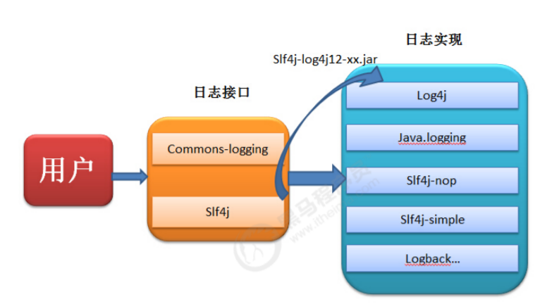

# 第一章 日志简介

## 1. 日志的概念

### 1.1 日志文件

日志文件是用于记录系统操作事件的文件集合，可分为事件日志和消息日志。具有处理历史数据、诊断问题的追踪以及理解系统的活动等重要作用。

在计算机中，日志文件是记录在操作系统或其他软件运行中发生的事件或在通信软件的不同用户之间的消息的文件。记录是保持日志的行为。在最简单的情况下，消息被写入单个日志文件。

有许多操作系统，软件框架和程序包括日志系统。广泛使用的日志记录标准是在因特网工程任务组（IETF）RFC5424中定义的syslog。 syslog标准使专用的标准化子系统能够生成，过滤，记录和分析日志消息。

#### 1.1.1 调试日志

软件开发中，我们经常需要去调试程序，做一些信息，状态的输出便于我们查询程序的运行状况。为了让我们能够更加灵活和方便的控制这些调试的信息，所有我们需要专业的日志技术。java中寻找bug会需要重现。调试也就是debug 可以在程序运行中暂停程序运行，可以查看程序在运行中的情况。日志主要是为了更方便的去重现问题。

#### 1.1.2 系统日志

系统日志是记录系统中硬件、软件和系统问题的信息，同时还可以监视系统中发生的事件。用户可以通过它来检查错误发生的原因，或者寻找受到攻击时攻击者留下的痕迹。系统日志包括系统日志、应用程序日志和安全日志。

系统日志的价值：

系统日志策略可以在故障刚刚发生时就向你发送警告信息，系统日志帮助你在最短的时间内发现问题。

系统日志是一种非常关键的组件，因为系统日志可以让你充分了解自己的环境。这种系统日志信息对于决定故障的根本原因或者缩小系统攻击范围来说是非常关键的，因为系统日志可以让你了解故障或者袭 击发生之前的所有事件。为虚拟化环境制定一套良好的系统日志策略也是至关重要的，因为系统日志需要和许多不同的外部组件进行关联。良好的系统日志可以防止你从错误的角度分析问题，避免浪费宝贵的排错时间。另外一种原因是借助于系统日志，管理员很有可能会发现一些之前从未意识到的问题。

## 2. JAVA日志框架

### 2.1 为什么要用日志框架

因为软件系统发展到今天已经很复杂了，特别是服务器端软件，涉及到的知识，内容，问题太多。在某些方面使用别人成熟的框架，就相当于让别人帮你完成一些基础工作，你只需要集中精力完成系统的业务逻辑设计。而且框架一般是成熟，稳健的，他可以处理系统很多细节问题，比如，事务处理，安全性，数据流控制等问题。还有框架一般都经过很多人使用，所以结构很好，所以扩展性也很好，而且它是不断升级的，你可以直接享受别人升级代码带来的好处。

### 2.2 现有的日志框架

JUL（java util logging）、logback、log4j、log4j2

### 2.3 日志门面技术

当我们的系统变的更加复杂的时候，我们的日志就容易发生混乱。随着系统开发的进行，可能会更新不同的日志框架，造成当前系统中存在不同的日志依赖，让我们难以统一的管理和控制。就算我们强制要求所有的模块使用相同的日志框架，系统中也难以避免使用其他类似spring,mybatis等其他的第三方框架，它们依赖于我们规定不同的日志框架，而且他们自身的日志系统就有着不一致性，依然会出来日志体系的混乱。

所以我们需要借鉴JDBC的思想，为日志系统也提供一套门面，那么我们就可以面向这些接口规范来开发，避免了直接依赖具体的日志框架。这样我们的系统在日志中，就存在了日志的门面和日志的实现。

### 2.4 现有的日志门面技术

JCL（Jakarta Commons Logging）、slf4j（ Simple Logging Facade for Java）

### 2.5 日志门面和日志实现的关系

日志框架出现的历史顺序：

log4j -->JUL-->JCL--> slf4j --> logback --> log4j2