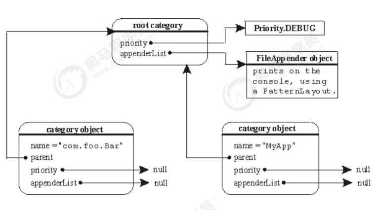

# 第三章 Log4J

Log4j是Apache下的一款开源的日志框架，通过在项目中使用 Log4J，我们可以控制日志信息输出到控制台、文件、甚至是数据库中。我们可以控制每一条日志的输出格式，通过定义日志的输出级别，可以更灵活的控制日志的输出过程。方便项目的调试。

官方网站： http://logging.apache.org/log4j/1.2/

### 4.1 Log4j入门

1. 建立maven工程
2. 添加依赖

```xml
<dependencies>
    <dependency>
        <groupId>log4j</groupId>
        <artifactId>log4j</artifactId>
        <version>1.2.17</version>
    </dependency>
    <dependency>
        <groupId>junit</groupId>
        <artifactId>junit</artifactId>
        <version>4.12</version>
    </dependency>
</dependencies>
```

3. java代码

```java
public class Log4jTest {
    @Test
    public void testQuick() throws Exception {
        // 初始化系统配置，不需要配置文件
        BasicConfigurator.configure();
        // 创建日志记录器对象
        Logger logger = Logger.getLogger(Log4jTest.class);
        // 日志记录输出
        logger.info("hello log4j");
        // 日志级别
        logger.fatal("fatal"); // 严重错误，一般会造成系统崩溃和终止运行
        logger.error("error"); // 错误信息，但不会影响系统运行
        logger.warn("warn"); // 警告信息，可能会发生问题
        logger.info("info"); // 程序运行信息，数据库的连接、网络、IO操作等
        logger.debug("debug"); // 调试信息，一般在开发阶段使用，记录程序的变量、参
        数等
        logger.trace("trace"); // 追踪信息，记录程序的所有流程信息
    }
}
```

[相关文件Log4JTest.java](../../Log4J/src/main/java/com/toxicant123/Log4JTest.java)

4. 日志的级别

* 每个Logger都被了一个日志级别（log level），用来控制日志信息的输出。日志级别从高到低分为：
  - fatal 指出每个严重的错误事件将会导致应用程序的退出。
  - error 指出虽然发生错误事件，但仍然不影响系统的继续运行。
  - warn 表明会出现潜在的错误情形。
  - info 一般和在粗粒度级别上，强调应用程序的运行全程。
  - debug 一般用于细粒度级别上，对调试应用程序非常有帮助。
  - trace 是程序追踪，可以用于输出程序运行中的变量，显示执行的流程。
* 还有两个特殊的级别：
  - OFF，可用来关闭日志记录。
  - ALL，启用所有消息的日志记录。

> 注：一般只使用4个级别，优先级从高到低为 ERROR > WARN > INFO > DEBUG

### 4.2 Log4j组件

Log4J 主要由 Loggers (日志记录器)、Appenders（输出端）和 Layout（日志格式化器）组成。其中Loggers 控制日志的输出级别与日志是否输出；Appenders 指定日志的输出方式（输出到控制台、文件等）；Layout 控制日志信息的输出格式。

#### 4.2.1 Loggers

日志记录器，负责收集处理日志记录，实例的命名就是类“XX”的full quailied name（类的全限定名），Logger的名字大小写敏感，其命名有继承机制：例如：name为org.apache.commons的logger会继承name为org.apache的logger。

Log4J中有一个特殊的logger叫做“root”，他是所有logger的根，也就意味着其他所有的logger都会直接或者间接地继承自root。root logger可以用Logger.getRootLogger()方法获取。

但是，自log4j 1.2版以来， Logger 类已经取代了 Category 类。对于熟悉早期版本的log4j的人来说，Logger 类可以被视为 Category 类的别名。



#### 4.2.2 Appenders

Appender 用来指定日志输出到哪个地方，可以同时指定日志的输出目的地。Log4j 常用的输出目的地有以下几种：

|          输出端类型           |                            作用                             |
|:------------------------:|:---------------------------------------------------------:|
|     ConsoleAppender      |                         将日志输出到控制台                         |
|       FileAppender       |                         将日志输出到文件中                         |
| DailyRollingFileAppender |                将日志输出到一个日志文件，并且每天输出到一个新的文件                 |
|   RollingFileAppender    | 将日志信息输出到一个日志文件，并且指定文件的尺寸，当文件大小达到指定尺寸时，会自动把文件改名，同时产生一个新的文件 |
|       JDBCAppender       |                       把日志信息保存到数据库中                        |

[相关文件log4j.properties](../../Log4J/src/main/resources/log4j.properties)

#### 4.2.3 Layouts

布局器 Layouts用于控制日志输出内容的格式，让我们可以使用各种需要的格式输出日志。Log4j常用的Layouts:

|    格式化器类型     |                      作用                      |
|:-------------:|:--------------------------------------------:|
|  HTMLLayout   |               格式化日志输出为HTML表格形式               |
| SimpleLayout  |           简单的日志输出格式化，打印的日志格式为（info           |-|message）|
| PatternLayout | 最强大的格式化期，可以根据自定义格式输出日志，如果没有指定转换格式，就是用默认的转换格式 |

[相关文件log4j.properties](../../Log4J/src/main/resources/log4j.properties)

### 4.3 Layout的格式

在 log4j.properties 配置文件中，我们定义了日志输出级别与输出端，在输出端中分别配置日志的输出格式。

* log4j 采用类似 C 语言的 printf 函数的打印格式格式化日志信息，具体的占位符及其含义如下：
  - %m 输出代码中指定的日志信息
  - %p 输出优先级，及 DEBUG、INFO 等
  - %n 换行符（Windows平台的换行符为 "\n"，Unix 平台为 "\n"）
  - %r 输出自应用启动到输出该 log 信息耗费的毫秒数
  - %c 输出打印语句所属的类的全名
  - %t 输出产生该日志的线程全名
  - %d 输出服务器当前时间，默认为 ISO8601，也可以指定格式，如：%d{yyyy年MM月dd日 HH:mm:ss}
  - %l 输出日志时间发生的位置，包括类名、线程、及在代码中的行数。如：Test.main(Test.java:10)
  - %F 输出日志消息产生时所在的文件名称
  - %L 输出代码中的行号
  - %% 输出一个 "%" 字符
* 可以在 % 与字符之间加上修饰符来控制最小宽度、最大宽度和文本的对其方式。如：
  - %5c 输出category名称，最小宽度是5，category<5，默认的情况下右对齐
  - %-5c 输出category名称，最小宽度是5，category<5，"-"号指定左对齐,会有空格
  - %.5c 输出category名称，最大宽度是5，category>5，就会将左边多出的字符截掉，<5不会有空格
  - %20.30c category名称<20补空格，并且右对齐，>30字符，就从左边交远销出的字符截掉

### 4.4 Appender的输出

控制台，文件，数据库

```properties
#指定日志的输出级别与输出端
log4j.rootLogger=INFO,Console

# 控制台输出配置
log4j.appender.Console=org.apache.log4j.ConsoleAppender
log4j.appender.Console.layout=org.apache.log4j.PatternLayout
log4j.appender.Console.layout.ConversionPattern=%d [%t] %-5p [%c] - %m%n

# 文件输出配置
log4j.appender.A = org.apache.log4j.DailyRollingFileAppender
#指定日志的输出路径
log4j.appender.A.File = D:/log.txt
log4j.appender.A.Append = true
#使用自定义日志格式化器
log4j.appender.A.layout = org.apache.log4j.PatternLayout
#指定日志的输出格式
log4j.appender.A.layout.ConversionPattern = %-d{yyyy-MM-dd HH:mm:ss} [%t:%r] - [%p] %m%n
#指定日志的文件编码
log4j.appender.A.encoding=UTF-8

#mysql
log4j.appender.logDB=org.apache.log4j.jdbc.JDBCAppender
log4j.appender.logDB.layout=org.apache.log4j.PatternLayout
log4j.appender.logDB.Driver=com.mysql.jdbc.Driver
log4j.appender.logDB.URL=jdbc:mysql://localhost:3306/test
log4j.appender.logDB.User=root
log4j.appender.logDB.Password=root
log4j.appender.logDB.Sql=INSERT INTO log(project_name,create_date,level,category,file_name,thread_name,line,all_category,message) values('itcast','%d{yyyy-MM-dd-HH:mm:ss}','%p','%c','%F','%t','%L','%l','%m')
```

[相关文件log4j.properties](../../Log4J/src/main/resources/log4j.properties)

输出到MySQL数据库中的表的结构
```sql
CREATE TABLE `log`
(
    `log_id`       int(11) NOT NULL AUTO_INCREMENT,
    `project_name` varchar(255)  DEFAULT NULL COMMENT '目项名',
    `create_date`  varchar(255)  DEFAULT NULL COMMENT '创建时间',
    `level`        varchar(255)  DEFAULT NULL COMMENT '优先级',
    `category`     varchar(255)  DEFAULT NULL COMMENT '所在类的全名',
    `file_name`    varchar(255)  DEFAULT NULL COMMENT '输出日志消息产生时所在的文件名称 ',
    `thread_name`  varchar(255)  DEFAULT NULL COMMENT '日志事件的线程名',
    `line`         varchar(255)  DEFAULT NULL COMMENT '号行',
    `all_category` varchar(255)  DEFAULT NULL COMMENT '日志事件的发生位置',
    `message`      varchar(4000) DEFAULT NULL COMMENT '输出代码中指定的消息',
    PRIMARY KEY (`log_id`)
);
```

### 4.5 自定义Logger

```properties
# RootLogger配置
log4j.rootLogger = trace,console

# 自定义Logger
log4j.logger.com.itheima = info,file
log4j.logger.org.apache = error
```

[相关文件log4j.properties](../../Log4J/src/main/resources/log4j.properties)

```java
public class Example {
    @Test
    public void testCustomLogger() throws Exception {
        // 自定义 com.itheima
        Logger logger1 = Logger.getLogger(Log4jTest.class);
        logger1.fatal("fatal"); // 严重错误，一般会造成系统崩溃和终止运行
        logger1.error("error"); // 错误信息，但不会影响系统运行
        logger1.warn("warn"); // 警告信息，可能会发生问题
        logger1.info("info"); // 程序运行信息，数据库的连接、网络、IO操作等
        logger1.debug("debug"); // 调试信息，一般在开发阶段使用，记录程序的变量、参数等
        logger1.trace("trace"); // 追踪信息，记录程序的所有流程信息
        // 自定义 org.apache
        Logger logger2 = Logger.getLogger(Logger.class);
        logger2.fatal("fatal logger2"); // 严重错误，一般会造成系统崩溃和终止运行
        logger2.error("error logger2"); // 错误信息，但不会影响系统运行
        logger2.warn("warn logger2"); // 警告信息，可能会发生问题
        logger2.info("info logger2"); // 程序运行信息，数据库的连接、网络、IO操作等
        logger2.debug("debug logger2"); // 调试信息，一般在开发阶段使用，记录程序的变量、参数等
        logger2.trace("trace logger2"); // 追踪信息，记录程序的所有流程信息
    }
}
```

