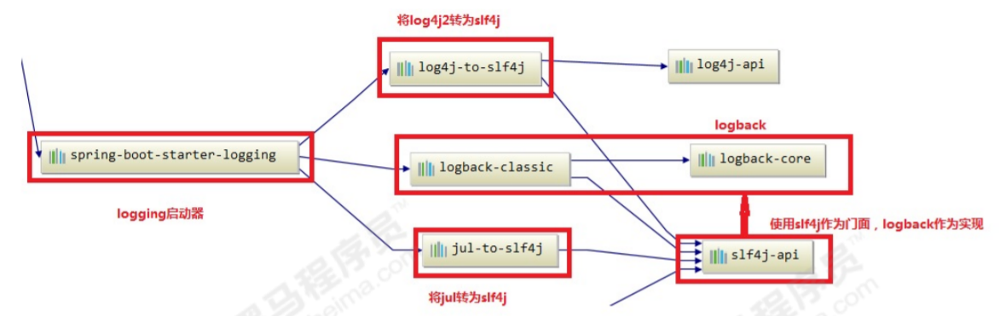

# 第八章 SpringBoot中的日志使用

springboot框架在企业中的使用越来越普遍，springboot日志也是开发中常用的日志系统。springboot默认就是使用SLF4J作为日志门面，logback作为日志实现来记录日志。

### 5.1 SpringBoot中的日志设计

springboot中的日志

```xml
<dependency>
    <artifactId>spring-boot-starter-logging</artifactId>
    <groupId>org.springframework.boot</groupId>
</dependency>
```

依赖关系图：



总结：
1. springboot 底层默认使用logback作为日志实现。
2. 使用了SLF4J作为日志门面
3. 将JUL也转换成slf4j
4. 也可以使用log4j2作为日志门面，但是最终也是通过slf4j调用logback

### 5.2 SpringBoot日志使用

1. 在springboot中测试打印日志

```java
public class Example {
    @SpringBootTest
    class SpringbootLogApplicationTests {
        //记录器
        public static final Logger LOGGER =
                LoggerFactory.getLogger(SpringbootLogApplicationTests.class);
        @Test
        public void contextLoads() {
            // 打印日志信息
            LOGGER.error("error");
            LOGGER.warn("warn");
            LOGGER.info("info"); // 默认日志级别
            LOGGER.debug("debug");
            LOGGER.trace("trace");
        }
    }
}
```

2. 修改默认日志配置

```properties
#指定自定义logger对象日志级别
logging.level.com.toxicant123=trace

#指定控制台输出消息格式
logging.pattern.console=%d{yyyy-MM-dd} [%thread] [%-5level] %logger{50} - %msg%n

# 指定存放日志文件的具体路径
#logging.file=D:/logs/springboot.log
#指定日志文件存放的目录，默认的文件名，spring.log
logging.file.name=D:/logs/springboot/
#指定日志文件消息格式
logging.pattern.file=%d{yyyy-MM-dd} [%thread] %-5level %logger{50} - %msg%n
```

3. 指定配置

给类路径下放上每个日志框架自己的配置文件，SpringBoot就不使用默认配置的了

|   日志框架    | 配置文件  |
|:-----:|:-----:|
|    Logback   | logback-spring.xml , logback.xml      |
|   Log4j2    |  log4j2-spring.xml ， log4j2.xml     |
|    JUL    | logging.properties      |

4. 使用SpringBoot解析日志配置

logback-spring.xml：由SpringBoot解析日志配置，可以根据application.properties中的`spring.profile.active`属性动态切换开发配置和生产配置

```xml
<encoder class="ch.qos.logback.classic.encoder.PatternLayoutEncoder">
    <springProfile name="dev">
        <pattern>${pattern}</pattern>
    </springProfile>
    <springProfile name="pro">
        <pattern>%d{yyyyMMdd:HH:mm:ss.SSS} [%thread] %-5level %msg%n</pattern>
    </springProfile>
</encoder>
```

application.properties

```properties
spring.profiles.active=dev
```

5. 将日志切换为log4j2

将logback排除，再导入log4j2

```xml
<dependencies>
    <dependency>
        <groupId>org.springframework.boot</groupId>
        <artifactId>spring-boot-starter-web</artifactId>
        <exclusions>
            <!--排除logback-->
            <exclusion>
                <artifactId>spring-boot-starter-logging</artifactId>
                <groupId>org.springframework.boot</groupId>
            </exclusion>
        </exclusions>
    </dependency>
    <!-- 添加log4j2 -->
    <dependency>
        <groupId>org.springframework.boot</groupId>
        <artifactId>spring-boot-starter-log4j2</artifactId>
    </dependency>
</dependencies>
```