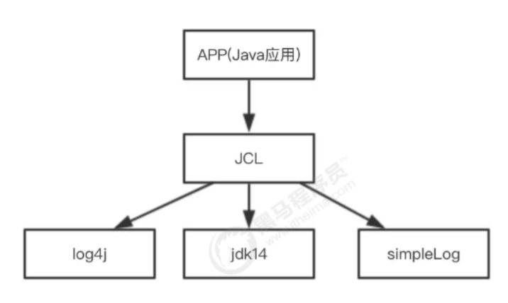
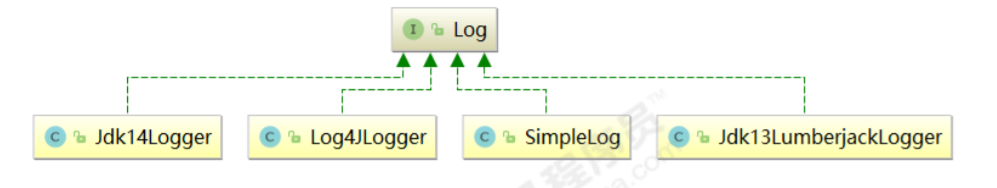
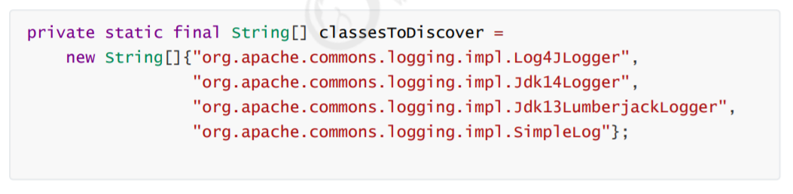

# 第四章 JCL

JCL全称为Jakarta Commons Logging，是Apache提供的一个通用日志API。

它是为 "所有的Java日志实现"提供一个统一的接口，它自身也提供一个日志的实现，但是功能非常常弱（SimpleLog）。所以一般不会单独使用它。他允许开发人员使用不同的具体日志实现工具: Log4j, Jdk自带的日志（JUL)

JCL 有两个基本的抽象类：Log(基本记录器)和LogFactory(负责创建Log实例)。



## 5.1 JCL入门

1. 建立maven工程
2. 添加依赖

```xml
<dependencies>
    <dependency>
        <groupId>commons-logging</groupId>
        <artifactId>commons-logging</artifactId>
        <version>1.2</version>
    </dependency>
    <dependency>
        <groupId>log4j</groupId>
        <artifactId>log4j</artifactId>
        <version>1.2.17</version>
    </dependency>
    <dependency>
        <groupId>junit</groupId>
        <artifactId>junit</artifactId>
        <version>4.12</version>
    </dependency>
</dependencies>
```

3. 入门代码

```java
public class Example {
    public class JULTest {
        @Test
        public void testQuick() throws Exception {
            // 创建日志对象
            Log log = LogFactory.getLog(JULTest.class);
            // 日志记录输出
            log.fatal("fatal");
            log.error("error");
            log.warn("warn");
            log.info("info");
            log.debug("debug");
        }
    }
}
```

[相关文件JCLTest.java](../../JCL/src/main/java/com/toxicant123/JCLTest.java)

为什么要使用日志门面：

1. 面向接口开发，不再依赖具体的实现类。减少代码的耦合
2. 项目通过导入不同的日志实现类，可以灵活的切换日志框架
3. 统一API，方便开发者学习和使用
4. 统一配置便于项目日志的管理

### 5.2 JCL原理

1. 通过LogFactory动态加载Log实现类



2. 日志门面支持的日志实现数组



3. 获取具体的日志实现

```java
public class Example {
    public static void main(String[] args) {
        for (int i = 0; i < classesToDiscover.length && result == null; ++i) {
            result = this.createLogFromClass(classesToDiscover[i], logCategory, true);
        }
    }
}
```