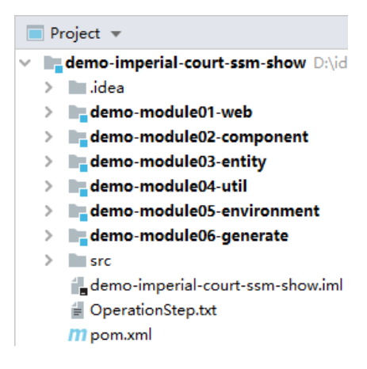
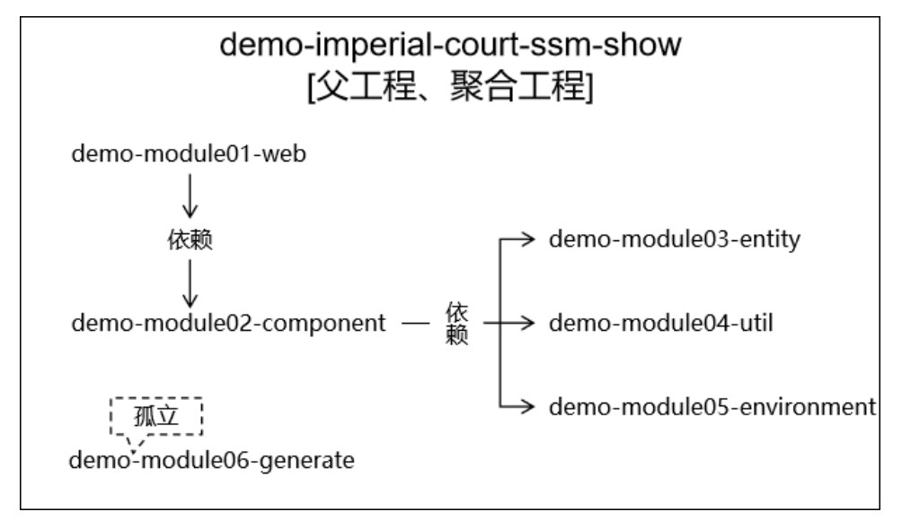
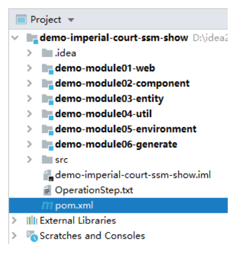
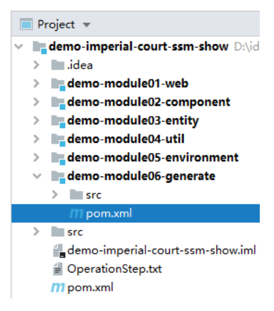
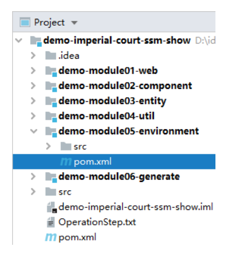
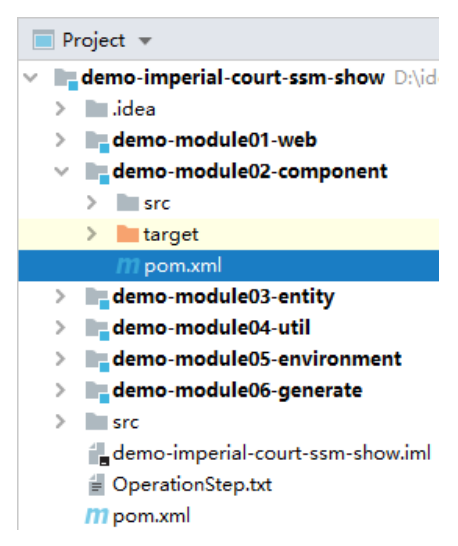
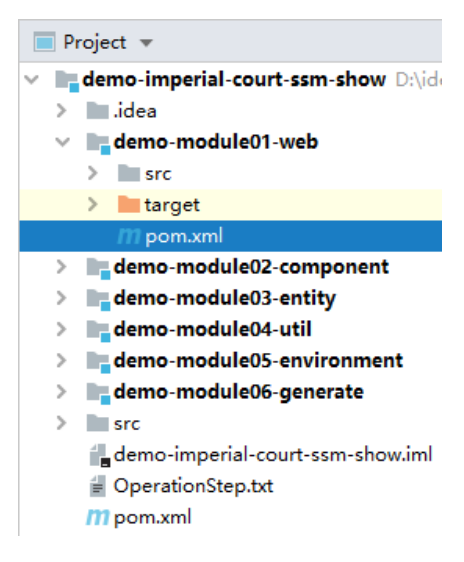

# 第一节 创建工程，引入依赖

## 1、创建工程

### ①工程清单




|              工程名              |     地位      |             说明             |
|:-----------------------------:|:-----------:|:--------------------------:|
| demo-imperial-court-ssm-show  |     父工程     |         总体管理各个子工程          |
|       demo-module01-web       |     子工程     |            唯一的             |
|              war              |     包工程     |  demo-module02-component   |
|              子工程              | 管理项目中的各种组件  |    demo-module03-entity    |
|              子工程              |  管理项目中的实体类  |     demo-module04-util     |
|              子工程              |  管理项目中的工具类  | demo-module05-environment  |
|              子工程              |  框架环境所需依赖   |   demo-module06-generate   |
|              子工程              |   Mybatis   |            逆向工程            |

### ②工程间关系



## 2、各工程 POM 配置

### ①父工程

POM 位置如下：



各子工程创建好之后就会有下面配置，不需要手动编辑：

```xml
<groupId>com.atguigu</groupId>
<artifactId>demo-imperial-court-ssm-show</artifactId>
<packaging>pom</packaging>
<version>1.0-SNAPSHOT</version>
<modules>
    <module>demo-module01-web</module>
    <module>demo-module02-component</module>
    <module>demo-module03-entity</module>
    <module>demo-module04-util</module>
    <module>demo-module05-environment</module>
    <module>demo-module06-generate</module>
</modules>
```

### ②Mybatis 逆向工程

POM 位置如下：



```xml
<!-- 依赖MyBatis核心包 -->
<dependencies>
    <dependency>
        <groupId>org.mybatis</groupId>
        <artifactId>mybatis</artifactId>
        <version>3.5.7</version>
    </dependency>
</dependencies>

<!-- 控制Maven在构建过程中相关配置 -->
<build>

    <!-- 构建过程中用到的插件 -->
    <plugins>

        <!-- 具体插件，逆向工程的操作是以构建过程中插件形式出现的 -->
        <plugin>
            <groupId>org.mybatis.generator</groupId>
            <artifactId>mybatis-generator-maven-plugin</artifactId>
            <version>1.3.0</version>

            <!-- 插件的依赖 -->
            <dependencies>

                <!-- 逆向工程的核心依赖 -->
                <dependency>
                    <groupId>org.mybatis.generator</groupId>
                    <artifactId>mybatis-generator-core</artifactId>
                    <version>1.3.2</version>
                </dependency>

                <!-- 数据库连接池 -->
                <dependency>
                    <groupId>com.mchange</groupId>
                    <artifactId>c3p0</artifactId>
                    <version>0.9.2</version>
                </dependency>

                <!-- MySQL驱动 -->
                <dependency>
                    <groupId>mysql</groupId>
                    <artifactId>mysql-connector-java</artifactId>
                    <version>5.1.8</version>
                </dependency>
            </dependencies>
        </plugin>
    </plugins>
</build>
```

### ③环境依赖工程

POM 位置如下：



```xml
<!-- SpringMVC -->
<dependency>
    <groupId>org.springframework</groupId>
    <artifactId>spring-webmvc</artifactId>
    <version>5.3.1</version>
</dependency>

<!-- Spring 持久化层所需依赖 -->
<dependency>
    <groupId>org.springframework</groupId>
    <artifactId>spring-orm</artifactId>
    <version>5.3.1</version>
</dependency>

<!-- 日志 -->
<dependency>
    <groupId>ch.qos.logback</groupId>
    <artifactId>logback-classic</artifactId>
    <version>1.2.3</version>
</dependency>

<!-- Spring5和Thymeleaf整合包 -->
<dependency>
    <groupId>org.thymeleaf</groupId>
    <artifactId>thymeleaf-spring5</artifactId>
    <version>3.0.12.RELEASE</version>
</dependency>

<!-- Mybatis 和 Spring 的整合包 -->
<dependency>
    <groupId>org.mybatis</groupId>
    <artifactId>mybatis-spring</artifactId>
    <version>2.0.6</version>
</dependency>

<!-- Mybatis核心 -->
<dependency>
    <groupId>org.mybatis</groupId>
    <artifactId>mybatis</artifactId>
    <version>3.5.7</version>
</dependency>

<!-- MySQL驱动 -->
<dependency>
    <groupId>mysql</groupId>
    <artifactId>mysql-connector-java</artifactId>
    <version>5.1.3</version>
</dependency>

<!-- 数据源 -->
<dependency>
    <groupId>com.alibaba</groupId>
    <artifactId>druid</artifactId>
    <version>1.0.31</version>
</dependency>
```

### ④工具类工程

无配置。

### ⑤实体类工程

无配置。

### ⑥组件工程

POM 位置如下：



```xml
<dependency>
    <groupId>com.atguigu</groupId>
    <artifactId>demo-module03-entity</artifactId>
    <version>1.0-SNAPSHOT</version>
</dependency>
<dependency>
    <groupId>com.atguigu</groupId>
    <artifactId>demo-module04-util</artifactId>
    <version>1.0-SNAPSHOT</version>
</dependency>
<dependency>
    <groupId>com.atguigu</groupId>
    <artifactId>demo-module05-environment</artifactId>
    <version>1.0-SNAPSHOT</version>
</dependency>

<!-- ServletAPI -->
<dependency>
    <groupId>javax.servlet</groupId>
    <artifactId>javax.servlet-api</artifactId>
    <version>3.1.0</version>
    <scope>provided</scope>
</dependency>
```

### ⑦Web 工程

POM 位置如下：



```xml
<dependency>
    <groupId>com.atguigu</groupId>
    <artifactId>demo-module02-component</artifactId>
    <version>1.0-SNAPSHOT</version>
</dependency>

<!-- junit5 -->
<dependency>
    <groupId>org.junit.jupiter</groupId>
    <artifactId>junit-jupiter-api</artifactId>
    <version>5.7.0</version>
    <scope>test</scope>
</dependency>

<!-- Spring 的测试功能 -->
<dependency>
    <groupId>org.springframework</groupId>
    <artifactId>spring-test</artifactId>
    <version>5.3.1</version>
    <scope>test</scope>
</dependency>
```