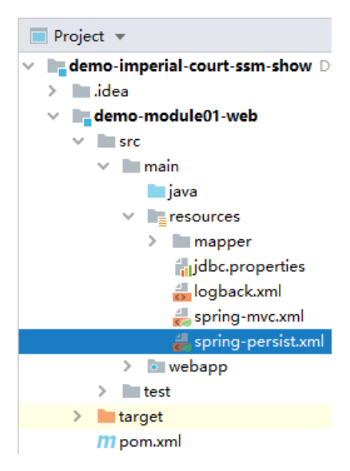

# 第三节 搭建环境：事务控制

## 1、声明式事务配置



```xml
<!-- 配置事务管理器 -->
<bean id="transactionManager" class="org.springframework.jdbc.datasource.DataSourceTransactionManager">
    <!-- 装配数据源 -->
    <property name="dataSource" ref="dataSource"/>
</bean>

<!-- 配置事务的注解驱动，开启基于注解的声明式事务功能 -->
<tx:annotation-driven transaction-manager="transactionManager"/>

<!-- 配置对 Service 所在包的自动扫描 -->
<context:component-scan base-package="com.atguigu.imperial.court.service"/>
```

## 2、注解写法

### ①查询操作

```java
@Transactional(readOnly = true)
```

### ②增删改操作

```java
@Transactional(propagation = Propagation.REQUIRES_NEW, readOnly = false)
```

> TIP

> 在具体代码开发中可能会将相同设置的 @Transactional 注解提取到 Service 类上。