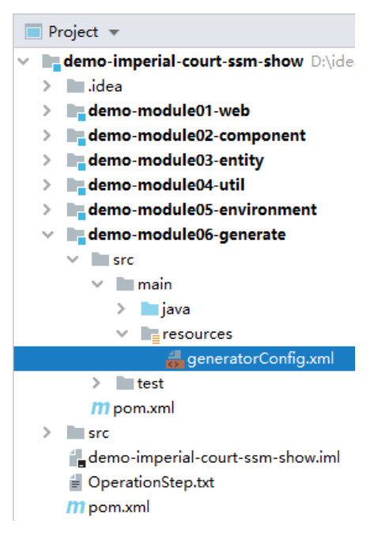
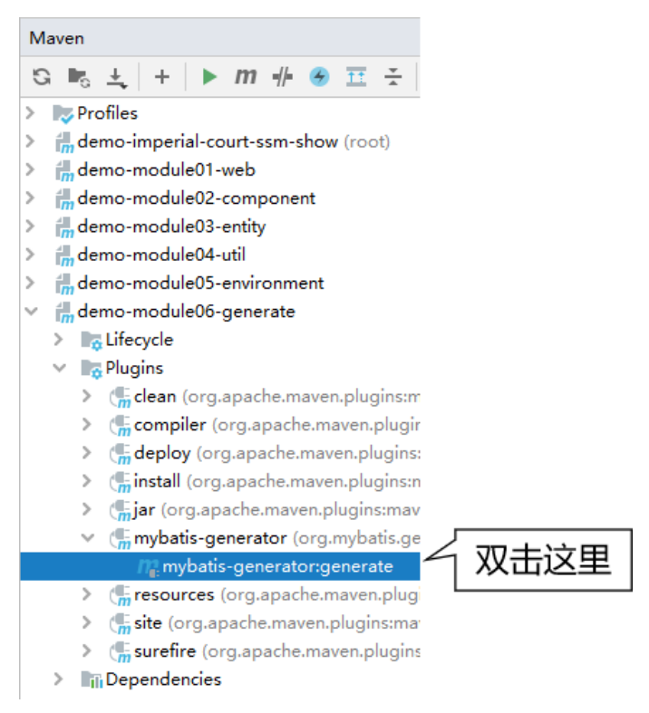
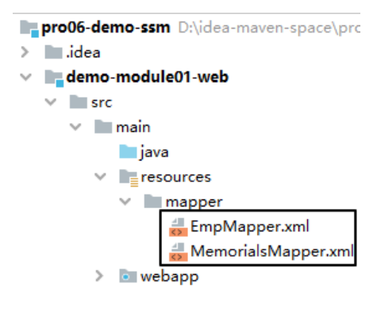
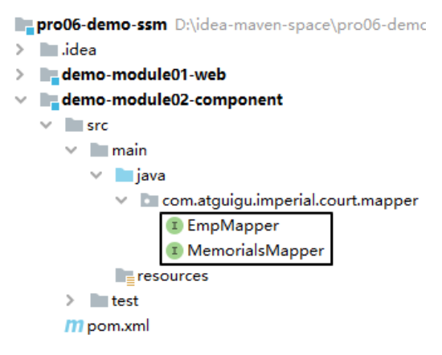
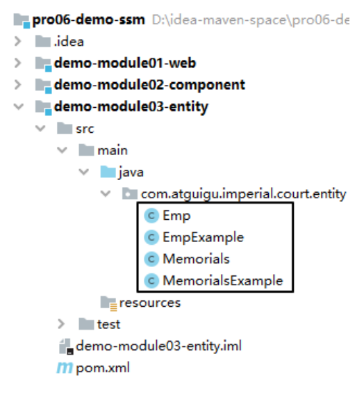
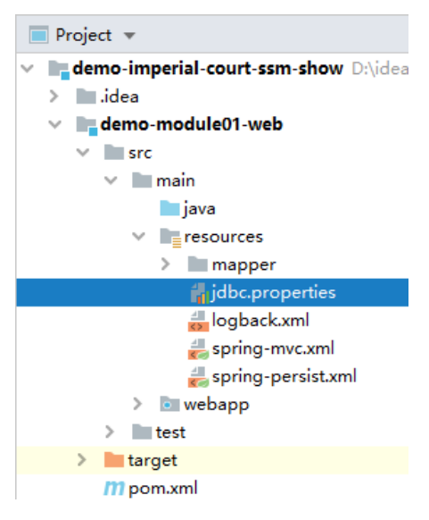
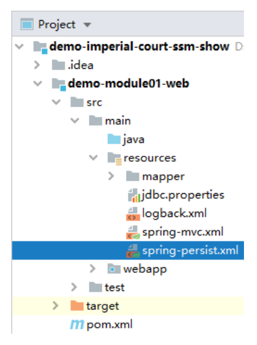
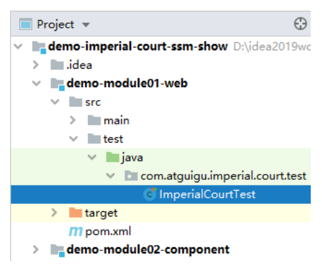
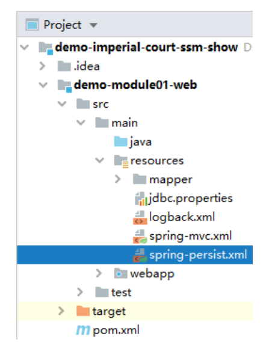
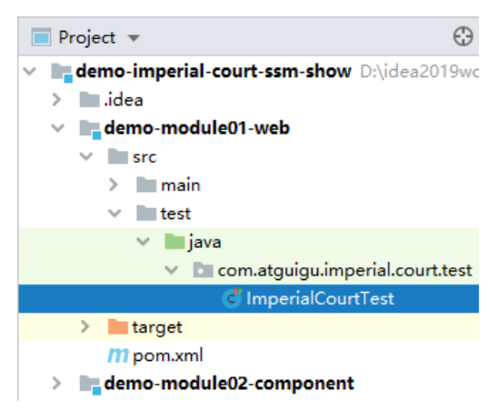

# 第二节 搭建环境：持久化层

## 1、物理建模

我们仍然继续使用《第六章 单一架构案例》中创建的数据库和表。

## 2、Mybatis 逆向工程

### ①generatorConfig.xml



[查看详细配置信息](../../../pro06-demo-ssm/demo-module06-generate/src/main/resources/generatorConfig.xml)

### ②执行逆向生成



### ③资源归位

下面罗列各种资源应该存放的位置，排名不分先后：

#### [1]Mapper 配置文件



#### [2]Mapper 接口



### [3]实体类

Mybatis 逆向工程生成的实体类只有字段和 get、set 方法，我们可以自己添加无参构造器、有参构造器、toString() 方法。



## 3、建立数据库连接

### ①数据库连接信息



```properties
dev.driverClassName=com.mysql.jdbc.Driver
dev.url=jdbc:mysql://192.168.198.100:3306/db_imperial_court
dev.username=root
dev.password=atguigu
dev.initialSize=10
dev.maxActive=20
dev.maxWait=10000
```

### ②配置数据源



```xml
<context:property-placeholder location="classpath:jdbc.properties"/>

<bean id="druidDataSource" class="com.alibaba.druid.pool.DruidDataSource">
    <property name="username" value="${dev.username}"/>
    <property name="password" value="${dev.password}"/>
    <property name="url" value="${dev.url}"/>
    <property name="driverClassName" value="${dev.driverClassName}"/>
    <property name="initialSize" value="${dev.initialSize}"/>
    <property name="maxActive" value="${dev.maxActive}"/>
    <property name="maxWait" value="${dev.maxWait}"/>
</bean>
```

### ③测试



```java
@ExtendWith(SpringExtension.class)
@ContextConfiguration(value = {"classpath:spring-persist.xml"})
public class ImperialCourtTest {

    @Autowired
    private DataSource dataSource;

    private Logger logger = LoggerFactory.getLogger(ImperialCourtTest.class);

    @Test
    public void testConnection() throws SQLException {
        Connection connection = dataSource.getConnection();
        logger.debug(connection.toString());
    }

}
```

配置文件为什么要放到 Web 工程里面？

* Web 工程将来生成 war 包。
* war 包直接部署到 Tomcat 运行。
* Tomcat 从 war 包（解压目录）查找配置文件最直接。
* 如果不是把配置文件放在 Web 工程，而是放在 Java 工程，那就等于将配置文件放在了 war 包内的 jar 包中。
* 配置文件在 jar 包中读取相对困难。

## 4、Spring 整合 Mybatis



### ①配置 SqlSessionFactoryBean

目的1：装配数据源

目的2：指定 Mapper 配置文件的位置

```xml
<!-- 配置 SqlSessionFactoryBean -->
<bean id="sqlSessionFactory" class="org.mybatis.spring.SqlSessionFactoryBean">

    <!-- 装配数据源 -->
    <property name="dataSource" ref="druidDataSource"/>

    <!-- 指定 Mapper 配置文件的位置 -->
    <property name="mapperLocations" value="classpath:mapper/*Mapper.xml"/>
</bean>
```

### ②扫描 Mapper 接口

```xml
<mybatis:scan base-package="com.atguigu.imperial.court.mapper"/>
```

### ③测试



```java
@Autowired
private EmpMapper empMapper;

@Test
public void testEmpMapper() {
    List<Emp> empList = empMapper.selectByExample(new EmpExample());
    for (Emp emp : empList) {
        System.out.println("emp = " + emp);
    }
}
```