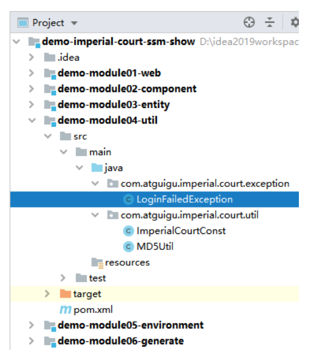
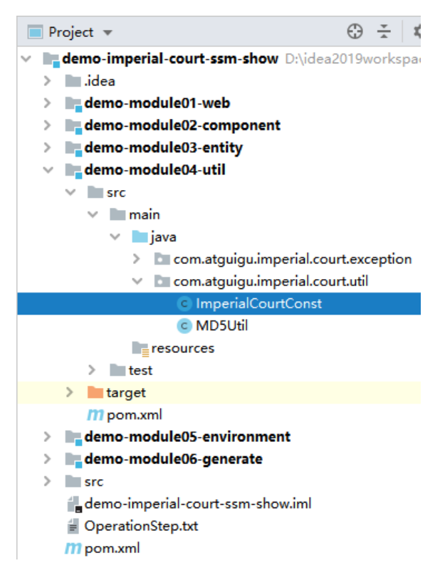
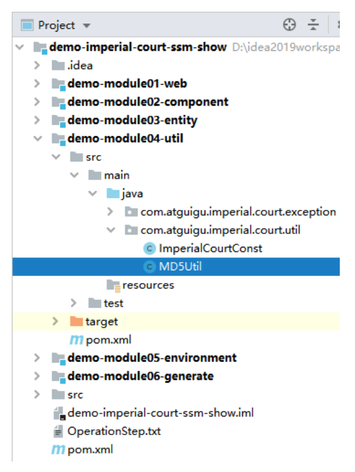
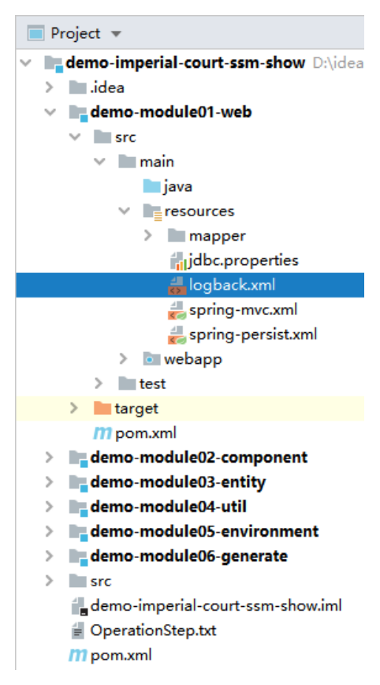

# 第五节 搭建环境：辅助功能

## 1、登录失败异常



```java
public class LoginFailedException extends RuntimeException {

    public LoginFailedException() {
    }

    public LoginFailedException(String message) {
        super(message);
    }

    public LoginFailedException(String message, Throwable cause) {
        super(message, cause);
    }

    public LoginFailedException(Throwable cause) {
        super(cause);
    }

    public LoginFailedException(String message, Throwable cause, boolean enableSuppression, boolean writableStackTrace) {
        super(message, cause, enableSuppression, writableStackTrace);
    }
}
```

## 2、常量类



```java
public class ImperialCourtConst {

    public static final String LOGIN_FAILED_MESSAGE = "账号、密码错误，不可进宫！";
    public static final String ACCESS_DENIED_MESSAGE = "宫闱禁地，不得擅入！";
    public static final String LOGIN_EMP_ATTR_NAME = "loginInfo";

}
```

## 3、MD5 工具



```java
public class MD5Util {

    /**
     * 针对明文字符串执行MD5加密
     * @param source
     * @return
     */
    public static String encode(String source) {

        // 1.判断明文字符串是否有效
        if (source == null || "".equals(source)) {
            throw new RuntimeException("用于加密的明文不可为空");
        }

        // 2.声明算法名称
        String algorithm = "md5";

        // 3.获取MessageDigest对象
        MessageDigest messageDigest = null;
        try {
            messageDigest = MessageDigest.getInstance(algorithm);
        } catch (NoSuchAlgorithmException e) {
            e.printStackTrace();
        }

        // 4.获取明文字符串对应的字节数组
        byte[] input = source.getBytes();

        // 5.执行加密
        byte[] output = messageDigest.digest(input);

        // 6.创建BigInteger对象
        int signum = 1;
        BigInteger bigInteger = new BigInteger(signum, output);

        // 7.按照16进制将bigInteger的值转换为字符串
        int radix = 16;
        String encoded = bigInteger.toString(radix).toUpperCase();

        return encoded;
    }

}
```

## 4、日志配置文件



```xml
<?xml version="1.0" encoding="UTF-8"?>
<configuration debug="true">
    <!-- 指定日志输出的位置 -->
    <appender name="STDOUT"
              class="ch.qos.logback.core.ConsoleAppender">
        <encoder>
            <!-- 日志输出的格式 -->
            <!-- 按照顺序分别是：时间、日志级别、线程名称、打印日志的类、日志主体内容、换行 -->
            <pattern>[%d{HH:mm:ss.SSS}] [%-5level] [%thread] [%logger] [%msg]%n</pattern>
            <charset>UTF-8</charset>
        </encoder>
    </appender>

    <!-- 设置全局日志级别。日志级别按顺序分别是：DEBUG、INFO、WARN、ERROR -->
    <!-- 指定任何一个日志级别都只打印当前级别和后面级别的日志。 -->
    <root level="INFO">
        <!-- 指定打印日志的appender，这里通过“STDOUT”引用了前面配置的appender -->
        <appender-ref ref="STDOUT" />
    </root>

    <!-- 专门给某一个包指定日志级别 -->
    <logger name="com.atguigu" level="DEBUG" additivity="false">
        <appender-ref ref="STDOUT" />
    </logger>

</configuration>
```