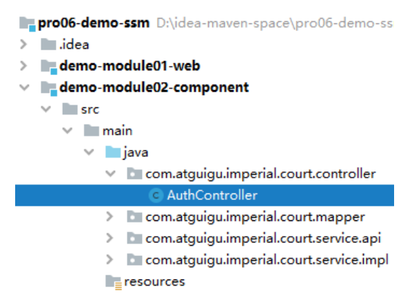
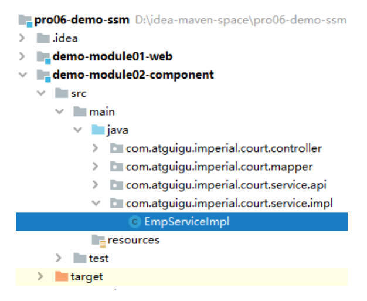
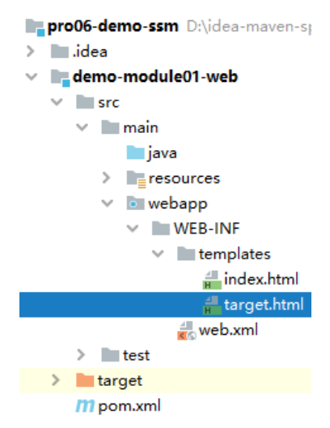

# 第六节 业务功能：登录

## 1、AuthController



```java
@Controller
public class AuthController {

    @Autowired
    private EmpService empService;

    @RequestMapping("/auth/login")
    public String doLogin(
            @RequestParam("loginAccount") String loginAccount,
            @RequestParam("loginPassword") String loginPassword,
            HttpSession session,
            Model model
    ) {

        // 1、尝试查询登录信息
        Emp emp = empService.getEmpByLogin(loginAccount, loginPassword);

        // 2、判断登录是否成功
        if (emp == null) {

            // 3、如果登录失败则回到登录页面显示提示消息
            model.addAttribute("message", ImperialCourtConst.LOGIN_FAILED_MESSAGE);

            return "index";

        } else {

            // 4、如果登录成功则将登录信息存入 Session 域
            session.setAttribute("loginInfo", emp);

            return "target";
        }
    }

}
```

## 2、EmpService



```java
@Service
@Transactional(readOnly = true)
public class EmpServiceImpl implements EmpService {

    @Autowired
    private EmpMapper empMapper;


    @Override
    public Emp getEmpByLogin(String loginAccount, String loginPassword) {

        // 1、密码加密
        String encodedLoginPassword = MD5Util.encode(loginPassword);

        // 2、通过 QBC 查询方式封装查询条件
        EmpExample example = new EmpExample();

        EmpExample.Criteria criteria = example.createCriteria();

        criteria.andLoginAccountEqualTo(loginAccount).andLoginPasswordEqualTo(encodedLoginPassword);

        List<Emp> empList = empMapper.selectByExample(example);

        if (empList != null && empList.size() > 0) {

            // 3、返回查询结果
            return empList.get(0);
        }

        return null;
    }
}
```

## 3、target.html



```html
<!DOCTYPE html>
<html lang="en" xml:th="http://www.thymeleaf.org">
<head>
    <meta charset="UTF-8">
    <title>Title</title>
</head>
<body>

    <p th:text="${session.loginInfo}"></p>

</body>
</html>
```