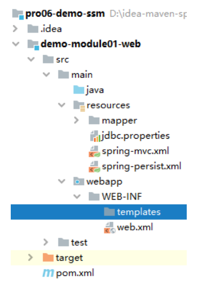
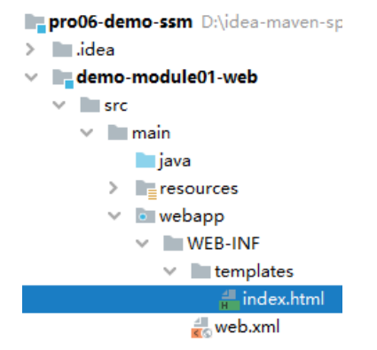

# 第四节 搭建环境：表述层

## 1、设定 Web 工程

[传送门](../../初级篇/第四章使用Maven：IDEA环境/第四节%20创建%20Web%20模块工程.md)

## 2、web.xml 配置

### ①配置 ContextLoaderListener

```xml
<!-- 第一部分：加载 spring-persist.xml 配置文件 -->
<context-param>
    <param-name>contextConfigLocation</param-name>
    <param-value>classpath:spring-persist.xml</param-value>
</context-param>
<listener>
    <listener-class>org.springframework.web.context.ContextLoaderListener</listener-class>
</listener>
```

### ②配置 DispatcherServlet

```xml
<!-- 第二部分：加载 spring-mvc.xml 配置文件 -->
<servlet>
    <servlet-name>dispatcherServlet</servlet-name>
    <servlet-class>org.springframework.web.servlet.DispatcherServlet</servlet-class>
    <init-param>
        <param-name>contextConfigLocation</param-name>
        <param-value>classpath:spring-mvc.xml</param-value>
    </init-param>
    <load-on-startup>1</load-on-startup>
</servlet>
<servlet-mapping>
    <servlet-name>dispatcherServlet</servlet-name>
    <url-pattern>/</url-pattern>
</servlet-mapping>
```

### ③配置 CharacterEncodingFilter

```xml
<!-- 第三部分：设置字符集的 Filter -->
<filter>
    <filter-name>characterEncodingFilter</filter-name>
    <filter-class>org.springframework.web.filter.CharacterEncodingFilter</filter-class>
    <init-param>
        <param-name>encoding</param-name>
        <param-value>UTF-8</param-value>
    </init-param>
    <init-param>
        <param-name>forceRequestEncoding</param-name>
        <param-value>true</param-value>
    </init-param>
    <init-param>
        <param-name>forceResponseEncoding</param-name>
        <param-value>true</param-value>
    </init-param>
</filter>
<filter-mapping>
    <filter-name>characterEncodingFilter</filter-name>
    <url-pattern>/*</url-pattern>
</filter-mapping>
```

### ④配置 HiddenHttpMethodFilter

```xml
<!-- 第四部分：按照 RESTFul 风格负责转换请求方式的 Filter -->
<filter>
    <filter-name>hiddenHttpMethodFilter</filter-name>
    <filter-class>org.springframework.web.filter.HiddenHttpMethodFilter</filter-class>
</filter>
<filter-mapping>
    <filter-name>hiddenHttpMethodFilter</filter-name>
    <url-pattern>/*</url-pattern>
</filter-mapping>
```

## 3、显示首页

### ①配置 SpringMVC

#### [1]标配

```xml
<!-- 开启 SpringMVC 的注解驱动功能 -->
<mvn:annotation-driven />

<!-- 让 SpringMVC 对没有 @RequestMapping 的请求直接放行 -->
<mvc:default-servlet-handler />
```

#### [2]配置视图解析相关

```xml
<!-- 配置视图解析器 -->
<bean id="thymeleafViewResolver" class="org.thymeleaf.spring5.view.ThymeleafViewResolver">
	<property name="order" value="1"/>
	<property name="characterEncoding" value="UTF-8"/>
	<property name="templateEngine">
		<bean class="org.thymeleaf.spring5.SpringTemplateEngine">
			<property name="templateResolver">
				<bean class="org.thymeleaf.spring5.templateresolver.SpringResourceTemplateResolver">
					<property name="prefix" value="/WEB-INF/templates/"/>
					<property name="suffix" value=".html"/>
					<property name="characterEncoding" value="UTF-8"/>
					<property name="templateMode" value="HTML5"/>
				</bean>
			</property>
		</bean>
	</property>
</bean>
```

注意：需要我们自己手动创建 templates 目录。



#### [3]配置自动扫描的包

```xml
<!-- 配置自动扫描的包 -->
<context:component-scan base-package="com.atguigu.imperial.court.controller"/>
```

### ②配置 view-controller 访问首页

```xml
<!-- 配置 view-controller -->
<mvc:view-controller path="/" view-name="index" />
```

### ③创建首页模板文件



```html
<!DOCTYPE html>
<html lang="en" xml:th="http://www.thymeleaf.org">
<head>
    <meta charset="UTF-8">
    <title>首页</title>
</head>
<body>

<!-- @{/auth} 解析后：/demo/auth -->
<form th:action="@{/auth/login}" method="post">

    <!-- th:text 解析表达式后会替换标签体 -->
    <!-- ${attrName} 从请求域获取属性名为 attrName 的属性值 -->
    <p style="color: red;font-weight: bold;" th:text="${message}"></p>
    <p style="color: red;font-weight: bold;" th:text="${systemMessage}"></p>

    账号：<input type="text" name="loginAccount"/><br/>
    密码：<input type="password" name="loginPassword"><br/>
    <button type="submit">进宫</button>
</form>

</body>
</html>
```