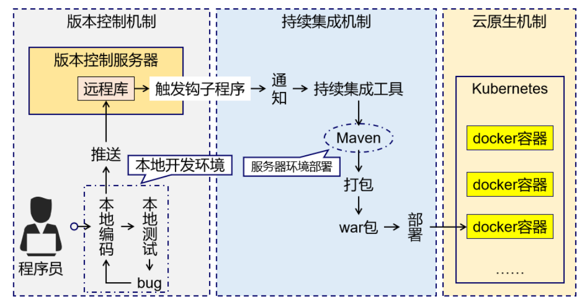
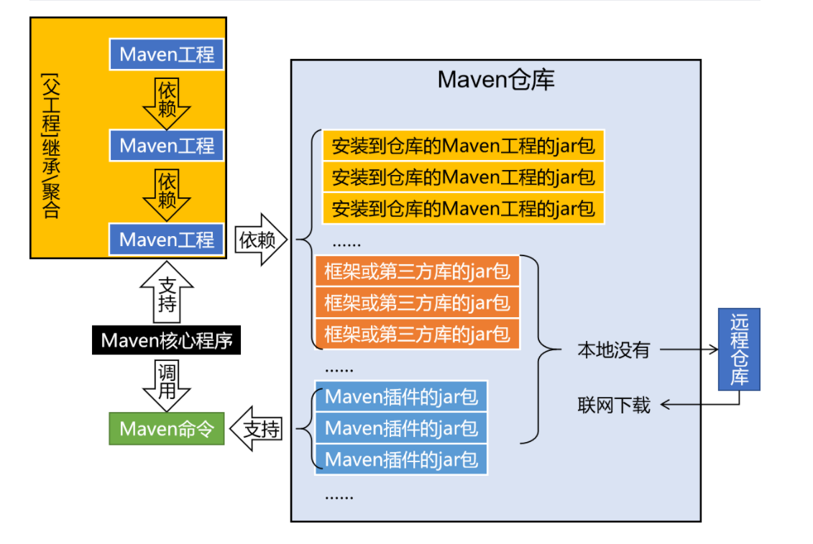

# 第一章 Maven 概述

## 第一节 为什么要学习 Maven

### 1. Maven 作为依赖管理工具

#### 一、jar 包的规模

随着我们使用越来越多的框架，或者框架封装程度越来越高，项目中使用的jar包也越来越多。项目中，一个模块里面用到上百个jar包是非常正常的。

比如下面的例子，我们只用到 SpringBoot、SpringCloud 框架中的三个功能：

* Nacos 服务注册发现
* Web 框架环境
* 图模板技术 Thymeleaf

最终却导入了 106 个 jar 包：

> org.springframework.security:spring-security-rsa:jar:1.0.9.RELEASE:compile  
> com.netflix.ribbon: ribbon:jar:2.3.0:compile  
> org.springframework.boot:spring-boot-starter-thymeleaf:jar:2.3.6.RELEASE:compile  
> commons-configuration:commons-configuration:jar:1.8:compile  
> org.apache.logging.log4j:log4j-api:jar:2.13.3:compile  
> org.springframework:spring-beans:jar:5.2.11.RELEASE:compile  
> org.springframework.cloud:spring-cloud-starter-netflix-ribbon:jar:2.2.6.RELEASE:compile  
> org.apache.tomcat.embed:tomcat-embed-websocket:jar:9.0.39:compile  
> com.alibaba.cloud:spring-cloud-alibaba-commons:jar:2.2.6.RELEASE:compile  
> org.bouncycastle:bcprov-jdk15on:jar:1.64:compile  
> org.springframework.security:spring-security-crypto:jar:5.3.5.RELEASE:compile  
> org.apache.httpcomponents:httpasyncclient:jar:4.1.4:compile  
> com.google.j2objc:j2objc-annotations:jar:1.3:compile  
> com.fasterxml.jackson.core:jackson-databind:jar:2.11.3:compile  
> io.reactivex:rxjava:jar:1.3.8:compile  
> ch.qos.logback:logback-classic:jar:1.2.3:compile  
> org.springframework:spring-web:jar:5.2.11.RELEASE:compile  
> io.reactivex:rxnetty-servo:jar:0.4.9:runtime  
> org.springframework:spring-core:jar:5.2.11.RELEASE:compile  
> io.github.openfeign.form:feign-form-spring:jar:3.8.0:compile  
> io.github.openfeign.form:feign-form:jar:3.8.0:compile  
> com.netflix.ribbon:ribbon-loadbalancer:jar:2.3.0:compile  
> org.apache.httpcomponents:httpcore:jar:4.4.13:compile  
> org.thymeleaf.extras:thymeleaf-extras-java8time:jar:3.0.4.RELEASE:compile  
> org.slf4j:jul-to-slf4j:jar:1.7.30:compile  
> com.atguigu.demo:demo09-base-entity:jar:1.0-SNAPSHOT:compile  
> org.yaml:snakeyaml:jar:1.26:compile  
> org.springframework.boot:spring-boot-starter-logging:jar:2.3.6.RELEASE:compile  
> io.reactivex:rxnetty-contexts:jar:0.4.9:runtime  
> org.apache.httpcomponents:httpclient:jar:4.5.13:compile  
> io.github.openfeign:feign-core:jar:10.10.1:compile  
> org.springframework.boot:spring-boot-starter-aop:jar:2.3.6.RELEASE:compile  
> org.hdrhistogram:HdrHistogram:jar:2.1.9:compile  
> org.springframework:spring-context:jar:5.2.11.RELEASE:compile  
> commons-lang:commons-lang:jar:2.6:compile  
> io.prometheus:simpleclient:jar:0.5.0:compile  
> ch.qos.logback:logback-core:jar:1.2.3:compile  
> org.springframework:spring-webmvc:jar:5.2.11.RELEASE:compile  
> com.sun.jersey:jersey-core:jar:1.19.1:runtime  
> javax.ws.rs:jsr311-api:jar:1.1.1:runtime  
> javax.inject:javax.inject:jar:1:runtime  
> org.springframework.cloud:spring-cloud-openfeign-core:jar:2.2.6.RELEASE:compile  
> com.netflix.ribbon:ribbon-core:jar:2.3.0:compile  
> com.netflix.hystrix:hystrix-core:jar:1.5.18:compile  
> com.netflix.ribbon:ribbon-transport:jar:2.3.0:runtime  
> org.springframework.boot:spring-boot-starter-json:jar:2.3.6.RELEASE:compile  
> org.springframework.cloud:spring-cloud-starter-openfeign:jar:2.2.6.RELEASE:compile  
> com.fasterxml.jackson.module:jackson-module-parameter-names:jar:2.11.3:compile  
> com.sun.jersey.contribs:jersey-apache-client4:jar:1.19.1:runtime  
> io.github.openfeign:feign-hystrix:jar:10.10.1:compile  
> io.github.openfeign:feign-slf4j:jar:10.10.1:compile  
> com.alibaba.nacos:nacos-client:jar:1.4.2:compile  
> org.apache.httpcomponents:httpcore-nio:jar:4.4.13:compile  
> com.sun.jersey:jersey-client:jar:1.19.1:runtime  
> org.springframework.cloud:spring-cloud-context:jar:2.2.6.RELEASE:compile  
> org.glassfish:jakarta.el:jar:3.0.3:compile  
> org.apache.logging.log4j:log4j-to-slf4j:jar:2.13.3:compile  
> com.fasterxml.jackson.datatype:jackson-datatype-jsr310:jar:2.11.3:compile  
> org.springframework.cloud:spring-cloud-commons:jar:2.2.6.RELEASE:compile  
> org.aspectj:aspectjweaver:jar:1.9.6:compile  
> com.alibaba.cloud:spring-cloud-starter-alibaba-nacos-discovery:jar:2.2.6.RELEASE:compile  
> com.google.guava:listenablefuture:jar:9999.0-empty-to-avoid-conflict-with-guava:compile  
> com.alibaba.spring:spring-context-support:jar:1.0.10:compile  
> jakarta.annotation:jakarta.annotation-api:jar:1.3.5:compile  
> org.bouncycastle:bcpkix-jdk15on:jar:1.64:compile  
> com.netflix.netflix-commons:netflix-commons-util:jar:0.3.0:runtime  
> com.fasterxml.jackson.core:jackson-annotations:jar:2.11.3:compile  
> com.google.guava:guava:jar:29.0-jre:compile  
> com.google.guava:failureaccess:jar:1.0.1:compile  
> org.springframework.boot:spring-boot:jar:2.3.6.RELEASE:compile  
> com.fasterxml.jackson.datatype:jackson-datatype-jdk8:jar:2.11.3:compile  
> com.atguigu.demo:demo08-base-api:jar:1.0-SNAPSHOT:compile  
> org.springframework.cloud:spring-cloud-starter-netflix-archaius:jar:2.2.6.RELEASE:compile  
> org.springframework.boot:spring-boot-autoconfigure:jar:2.3.6.RELEASE:compile  
> org.slf4j:slf4j-api:jar:1.7.30:compile  
> commons-io:commons-io:jar:2.7:compile  
> org.springframework.cloud:spring-cloud-starter:jar:2.2.6.RELEASE:compile  
> org.apache.tomcat.embed:tomcat-embed-core:jar:9.0.39:compile  
> io.reactivex:rxnetty:jar:0.4.9:runtime  
> com.fasterxml.jackson.core:jackson-core:jar:2.11.3:compile  
> com.google.code.findbugs:jsr305:jar:3.0.2:compile  
> com.netflix.archaius:archaius-core:jar:0.7.6:compile  
> org.springframework.boot:spring-boot-starter-web:jar:2.3.6.RELEASE:compile  
> commons-codec:commons-codec:jar:1.14:compile  
> com.netflix.servo:servo-core:jar:0.12.21:runtime  
> com.google.errorprone:error_prone_annotations:jar:2.3.4:compile  
> org.attoparser:attoparser:jar:2.0.5.RELEASE:compile  
> com.atguigu.demo:demo10-base-util:jar:1.0-SNAPSHOT:compile  
> org.checkerframework:checker-qual:jar:2.11.1:compile  
> org.thymeleaf:thymeleaf-spring5:jar:3.0.11.RELEASE:compile  
> commons-fileupload:commons-fileupload:jar:1.4:compile  
> com.netflix.ribbon:ribbon-httpclient:jar:2.3.0:compile  
> com.netflix.netflix-commons:netflix-statistics:jar:0.1.1:runtime  
> org.unbescape:unbescape:jar:1.1.6.RELEASE:compile  
> org.springframework:spring-jcl:jar:5.2.11.RELEASE:compile  
> com.alibaba.nacos:nacos-common:jar:1.4.2:compile  
> commons-collections:commons-collections:jar:3.2.2:runtime  
> javax.persistence:persistence-api:jar:1.0:compile  
> com.alibaba.nacos:nacos-api:jar:1.4.2:compile  
> org.thymeleaf:thymeleaf:jar:3.0.11.RELEASE:compile  
> org.springframework:spring-aop:jar:5.2.11.RELEASE:compile  
> org.springframework.boot:spring-boot-starter:jar:2.3.6.RELEASE:compile  
> org.springframework.boot:spring-boot-starter-tomcat:jar:2.3.6.RELEASE:compile  
> org.springframework.cloud:spring-cloud-netflix-ribbon:jar:2.2.6.RELEASE:compile  
> org.springframework:spring-expression:jar:5.2.11.RELEASE:compile  
> org.springframework.cloud:spring-cloud-netflix-archaius:jar:2.2.6.RELEASE:compile

而如果使用 Maven 来引入这些 jar 包只需要配置三个`依赖`：

```xml
<!-- Nacos 服务注册发现启动器 -->
<dependency>
    <groupId>com.alibaba.cloud</groupId>
    <artifactId>spring-cloud-starter-alibaba-nacos-discovery</artifactId>
</dependency>

<!-- web启动器依赖 -->
<dependency>
<groupId>org.springframework.boot</groupId>
<artifactId>spring-boot-starter-web</artifactId>
</dependency>

<!-- 视图模板技术 thymeleaf -->
<dependency>
<groupId>org.springframework.boot</groupId>
<artifactId>spring-boot-starter-thymeleaf</artifactId>
</dependency>
```

#### 二、 jar 包的来源

* jar包所属技术的官网，通常是英文界面，网站的结构又不尽相同，甚至找到下载链接还发现需要通过特殊的工具下载。

* 第三方网站提供下载。问题是不规范，在使用过程中会出现各种问题。

  - jar包的名称
  - jar包的版本
  - jar包内的具体细节

* 而使用 Maven 后，依赖对应的 jar 包能够自动下载，方便、快捷又规范。

#### 三、jar 包之间的依赖关系

框架中使用的 jar 包，不仅数量庞大，而且彼此之间存在错综复杂的依赖关系。依赖关系的复杂程度，已经上升到了完全不能靠人力手动解决的程度。另外，jar 包之间有可能产生冲突。进一步增加了我们在 jar 包使用过程中的难度。

而实际上 jar 包之间的依赖关系是普遍存在的，如果要由程序员手动梳理无疑会增加极高的学习成本，而这些工作又对实现业务功能毫无帮助。

而使用 Maven 则几乎不需要管理这些关系，极个别的地方调整一下即可，极大的减轻了我们的工作量。

### 2. Maven 作为构建管理工具

#### 一、你没有注意过的构建

你可以不使用 Maven，但是构建必须要做。当我们使用 IDEA 进行开发时，构建是 IDEA 替我们做的。

#### 二、脱离 IDE 环境仍需构建



### 3. 结论

* 管理规模庞大的 jar 包，需要专门工具。
* 脱离 IDE 环境执行构建操作，需要专门工具。

## 第二节 什么是 Maven

Maven 是 Apache 软件基金会组织维护的一款专门为 Java 项目提供构建和依赖管理支持的工具。


### 1. 构建

Java 项目开发过程中，构建指的是使用`原材料生产产品`的过程。

* 原材料

  - Java 源代码

  - 基于 HTML 的 Thymeleaf 文件

  - 图片

  - 配置文件

  - ...

* 产品

  - 一个可以在服务器上运行的项目

构建过程包含的主要的环节：

* 清理：删除上一次构建的结果，为下一次构建做好准备
* 编译：Java 源程序编译成 *.class 字节码文件
* 测试：运行提前准备好的测试程序
* 报告：针对刚才测试的结果生成一个全面的信息
* 打包
  - Java工程：jar包
  - Web工程：war包
* 安装：把一个 Maven 工程经过打包操作生成的 jar 包或 war 包存入 Maven 仓库
* 部署
  - 部署 jar 包：把一个 jar 包部署到 Nexus 私服服务器上
  - 部署 war 包：借助相关 Maven 插件（例如 cargo），将 war 包部署到 Tomcat 服务器上
  
### 2. 依赖

如果 A 工程里面用到了 B 工程的类、接口、配置文件等等这样的资源，那么我们就可以说 A 依赖 B。例如：

* junit-4.12 依赖 hamcrest-core-1.3
* thymeleaf-3.0.12.RELEASE 依赖 ognl-3.1.26
  - ognl-3.1.26 依赖 javassist-3.20.0-GA
* thymeleaf-3.0.12.RELEASE 依赖 attoparser-2.0.5.RELEASE
* thymeleaf-3.0.12.RELEASE 依赖 unbescape-1.1.6.RELEASE
* thymeleaf-3.0.12.RELEASE 依赖 slf4j-api-1.7.26

依赖管理中要解决的具体问题：

* jar 包的下载：使用 Maven 之后，jar 包会从规范的远程仓库下载到本地
* jar 包之间的依赖：通过依赖的传递性自动完成
* jar 包之间的冲突：通过对依赖的配置进行调整，让某些jar包不会被导入

### 3. Maven 的工作机制

