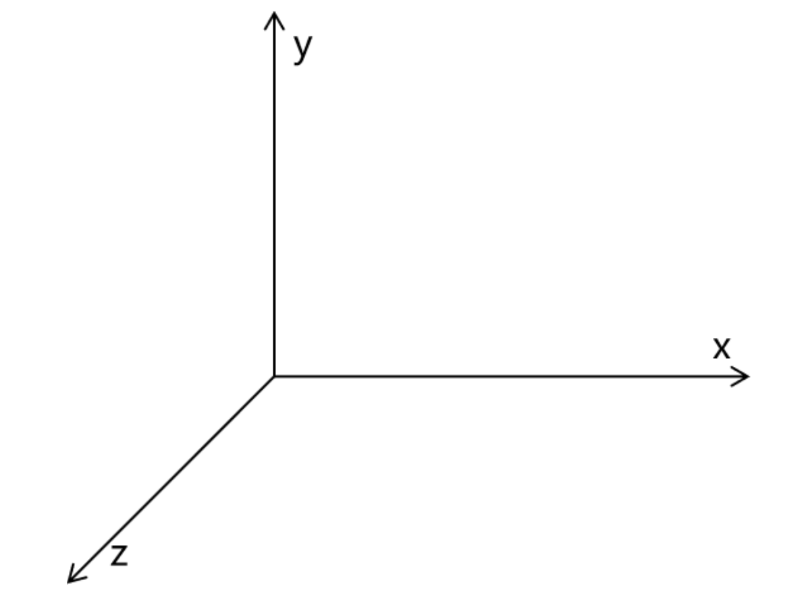
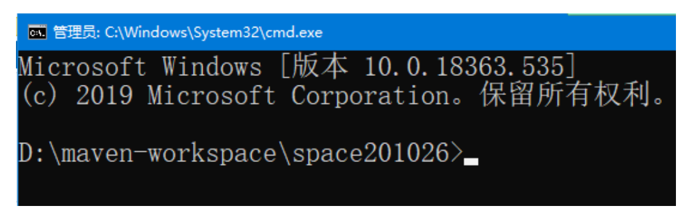
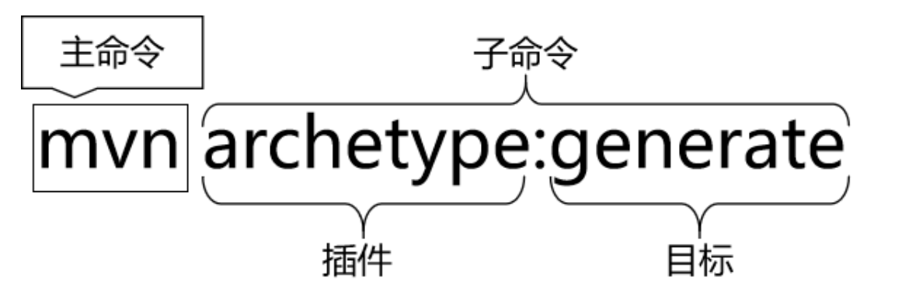
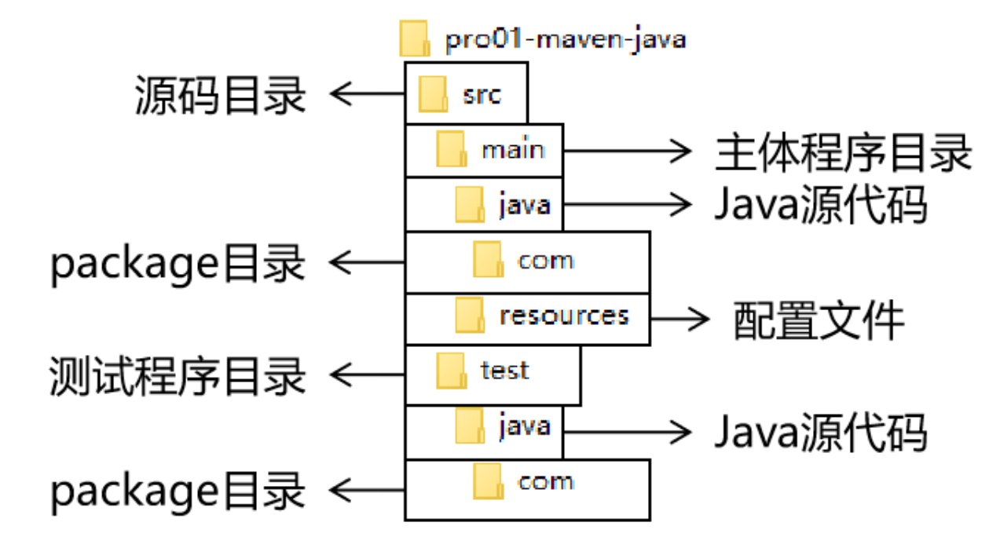

# 第一节 根据坐标创建 Maven 工程

## 1、Maven 核心概念：坐标

### ①数学中的坐标



使用 x、y、z 三个『向量』作为空间的坐标系，可以在『空间』中唯一的定位到一个『点』。

### ②Maven中的坐标

#### [1]向量说明

使用三个『向量』在『Maven的仓库』中唯一的定位到一个『jar』包。

* groupId：公司或组织的 id
* artifactId：一个项目或者是项目中的一个模块的 id
* version：版本号

#### [2]三个向量的取值方式

* groupId：公司或组织域名的倒序，通常也会加上项目名称
  - 例如：com.atguigu.maven
* artifactId：模块的名称，将来作为 Maven 工程的工程名
* version：模块的版本号，根据自己的需要设定
  - 例如：SNAPSHOT 表示快照版本，正在迭代过程中，不稳定的版本
  - 例如：RELEASE 表示正式版本
  
举例：

* groupId：com.atguigu.maven
* artifactId：pro01-atguigu-maven
* version：1.0-SNAPSHOT

### ③坐标和仓库中 jar 包的存储路径之间的对应关系

坐标：

```xml
<groupId>javax.servlet</groupId>
<artifactId>servlet-api</artifactId>
<version>2.5</version>
```

上面坐标对应的 jar 包在 Maven 本地仓库中的位置：

```text
Maven本地仓库根目录\javax\servlet\servlet-api\2.5\servlet-api-2.5.jar
```

## 2、实验操作

### ①创建目录作为后面操作的工作空间

例如：D:\maven-workspace\space201026

> WARNING
>
> 此时我们已经有了三个目录，分别是：
>
> Maven 核心程序：中军大帐
> 
> Maven 本地仓库：兵营
> 
> 本地工作空间：战场

### ②在工作空间目录下打开命令行窗口



### ③使用命令生成Maven工程



运行 mvn archetype:generate 命令

下面根据提示操作：

```text
Choose a number or apply filter (format: [groupId:]artifactId, case sensitive contains): 7:【直接回车，使用默认值】

Define value for property 'groupId': com.atguigu.maven

Define value for property 'artifactId': pro01-maven-java

Define value for property 'version' 1.0-SNAPSHOT: :【直接回车，使用默认值】

Define value for property 'package' com.atguigu.maven: :【直接回车，使用默认值】

Confirm properties configuration: groupId: com.atguigu.maven artifactId: pro01-maven-java version: 1.0-SNAPSHOT package: com.atguigu.maven Y: :【直接回车，表示确认。如果前面有输入错误，想要重新输入，则输入 N 再回车。】
```

### ④调整

Maven 默认生成的工程，对 junit 依赖的是较低的 3.8.1 版本，我们可以改成较适合的 4.12 版本。

自动生成的 App.java 和 AppTest.java 可以删除。

```xml
<!-- 依赖信息配置 -->
<!-- dependencies复数标签：里面包含dependency单数标签 -->
<dependencies>
    <!-- dependency单数标签：配置一个具体的依赖 -->
    <dependency>
        <!-- 通过坐标来依赖其他jar包 -->
        <groupId>junit</groupId>
        <artifactId>junit</artifactId>
        <version>4.12</version>

        <!-- 依赖的范围 -->
        <scope>test</scope>
    </dependency>
</dependencies>
```

### ⑤解读自动生成的 pom.xml

```xml
 <!-- 当前Maven工程的坐标 -->
<groupId>com.atguigu.maven</groupId>
<artifactId>pro01-maven-java</artifactId>
<version>1.0-SNAPSHOT</version>

        <!-- 当前Maven工程的打包方式，可选值有下面三种： -->
        <!-- jar：表示这个工程是一个Java工程  -->
        <!-- war：表示这个工程是一个Web工程 -->
        <!-- pom：表示这个工程是“管理其他工程”的工程 -->
<packaging>jar</packaging>

<name>pro01-maven-java</name>
<url>http://maven.apache.org</url>

<properties>
<!-- 工程构建过程中读取源码时使用的字符集 -->
<project.build.sourceEncoding>UTF-8</project.build.sourceEncoding>
</properties>

        <!-- 当前工程所依赖的jar包 -->
<dependencies>
<!-- 使用dependency配置一个具体的依赖 -->
<dependency>

    <!-- 在dependency标签内使用具体的坐标依赖我们需要的一个jar包 -->
    <groupId>junit</groupId>
    <artifactId>junit</artifactId>
    <version>4.12</version>

    <!-- scope标签配置依赖的范围 -->
    <scope>test</scope>
</dependency>
</dependencies>
```

## 3、Maven核心概念：POM

### ①含义

POM：Project Object Model，项目对象模型。和 POM 类似的是：DOM（Document Object Model），文档对象模型。它们都是模型化思想的具体体现。

### ②模型化思想

POM 表示将工程抽象为一个模型，再用程序中的对象来描述这个模型。这样我们就可以用程序来管理项目了。我们在开发过程中，最基本的做法就是将现实生活中的事物抽象为模型，然后封装模型相关的数据作为一个对象，这样就可以在程序中计算与现实事物相关的数据。

### ③对应的配置文件

POM 理念集中体现在 Maven 工程根目录下 pom.xml 这个配置文件中。所以这个 pom.xml 配置文件就是 Maven 工程的核心配置文件。其实学习 Maven 就是学这个文件怎么配置，各个配置有什么用。

## 4、Maven核心概念：约定的目录结构

### ①各个目录的作用



### ②约定目录结构的意义

Maven 为了让构建过程能够尽可能自动化完成，所以必须约定目录结构的作用。例如：Maven 执行编译操作，必须先去 Java 源程序目录读取 Java 源代码，然后执行编译，最后把编译结果存放在 target 目录。

### ③约定大于配置

Maven 对于目录结构这个问题，没有采用配置的方式，而是基于约定。这样会让我们在开发过程中非常方便。如果每次创建 Maven 工程后，还需要针对各个目录的位置进行详细的配置，那肯定非常麻烦。

目前开发领域的技术发展趋势就是：约定大于配置，配置大于编码。