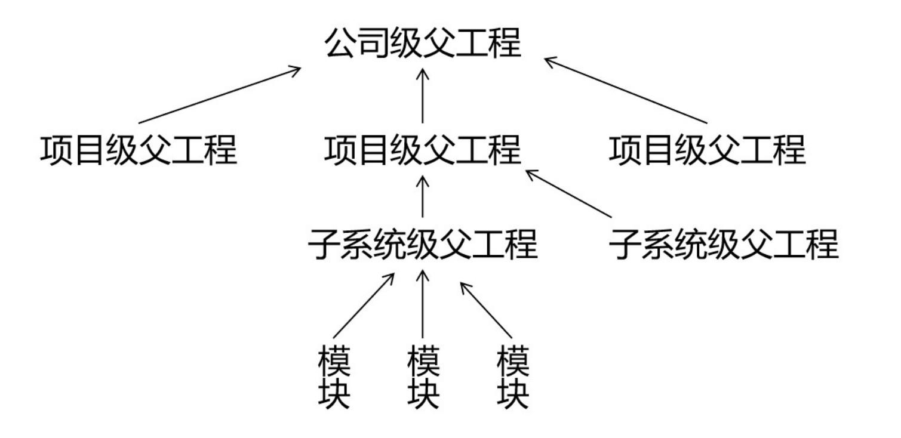

# 第九节 继承

## 1、概念

Maven工程之间，A 工程继承 B 工程

* B 工程：父工程
* A 工程：子工程

本质上是 A 工程的 pom.xml 中的配置继承了 B 工程中 pom.xml 的配置。

## 2、作用

在父工程中统一管理项目中的依赖信息，具体来说是管理依赖信息的版本。

它的背景是：

* 对一个比较大型的项目进行了模块拆分。
* 一个 project 下面，创建了很多个 module。
* 每一个 module 都需要配置自己的依赖信息。

它背后的需求是：

* 在每一个 module 中各自维护各自的依赖信息很容易发生出入，不易统一管理。
* 使用同一个框架内的不同 jar 包，它们应该是同一个版本，所以整个项目中使用的框架版本需要统一。
* 使用框架时所需要的 jar 包组合（或者说依赖信息组合）需要经过长期摸索和反复调试，最终确定一个可用组合。这个耗费很大精力总结出来的方案不应该在新的项目中重新摸索。
* 
通过在父工程中为整个项目维护依赖信息的组合既保证了整个项目使用规范、准确的 jar 包；又能够将以往的经验沉淀下来，节约时间和精力。

#3、举例

在一个工程中依赖多个 Spring 的 jar 包

```text
[INFO] +- org.springframework:spring-core:jar:4.0.0.RELEASE:compile
[INFO] | \- commons-logging:commons-logging:jar:1.1.1:compile
[INFO] +- org.springframework:spring-beans:jar:4.0.0.RELEASE:compile
[INFO] +- org.springframework:spring-context:jar:4.0.0.RELEASE:compile
[INFO] +- org.springframework:spring-expression:jar:4.0.0.RELEASE:compile
[INFO] +- org.springframework:spring-aop:jar:4.0.0.RELEASE:compile
[INFO] | \- aopalliance:aopalliance:jar:1.0:compile
```

使用 Spring 时要求所有 Spring 自己的 jar 包版本必须一致。为了能够对这些 jar 包的版本进行统一管理，我们使用继承这个机制，将所有版本信息统一在父工程中进行管理。

## 4、操作

### ①创建父工程

创建的过程和前面创建 pro01-maven-java 一样。

工程名称：pro03-maven-parent

工程创建好之后，要修改它的打包方式：

```xml
<groupId>com.atguigu.maven</groupId>
<artifactId>pro03-maven-parent</artifactId>
<version>1.0-SNAPSHOT</version>

<!-- 当前工程作为父工程，它要去管理子工程，所以打包方式必须是 pom -->
<packaging>pom</packaging>
```

只有打包方式为 pom 的 Maven 工程能够管理其他 Maven 工程。打包方式为 pom 的 Maven 工程中不写业务代码，它是专门管理其他 Maven 工程的工程。

### ②创建模块工程

模块工程类似于 IDEA 中的 module，所以需要进入 pro03-maven-parent 工程的根目录，然后运行 mvn archetype:generate 命令来创建模块工程。

假设，我们创建三个模块工程：


### ③查看被添加新内容的父工程 pom.xml

下面 modules 和 module 标签是聚合功能的配置

```xml
<modules>  
	<module>pro04-maven-module</module>
	<module>pro05-maven-module</module>
	<module>pro06-maven-module</module>
</modules>
```

### ④解读子工程的pom.xml

```xml
<!-- 使用parent标签指定当前工程的父工程 -->
<parent>
	<!-- 父工程的坐标 -->
	<groupId>com.atguigu.maven</groupId>
	<artifactId>pro03-maven-parent</artifactId>
	<version>1.0-SNAPSHOT</version>
</parent>

<!-- 子工程的坐标 -->
<!-- 如果子工程坐标中的groupId和version与父工程一致，那么可以省略 -->
<!-- <groupId>com.atguigu.maven</groupId> -->
<artifactId>pro04-maven-module</artifactId>
<!-- <version>1.0-SNAPSHOT</version> -->
```

### ⑤在父工程中配置依赖的统一管理


```xml
<!-- 使用dependencyManagement标签配置对依赖的管理 -->
<!-- 被管理的依赖并没有真正被引入到工程 -->
<dependencyManagement>
	<dependencies>
		<dependency>
			<groupId>org.springframework</groupId>
			<artifactId>spring-core</artifactId>
			<version>4.0.0.RELEASE</version>
		</dependency>
		<dependency>
			<groupId>org.springframework</groupId>
			<artifactId>spring-beans</artifactId>
			<version>4.0.0.RELEASE</version>
		</dependency>
		<dependency>
			<groupId>org.springframework</groupId>
			<artifactId>spring-context</artifactId>
			<version>4.0.0.RELEASE</version>
		</dependency>
		<dependency>
			<groupId>org.springframework</groupId>
			<artifactId>spring-expression</artifactId>
			<version>4.0.0.RELEASE</version>
		</dependency>
		<dependency>
			<groupId>org.springframework</groupId>
			<artifactId>spring-aop</artifactId>
			<version>4.0.0.RELEASE</version>
		</dependency>
	</dependencies>
</dependencyManagement>
```

### ⑥子工程中引用那些被父工程管理的依赖

关键点：省略版本号

```xml
<!-- 子工程引用父工程中的依赖信息时，可以把版本号去掉。	-->
<!-- 把版本号去掉就表示子工程中这个依赖的版本由父工程决定。 -->
<!-- 具体来说是由父工程的dependencyManagement来决定。 -->
<dependencies>
	<dependency>
		<groupId>org.springframework</groupId>
		<artifactId>spring-core</artifactId>
	</dependency>
	<dependency>
		<groupId>org.springframework</groupId>
		<artifactId>spring-beans</artifactId>
	</dependency>
	<dependency>
		<groupId>org.springframework</groupId>
		<artifactId>spring-context</artifactId>
	</dependency>
	<dependency>
		<groupId>org.springframework</groupId>
		<artifactId>spring-expression</artifactId>
	</dependency>
	<dependency>
		<groupId>org.springframework</groupId>
		<artifactId>spring-aop</artifactId>
	</dependency>
</dependencies>
```

### ⑦在父工程中升级依赖信息的版本

```xml
……
			<dependency>
				<groupId>org.springframework</groupId>
				<artifactId>spring-beans</artifactId>
				<version>4.1.4.RELEASE</version>
			</dependency>
……
```

然后在子工程中运行mvn dependency:list，效果如下：

```xml
[INFO] org.springframework:spring-aop:jar:4.1.4.RELEASE:compile
[INFO] org.springframework:spring-core:jar:4.1.4.RELEASE:compile
[INFO] org.springframework:spring-context:jar:4.1.4.RELEASE:compile
[INFO] org.springframework:spring-beans:jar:4.1.4.RELEASE:compile
[INFO] org.springframework:spring-expression:jar:4.1.4.RELEASE:compile
```

### ⑧在父工程中声明自定义属性

```xml
<!-- 通过自定义属性，统一指定Spring的版本 -->
<properties>
	<project.build.sourceEncoding>UTF-8</project.build.sourceEncoding>
	
	<!-- 自定义标签，维护Spring版本数据 -->
	<atguigu.spring.version>4.3.6.RELEASE</atguigu.spring.version>
</properties>
```

在需要的地方使用${}的形式来引用自定义的属性名：

```xml
<dependency>
    <groupId>org.springframework</groupId>
    <artifactId>spring-core</artifactId>
    <version>${atguigu.spring.version}</version>
</dependency>
```

真正实现“一处修改，处处生效”。

## 5、实际意义



编写一套符合要求、开发各种功能都能正常工作的依赖组合并不容易。如果公司里已经有人总结了成熟的组合方案，那么再开发新项目时，如果不使用原有的积累，而是重新摸索，会浪费大量的时间。为了提高效率，我们可以使用工程继承的机制，让成熟的依赖组合方案能够保留下来。

如上图所示，公司级的父工程中管理的就是成熟的依赖组合方案，各个新项目、子系统各取所需即可。