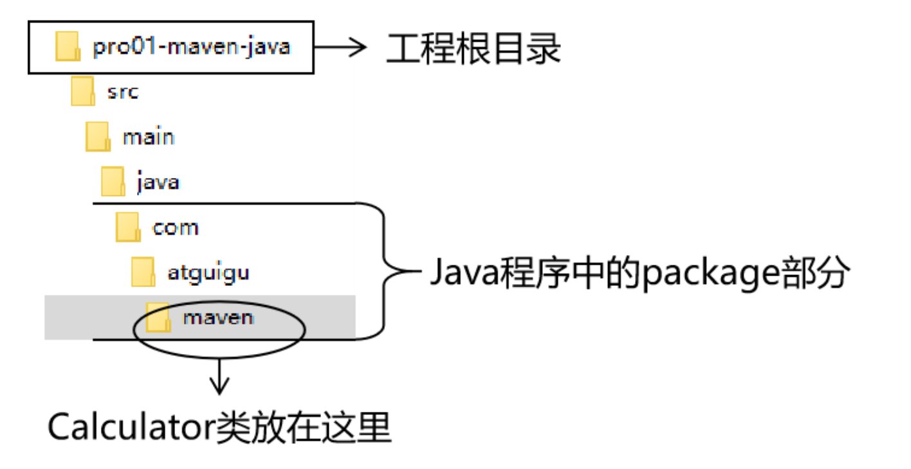
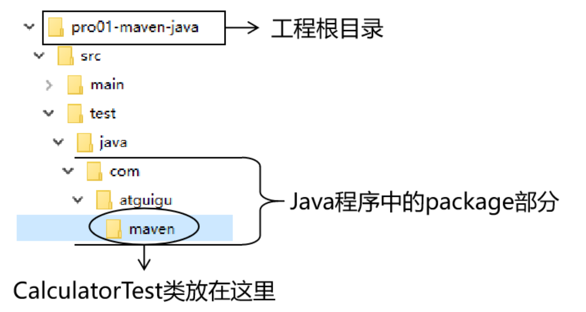

# 第二节 在 Maven 工程中编写代码

## 1、主体程序



主体程序指的是被测试的程序，同时也是将来在项目中真正要使用的程序。

```java
package com.atguigu.maven;
	
public class Calculator {
	
	public int sum(int i, int j){
		return i + j;
	}
	
}
```

## 2、测试程序



```java
package com.atguigu.maven;
	
import org.junit.Test;
import com.atguigu.maven.Calculator;
	
// 静态导入的效果是将Assert类中的静态资源导入当前类
// 这样一来，在当前类中就可以直接使用Assert类中的静态资源，不需要写类名
import static org.junit.Assert.*;
	
public class CalculatorTest{
	
	@Test
	public void testSum(){
		
		// 1.创建Calculator对象
		Calculator calculator = new Calculator();
		
		// 2.调用Calculator对象的方法，获取到程序运行实际的结果
		int actualResult = calculator.sum(5, 3);
		
		// 3.声明一个变量，表示程序运行期待的结果
		int expectedResult = 8;
		
		// 4.使用断言来判断实际结果和期待结果是否一致
		// 如果一致：测试通过，不会抛出异常
		// 如果不一致：抛出异常，测试失败
		assertEquals(expectedResult, actualResult);
		
	}
	
}
```