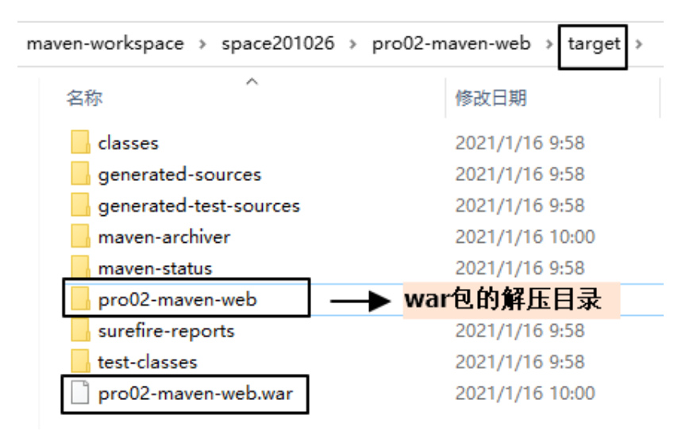
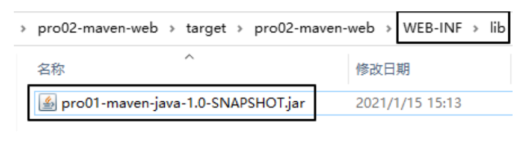

# 第五节 让 Web 工程依赖 Java 工程

## 1、观念

明确一个意识：从来只有 Web 工程依赖 Java 工程，没有反过来 Java 工程依赖 Web 工程。本质上来说，Web 工程依赖的 Java 工程其实就是 Web 工程里导入的 jar 包。最终 Java 工程会变成 jar 包，放在 Web 工程的 WEB-INF/lib 目录下。

## 2、操作

在 pro02-maven-web 工程的 pom.xml 中，找到 dependencies 标签，在 dependencies 标签中做如下配置：

```xml
<!-- 配置对Java工程pro01-maven-java的依赖 -->
<!-- 具体的配置方式：在dependency标签内使用坐标实现依赖 -->
<dependency>
	<groupId>com.atguigu.maven</groupId>
	<artifactId>pro01-maven-java</artifactId>
	<version>1.0-SNAPSHOT</version>
</dependency>
```

## 3、在 Web 工程中，编写测试代码

### ①补充创建目录

pro02-maven-web\src\test\java\com\atguigu\maven

### ②确认 Web 工程依赖了 junit

```xml
<dependency>
    <groupId>junit</groupId>
    <artifactId>junit</artifactId>
    <version>4.12</version>
    <scope>test</scope>
</dependency>
```

### ③创建测试类

把 Java 工程的 CalculatorTest.java 类复制到 pro02-maven-wb\src\test\java\com\atguigu\maven 目录下

## 4、执行Maven命令

### ①测试命令

mvn test

说明：测试操作中会提前自动执行编译操作，测试成功就说明编译也是成功的。

### ②打包命令

mvn package



通过查看 war 包内的结构，我们看到被 Web 工程依赖的 Java 工程确实是会变成 Web 工程的 WEB-INF/lib 目录下的 jar 包。



### ③查看当前 Web 工程所依赖的 jar 包的列表

mvn dependency:list

```text
[INFO] The following files have been resolved:
[INFO] org.hamcrest:hamcrest-core:jar:1.3:test
[INFO] javax.servlet:javax.servlet-api:jar:3.1.0:provided
[INFO] com.atguigu.maven:pro01-maven-java:jar:1.0-SNAPSHOT:compile
[INFO] junit:junit:jar:4.12:test
```

说明：javax.servlet:javax.servlet-api:jar:3.1.0:provided 格式显示的是一个 jar 包的坐标信息。格式是：`groupId:artifactId:打包方式:version:依赖的范围`

这样的格式虽然和我们 XML 配置文件中坐标的格式不同，但是本质上还是坐标信息，大家需要能够认识这样的格式，将来从 Maven 命令的日志或错误信息中看到这样格式的信息，就能够识别出来这是坐标。进而根据坐标到Maven 仓库找到对应的jar包，用这样的方式解决我们遇到的报错的情况。

### ④以树形结构查看当前 Web 工程的依赖信息

mvn dependency:tree

```text
[INFO] com.atguigu.maven:pro02-maven-web:war:1.0-SNAPSHOT
[INFO] +- junit:junit:jar:4.12:test
[INFO] | \- org.hamcrest:hamcrest-core:jar:1.3:test
[INFO] +- javax.servlet:javax.servlet-api:jar:3.1.0:provided
[INFO] \- com.atguigu.maven:pro01-maven-java:jar:1.0-SNAPSHOT:compile
```

我们在 pom.xml 中并没有依赖 hamcrest-core，但是它却被加入了我们依赖的列表。原因是：junit 依赖了hamcrest-core，然后基于依赖的传递性，hamcrest-core 被传递到我们的工程了。