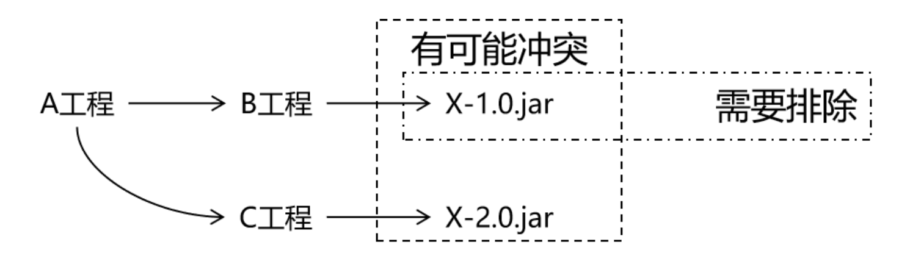

# 第八节 测试依赖的排除

## 1、概念

当 A 依赖 B，B 依赖 C 而且 C 可以传递到 A 的时候，A 不想要 C，需要在 A 里面把 C 排除掉。而往往这种情况都是为了避免 jar 包之间的冲突。



所以配置依赖的排除其实就是阻止某些 jar 包的传递。因为这样的 jar 包传递过来会和其他 jar 包冲突。

## 2、配置方式

```xml
<dependency>
	<groupId>com.atguigu.maven</groupId>
	<artifactId>pro01-maven-java</artifactId>
	<version>1.0-SNAPSHOT</version>
	<scope>compile</scope>
	<!-- 使用excludes标签配置依赖的排除	-->
	<exclusions>
		<!-- 在exclude标签中配置一个具体的排除 -->
		<exclusion>
			<!-- 指定要排除的依赖的坐标（不需要写version） -->
			<groupId>commons-logging</groupId>
			<artifactId>commons-logging</artifactId>
		</exclusion>
	</exclusions>
</dependency>
```

## 3、测试

测试的方式：在 pro02-maven-web 工程中配置对 commons-logging 的排除

```xml
<dependency>
	<groupId>com.atguigu.maven</groupId>
	<artifactId>pro01-maven-java</artifactId>
	<version>1.0-SNAPSHOT</version>
	<scope>compile</scope>
	<!-- 使用excludes标签配置依赖的排除	-->
	<exclusions>
		<!-- 在exclude标签中配置一个具体的排除 -->
		<exclusion>
			<!-- 指定要排除的依赖的坐标（不需要写version） -->
			<groupId>commons-logging</groupId>
			<artifactId>commons-logging</artifactId>
		</exclusion>
	</exclusions>
</dependency>
```

运行 mvn dependency:tree 命令查看效果：

```text
[INFO] com.atguigu.maven:pro02-maven-web:war:1.0-SNAPSHOT
[INFO] +- junit:junit:jar:4.12:test
[INFO] | \- org.hamcrest:hamcrest-core:jar:1.3:test
[INFO] +- javax.servlet:javax.servlet-api:jar:3.1.0:provided
[INFO] \- com.atguigu.maven:pro01-maven-java:jar:1.0-SNAPSHOT:compile
[INFO] \- org.springframework:spring-core:jar:4.0.0.RELEASE:compile
```

发现在 spring-core 下面就没有 commons-logging 了。