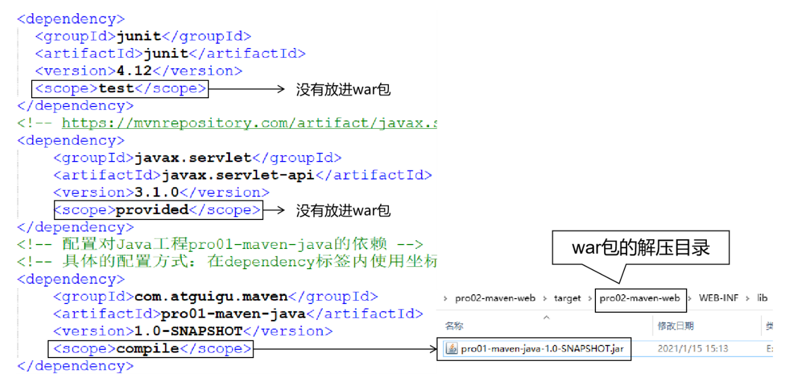

# 第六节 测试依赖范围

## 1、依赖范围

标签的位置：dependencies/dependency/scope

标签的可选值：**compile/test/provided**/system/runtime/import

### 对比

|          | main目录（空间） | test目录（空间） | 开发过程（时间） | 部署到服务器（时间） |
|:--------:|:----------:|:----------:|:--------:|:----------:|
| compile  |     有效     |     有效     |    有效    |     有效     |
|   test   |     无效     |     有效     |    有效    |     无效     |
| provided |     有效     |     有效     |    有效    |     无效     |


### 结论

compile：通常使用的第三方框架的 jar 包这样在项目实际运行时真正要用到的 jar 包都是以 compile 范围进行依赖的。比如 SSM 框架所需jar包。

test：测试过程中使用的 jar 包，以 test 范围依赖进来。比如 junit。

provided：在开发过程中需要用到的“服务器上的 jar 包”通常以 provided 范围依赖进来。比如 servlet-api、jsp-api。而这个范围的 jar 包之所以不参与部署、不放进 war 包，就是避免和服务器上已有的同类 jar 包产生冲突，同时减轻服务器的负担。说白了就是：“服务器上已经有了，你就别带啦！”

## 2、测试

### ①验证 compile 范围对 main 目录有效

main目录下的类：HelloServlet 使用compile范围导入的依赖：pro01-atguigu-maven

验证：使用compile范围导入的依赖对main目录下的类来说是有效的

有效：HelloServlet 能够使用 pro01-atguigu-maven 工程中的 Calculator 类

验证方式：在 HelloServlet 类中导入 Calculator 类，然后编译就说明有效。

### ②验证test范围对main目录无效

测试方式：在主体程序中导入org.junit.Test这个注解，然后执行编译。

具体操作：在pro01-maven-java\src\main\java\com\atguigu\maven目录下修改Calculator.java

```java
package com.atguigu.maven;

import org.junit.Test;

public class Calculator {

    public int sum(int i, int j){
        return i + j;
    }

}
```

执行Maven编译命令：

```text
[ERROR] /D:/maven-workspace/space201026/pro01-maven-java/src/main/java/com/atguigu/maven/Calculator.java:[3,17] 程序包org.junit不存在
```

### ③验证test和provided范围不参与服务器部署

其实就是验证：通过compile范围依赖的jar包会放入war包，通过test范围依赖的jar包不会放入war包。



### ④验证provided范围对测试程序有效

测试方式是在pro02-maven-web的测试程序中加入servlet-api.jar包中的类。

修改：pro02-maven-web\src\test\java\com\atguigu\maven\CalculatorTest.java

```java
package com.atguigu.maven;

import javax.servlet.http.HttpServlet;
import javax.servlet.http.HttpServletRequest;
import javax.servlet.http.HttpServletResponse;
import javax.servlet.ServletException;

import org.junit.Test;
import com.atguigu.maven.Calculator;

// 静态导入的效果是将Assert类中的静态资源导入当前类
// 这样一来，在当前类中就可以直接使用Assert类中的静态资源，不需要写类名
import static org.junit.Assert.*;

public class CalculatorTest{
	
	@Test
	public void testSum(){
		
		// 1.创建Calculator对象
		Calculator calculator = new Calculator();
		
		// 2.调用Calculator对象的方法，获取到程序运行实际的结果
		int actualResult = calculator.sum(5, 3);
		
		// 3.声明一个变量，表示程序运行期待的结果
		int expectedResult = 8;
		
		// 4.使用断言来判断实际结果和期待结果是否一致
		// 如果一致：测试通过，不会抛出异常
		// 如果不一致：抛出异常，测试失败
		assertEquals(expectedResult, actualResult);
		
	}
	
}
```

然后运行Maven的编译命令：mvn compile

然后看到编译成功。