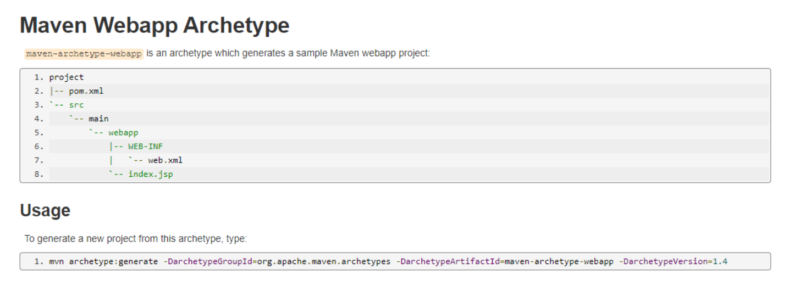
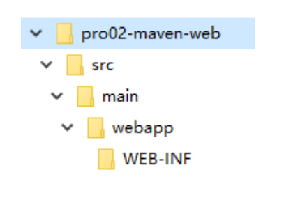
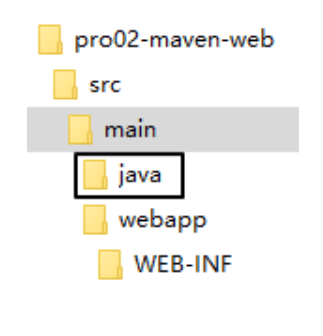
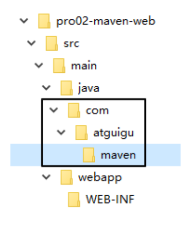
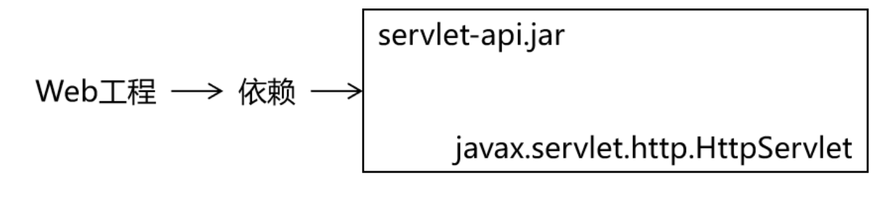
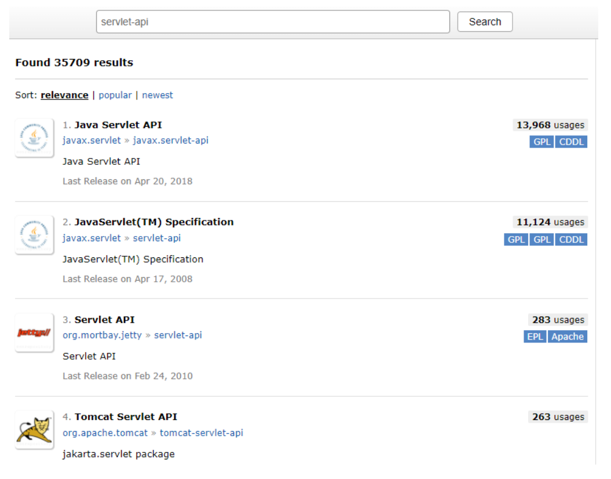
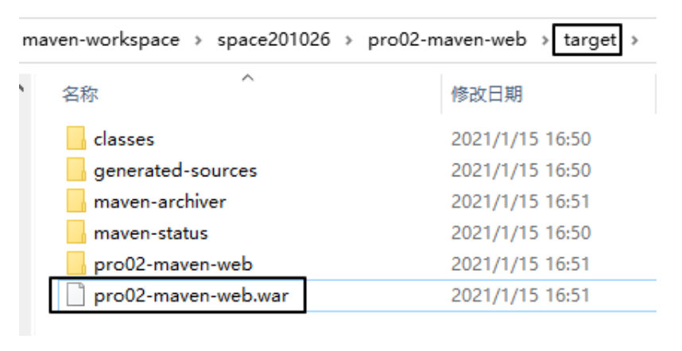
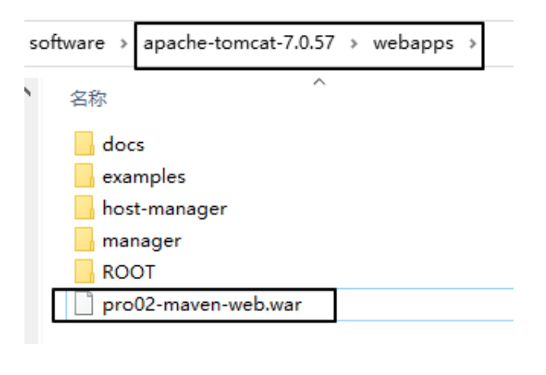
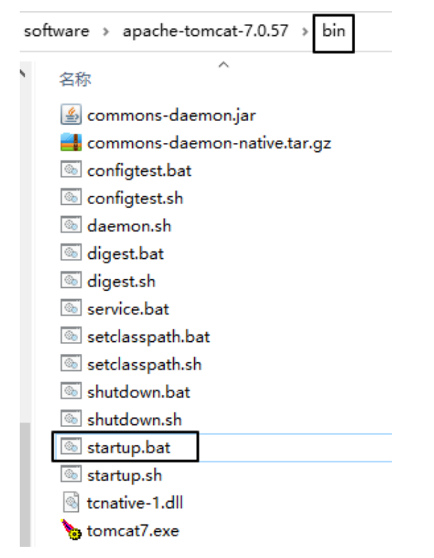
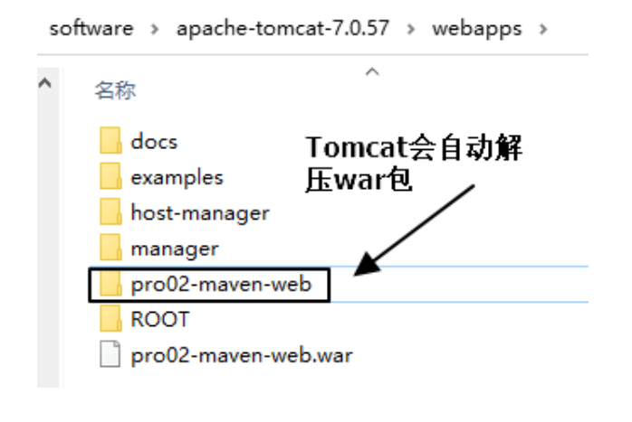

# 第四节 创建 Maven 版的 Web 工程

## 1、说明

使用 mvn archetype:generate 命令生成 Web 工程时，需要使用一个专门的 archetype。这个专门生成 Web 工程骨架的 archetype 可以参照官网看到它的用法：



参数 archetypeGroupId、archetypeArtifactId、archetypeVersion 用来指定现在使用的 maven-archetype-webapp 的坐标。

## 2、操作

注意：如果在上一个工程的目录下执行 mvn archetype:generate 命令，那么 Maven 会报错：不能在一个非 pom 的工程下再创建其他工程。所以不要再刚才创建的工程里再创建新的工程，请回到工作空间根目录来操作。

然后运行生成工程的命令：

```text
mvn archetype:generate -DarchetypeGroupId=org.apache.maven.archetypes -DarchetypeArtifactId=maven-archetype-webapp -DarchetypeVersion=1.4
```

下面的操作按照提示执行：

```text
Define value for property 'groupId': com.atguigu.maven Define value for property 'artifactId': pro02-maven-web Define value for property 'version' 1.0-SNAPSHOT: :【直接回车，使用默认值】

Define value for property 'package' com.atguigu.maven: :【直接回车，使用默认值】 Confirm properties configuration: groupId: com.atguigu.maven artifactId: pro02-maven-web version: 1.0-SNAPSHOT package: com.atguigu.maven Y: :【直接回车，表示确认】
```

## 3、生成的pom.xml

确认打包的方式是war包形式

```xml
<packaging>war</packaging>
```

## 4、生成的Web工程的目录结构




webapp 目录下有 index.jsp

WEB-INF 目录下有 web.xml

## 5、创建 Servlet

### ①在 main 目录下创建 java 目录



### ②在 java 目录下创建 Servlet 类所在的包的目录



### ③在包下创建 Servlet 类

```java
package com.atguigu.maven;
	
import javax.servlet.http.HttpServlet;
import javax.servlet.http.HttpServletRequest;
import javax.servlet.http.HttpServletResponse;
import javax.servlet.ServletException;
import java.io.IOException;
	
public class HelloServlet extends HttpServlet{
	
	protected void doGet(HttpServletRequest request, HttpServletResponse response) throws ServletException, IOException {
		
		response.getWriter().write("hello maven web");
		
	}
	
}
```

### ④在 web.xml 中注册 Servlet

```xml
<servlet>
    <servlet-name>helloServlet</servlet-name>
    <servlet-class>com.atguigu.maven.HelloServlet</servlet-class>
</servlet>
<servlet-mapping>
    <servlet-name>helloServlet</servlet-name>
    <url-pattern>/helloServlet</url-pattern>
</servlet-mapping>
```

## 6、在 index.jsp 页面编写超链接

```html
<html>
<body>
<h2>Hello World!</h2>
<a href="helloServlet">Access Servlet</a>
</body>
</html>
```

JSP全称是 Java Server Page，和 Thymeleaf 一样，是服务器端页面渲染技术。这里我们不必关心 JSP 语法细节，编写一个超链接标签即可。

## 7、编译

此时直接执行 mvn compile 命令出错：

```text
DANGER

程序包 javax.servlet.http 不存在

程序包 javax.servlet 不存在

找不到符号

符号: 类 HttpServlet

……
```

上面的错误信息说明：我们的 Web 工程用到了 HttpServlet 这个类，而 HttpServlet 这个类属于 servlet-api.jar 这个 jar 包。此时我们说，Web 工程需要依赖 servlet-api.jar 包。



## 8、配置对 servlet-api.jar 包的依赖


对于不知道详细信息的依赖可以到https://mvnrepository.com/ 网站查询。使用关键词搜索，然后在搜索结果列表中选择适合的使用。



比如，我们找到的 servlet-api 的依赖信息：

```xml
<!-- https://mvnrepository.com/artifact/javax.servlet/javax.servlet-api -->
<dependency>
    <groupId>javax.servlet</groupId>
    <artifactId>javax.servlet-api</artifactId>
    <version>3.1.0</version>
    <scope>provided</scope>
</dependency>
```

这样就可以把上面的信息加入 pom.xml。重新执行 mvn compile 命令。

## 9、将 Web 工程打包为 war 包

运行 mvn package 命令，生成 war 包的位置如下图所示：



## 10、将 war 包部署到 Tomcat 上运行

将 war 包复制到 Tomcat/webapps 目录下



启动 Tomcat：





通过浏览器尝试访问：http://localhost:8080/pro02-maven-web/index.jsp