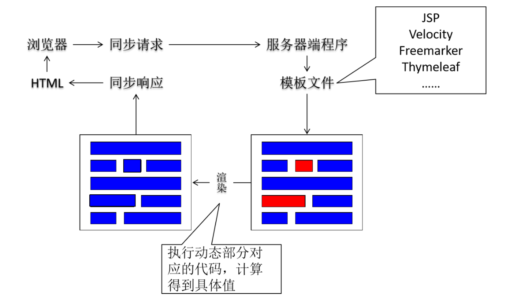
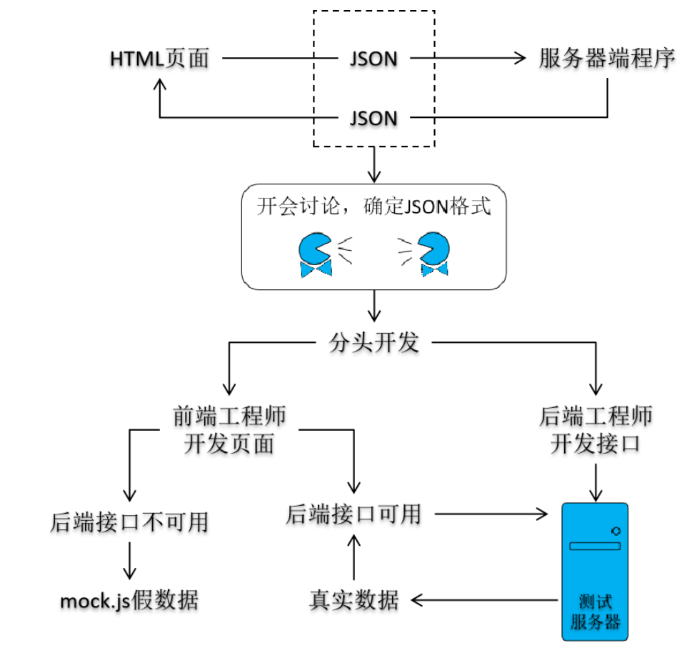
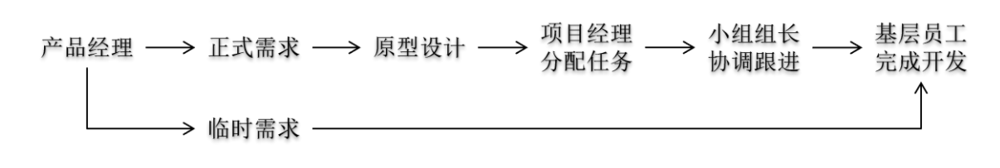

# 后端工程师与前端工程师交互

## 服务器端渲染

除了我们熟悉的JSP，还有Velocity、Freemarker、Thymeleaf等视图模板技术。虽然具体语法各不相同，但是它们都有一个共通的特点，就是在固定内容中可以穿插表达式等形式的动态内容。将视图模板中的动态内容转换为对应的Java代码并执行，然后使用计算得到的具体数据替换原来的动态部分。这样整个文件的动态内容就可以作为确定的响应结果返回给浏览器。在这种模式下，前端工程师将前端页面全部开发完成，交给后端程序员加入到项目中。此时不可避免的需要后端程序员根据需要对前端代码进行补充和调整。

## 前后端分离

前后端分离模式下，前端程序和后端程序使用JSON格式进行交互，所以项目启动时前端工程和后端工程师需要坐在一起开会，商量确定JSON格式的具体细节。然后分头开发。后端工程师在把后端的代码发布到测试服务器前，前端工程师无法调用后端程序拿到真实数据，所以使用Mock.js生成假数据。直到后端工程师开发完成，后端程序发布到了测试服务器上，前端工程师再从Mock.js切换到实际后端代码。

## 开发工程师与运维工程师交互

开发工程师有项目需要部署的时候，如果需要交给运维工程操作，那么除了要部署的项目本身，还要编写可以自动化部署项目的Shell脚本，一起交给运维工程师去部署项目。

另外还有一种情况，程序员开发具体模块时需要设计创建本模块的数据库表，本地建表调试确定后，把建表语句发送给运维工程师，在正式环境服务器上创建数据库表。因为正式服务器上通常是不给开发工程师操作权限的。

## 开发工程师与产品经理交互

你以为完成组长交给的任务就可以轻松优雅的下班？图样图森破！产品经理会直接找到你，让你改需求！你90%的精力其实都用来忍住揍他的冲动。

## 开发工程师与测试工程师

开发工程师将代码提交到版本控制服务器（SVN或Git的代码托管中心），然后根据版本控制服务器上的代码部署到测试服务器上，测试工程师访问测试服务器上的应用进行测试。发现Bug通过Bug管理软件通知开发工程师。