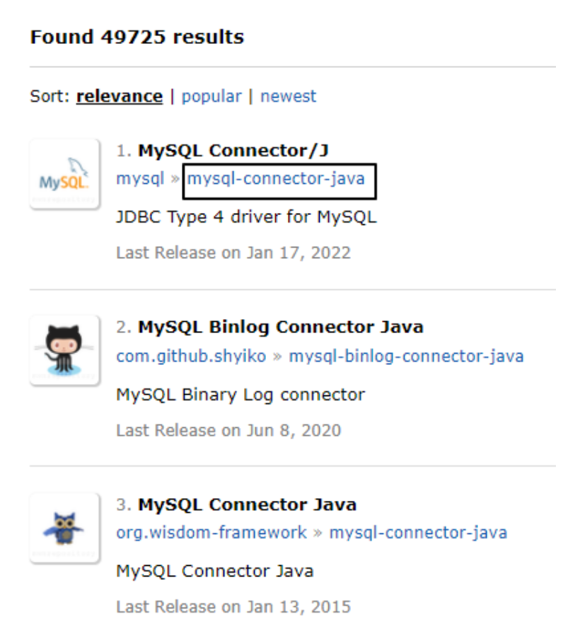

# 第一节 创建工程，引入依赖

## 1、架构

### ①架构的概念

『架构』其实就是『项目的结构』，只是因为架构是一个更大的词，通常用来形容比较大规模事物的结构。

### ②单一架构

单一架构也叫『all-in-one』结构，就是所有代码、配置文件、各种资源都在同一个工程。

* 一个项目包含一个工程
* 导出一个 war 包
* 放在一个 Tomcat 上运行

## 2、创建工程


## 3、引入依赖

### ①搜索依赖信息的网站

####[1]到哪儿找？

https://mvnrepository.com/

####[2]怎么选择？

* 确定技术选型：确定我们项目中要使用哪些技术
* 到 mvnrepository 网站搜索具体技术对应的具体依赖信息



* 确定这个技术使用哪个版本的依赖
  - 考虑因素1：看是否有别的技术要求这里必须用某一个版本
  - 考虑因素2：如果没有硬性要求，那么选择较高版本或下载量大的版本


* 在实际使用中检验所有依赖信息是否都正常可用

> TIP
> 
> 确定技术选型、组建依赖列表、项目划分模块……等等这些操作其实都属于架构设计的范畴。
> 
> * 项目本身所属行业的基本特点
> * 项目具体的功能需求
> * 项目预计访问压力程度
> * 项目预计将来需要扩展的功能
> * 设计项目总体的体系结构

### ②持久化层所需依赖

* mysql:mysql-connector-java:5.1.37
* com.alibaba:druid:1.2.8
* commons-dbutils:commons-dbutils:1.6

### ③表述层所需依赖

* javax.servlet:javax.servlet-api:3.1.0
* org.thymeleaf:thymeleaf:3.0.11.RELEASE

### ④辅助功能所需依赖

* junit:junit:4.12
* ch.qos.logback:logback-classic:1.2.3
* 
### ⑤最终完整依赖信息

```xml
<dependencies>
    <!-- https://mvnrepository.com/artifact/mysql/mysql-connector-java -->
    <dependency>
        <groupId>mysql</groupId>
        <artifactId>mysql-connector-java</artifactId>
        <version>5.1.37</version>
    </dependency>
    <!-- https://mvnrepository.com/artifact/com.alibaba/druid -->
    <dependency>
        <groupId>com.alibaba</groupId>
        <artifactId>druid</artifactId>
        <version>1.2.8</version>
    </dependency>
    <!-- https://mvnrepository.com/artifact/commons-dbutils/commons-dbutils -->
    <dependency>
        <groupId>commons-dbutils</groupId>
        <artifactId>commons-dbutils</artifactId>
        <version>1.6</version>
    </dependency>
    <!-- https://mvnrepository.com/artifact/javax.servlet/javax.servlet-api -->
    <dependency>
        <groupId>javax.servlet</groupId>
        <artifactId>javax.servlet-api</artifactId>
        <version>3.1.0</version>
        <scope>provided</scope>
    </dependency>
    <!-- https://mvnrepository.com/artifact/org.thymeleaf/thymeleaf -->
    <dependency>
        <groupId>org.thymeleaf</groupId>
        <artifactId>thymeleaf</artifactId>
        <version>3.0.11.RELEASE</version>
    </dependency>
    <!-- https://mvnrepository.com/artifact/junit/junit -->
    <dependency>
        <groupId>junit</groupId>
        <artifactId>junit</artifactId>
        <version>4.12</version>
        <scope>test</scope>
    </dependency>
    <!-- https://mvnrepository.com/artifact/ch.qos.logback/logback-classic -->
    <dependency>
        <groupId>ch.qos.logback</groupId>
        <artifactId>logback-classic</artifactId>
        <version>1.2.3</version>
        <scope>test</scope>
    </dependency>
</dependencies>
```

## 4、建包

|   package 功能    |                  package 名称                   |
|:---------------:|:---------------------------------------------:|
|       主包        |        com.toxicant123.imperial.court         |
|     子包[实体类]     |     com.toxicant123.imperial.court.entity     |
| 子包[Servlet基类包]  |  com.toxicant123.imperial.court.servlet.base  |
| 子包[Servlet模块包]  | com.toxicant123.imperial.court.servlet.module |
| 子包[Service接口包]  |  com.toxicant123.imperial.court.service.api   |
| 子包[Service实现类包] |  com.toxicant123.imperial.court.service.impl  |
|   子包[Dao接口包]    |    com.toxicant123.imperial.court.dao.api     |
|   子包[Dao实现类包]   |    com.toxicant123.imperial.court.dao.impl    |
|   子包[Filter]    |     com.toxicant123.imperial.court.filter     |
|    子包[异常类包]     |   com.toxicant123.imperial.court.exception    |
|     子包[工具类]     |      com.toxicant123.imperial.court.util      |
|     子包[测试类]     |      com.toxicant123.imperial.court.test      |