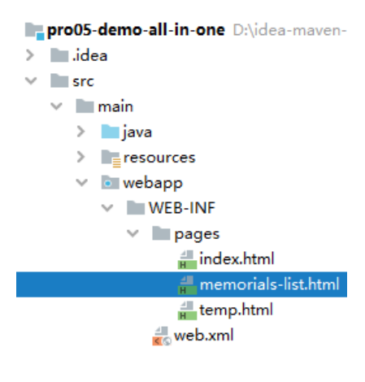

# 第七节 业务功能：显示奏折列表

## 1、流程图


## 2、创建组件

### ①创建 WorkServlet

#### [1]创建 Java 类

刚开始是空的，还没有写方法：


```java
public class WorkServlet extends ModelBaseServlet {
    
    private MemorialsService memorialsService = new MemorialsServiceImpl();
    
}
```

#### [2]注册

```xml
<servlet>
    <servlet-name>workServlet</servlet-name>
    <servlet-class>com.atguigu.imperial.court.servlet.module.WorkServlet</servlet-class>
</servlet>
<servlet-mapping>
    <servlet-name>workServlet</servlet-name>
    <url-pattern>/work</url-pattern>
</servlet-mapping>
```

### ②创建 MemorialsService

#### [1]接口


#### [2]实现类


```java
public class MemorialsServiceImpl implements MemorialsService {

    private MemorialsDao memorialsDao = new MemorialsDaoImpl();

}
```

## 3、WorkServlet 方法


```java
protected void showMemorialsDigestList(HttpServletRequest request, HttpServletResponse response) throws ServletException, IOException {

    // 1、调用 Service 方法查询数据
    List<Memorials> memorialsList = memorialsService.getAllMemorialsDigest();

    // 2、将查询得到的数据存入请求域
    request.setAttribute("memorialsList", memorialsList);

    // 3、渲染视图
    String templateName = "memorials-list";
    processTemplate(templateName, request, response);
}
```

## 4、MemorialsService 方法


```java
@Override
public List<Memorials> getAllMemorialsDigest() {
    return memorialsDao.selectAllMemorialsDigest();
}
```

## 5、MemorialsDao 方法


```java
@Override
public List<Memorials> selectAllMemorialsDigest() {

    String sql = "select memorials_id memorialsId,\n" +
            "       memorials_title memorialsTitle,\n" +
            "       concat(left(memorials_content, 10), \"...\") memorialsContentDigest,\n" +
            "       emp_name memorialsEmpName,\n" +
            "       memorials_create_time memorialsCreateTime,\n" +
            "       memorials_status memorialsStatus\n" +
            "from t_memorials m left join  t_emp e on m.memorials_emp=e.emp_id;";

    return getBeanList(sql, Memorials.class);
}
```

## 6、页面显示



### ①页面上的样式声明

```html
<style type="text/css">
    table {
        border-collapse: collapse;
        margin: 0px auto 0px auto;
    }

    table th, td {
        border: 1px solid black;
        text-align: center;
    }

    div {
        text-align: right;
    }
</style>
```

### ②用户登录信息部分

```xml
<!-- 登录信息部分 -->
<div>
    <span th:if="${session.loginInfo.empPosition == 'emperor'}">恭请皇上圣安</span>
    <span th:if="${session.loginInfo.empPosition == 'minister'}">给<span th:text="${session.loginInfo.empName}">XXX</span>大人请安</span>
    <a th:href="@{/auth?method=logout}">退朝</a>
</div>
```

### ③数据展示信息部分

```html
<!-- 数据显示部分 -->
<table>
    <thead>
        <tr>
            <th>奏折标题</th>
            <th>内容摘要</th>
            <th>上疏大臣</th>
            <th>上疏时间</th>
            <th>奏折状态</th>
            <th>奏折详情</th>
        </tr>
    </thead>
    <tbody th:if="${#lists.isEmpty(memorialsList)}">
        <tr>
            <td colspan="6">没有人上过折子</td>
        </tr>
    </tbody>
    <tbody th:if="${not #lists.isEmpty(memorialsList)}">
        <tr th:each="memorials : ${memorialsList}">
            <td th:switch="${memorials.memorialsStatus}">
                <span th:text="${memorials.memorialsTitle}" th:case="0" style="color: red;">奏折标题</span>
                <span th:text="${memorials.memorialsTitle}" th:case="1" style="color: blue;">奏折标题</span>
                <span th:text="${memorials.memorialsTitle}" th:case="2">奏折标题</span>
            </td>
            <td th:switch="${memorials.memorialsStatus}">
                <span th:text="${memorials.memorialsContentDigest}" th:case="0" style="color: red;">内容摘要</span>
                <span th:text="${memorials.memorialsContentDigest}" th:case="1" style="color: blue;">内容摘要</span>
                <span th:text="${memorials.memorialsContentDigest}" th:case="2">内容摘要</span>
            </td>
            <td th:switch="${memorials.memorialsStatus}">
                <span th:text="${memorials.memorialsEmpName}" th:case="0" style="color: red;">上疏大臣</span>
                <span th:text="${memorials.memorialsEmpName}" th:case="1" style="color: blue;">上疏大臣</span>
                <span th:text="${memorials.memorialsEmpName}" th:case="2">上疏大臣</span>
            </td>
            <td th:switch="${memorials.memorialsStatus}">
                <span th:text="${memorials.memorialsCreateTime}" th:case="0" style="color: red;">上疏时间</span>
                <span th:text="${memorials.memorialsCreateTime}" th:case="1" style="color: blue;">上疏时间</span>
                <span th:text="${memorials.memorialsCreateTime}" th:case="2">上疏时间</span>
            </td>
            <td th:switch="${memorials.memorialsStatus}">
                <span th:case="0" style="color: red;">未读</span>
                <span th:case="1" style="color: blue;">已读</span>
                <span th:case="2">已批示</span>
            </td>

            <td>
                <a th:href="@{/work?method=detail}">奏折详情</a>
            </td>
        </tr>
    </tbody>
</table>
```

## 7、和登录成功对接


```java
protected void login(
        HttpServletRequest request,
        HttpServletResponse response)
        throws ServletException, IOException {

    try {
        // 1、获取请求参数
        String loginAccount = request.getParameter("loginAccount");
        String loginPassword = request.getParameter("loginPassword");

        // 2、调用 EmpService 方法执行登录逻辑
        Emp emp = empService.getEmpByLoginAccount(loginAccount, loginPassword);

        // 3、通过 request 获取 HttpSession 对象
        HttpSession session = request.getSession();

        // 4、将查询到的 Emp 对象存入 Session 域
        session.setAttribute(ImperialCourtConst.LOGIN_EMP_ATTR_NAME, emp);

        // 5、前往指定页面视图
        // 前往临时页面
        // String templateName = "temp";
        // processTemplate(templateName, request, response);

        // 前往正式的目标地址
        response.sendRedirect(request.getContextPath() + "/work?method=showMemorialsDigestList");

    } catch (Exception e) {
        e.printStackTrace();

        // 6、判断此处捕获到的异常是否是登录失败异常
        if (e instanceof LoginFailedException) {
            // 7、如果是登录失败异常则跳转回登录页面
            // ①将异常信息存入请求域
            request.setAttribute("message", e.getMessage());

            // ②处理视图：index
            processTemplate("index", request, response);

        }else {
            // 8、如果不是登录异常则封装为运行时异常继续抛出
            throw new RuntimeException(e);

        }

    }

}
```