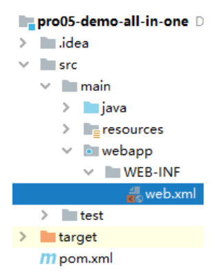

# 第三节 搭建环境：事务控制

## 1、总体思路


## 2、TransactionFilter

### ①创建 Filter 类


### ②TransactionFilter 完整代码

```java
public class TransactionFilter implements Filter {

    // 声明集合保存静态资源扩展名
    private static Set<String> staticResourceExtNameSet;

    static {
        staticResourceExtNameSet = new HashSet<>();
        staticResourceExtNameSet.add(".png");
        staticResourceExtNameSet.add(".jpg");
        staticResourceExtNameSet.add(".css");
        staticResourceExtNameSet.add(".js");
    }

    @Override
    public void doFilter(ServletRequest servletRequest, ServletResponse servletResponse, FilterChain filterChain) throws IOException, ServletException {

        // 前置操作：排除静态资源
        HttpServletRequest request = (HttpServletRequest) servletRequest;
        String servletPath = request.getServletPath();
        if (servletPath.contains(".")) {
            String extName = servletPath.substring(servletPath.lastIndexOf("."));

            if (staticResourceExtNameSet.contains(extName)) {

                // 如果检测到当前请求确实是静态资源，则直接放行，不做事务操作
                filterChain.doFilter(servletRequest, servletResponse);

                // 当前方法立即返回
                return ;
            }

        }

        Connection connection = null;

        try{

            // 1、获取数据库连接
            connection = JDBCUtils.getConnection();

            // 重要操作：关闭自动提交功能
            connection.setAutoCommit(false);

            // 2、核心操作
            filterChain.doFilter(servletRequest, servletResponse);

            // 3、提交事务
            connection.commit();

        }catch (Exception e) {

            try {
                // 4、回滚事务
                connection.rollback();
            } catch (SQLException ex) {
                ex.printStackTrace();
            }

            // 页面显示：将这里捕获到的异常发送到指定页面显示
            // 获取异常信息
            String message = e.getMessage();

            // 将异常信息存入请求域
            request.setAttribute("systemMessage", message);

            // 将请求转发到指定页面
            request.getRequestDispatcher("/").forward(request, servletResponse);

        }finally {

            // 5、释放数据库连接
            JDBCUtils.releaseConnection(connection);

        }

    }

    @Override
    public void init(FilterConfig filterConfig) throws ServletException {}
    @Override
    public void destroy() {}
}
```

### ③配置 web.xml

注意：需要首先将当前工程改成 Web 工程。



```xml
<filter>
    <filter-name>txFilter</filter-name>
    <filter-class>com.atguigu.imperial.court.filter.TransactionFilter</filter-class>
</filter>
<filter-mapping>
    <filter-name>txFilter</filter-name>
    <url-pattern>/*</url-pattern>
</filter-mapping>
```

### ④注意点

#### [1]确保异常回滚

在程序执行的过程中，必须让所有 catch 块都把编译时异常转换为运行时异常抛出；如果不这么做，在 TransactionFilter 中 catch 就无法捕获到底层抛出的异常，那么该回滚的时候就无法回滚。

#### [2]谨防数据库连接提前释放

由于诸多操作都是在使用同一个数据库连接，那么中间任何一个环节释放数据库连接都会导致后续操作无法正常完成。