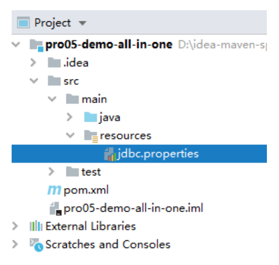
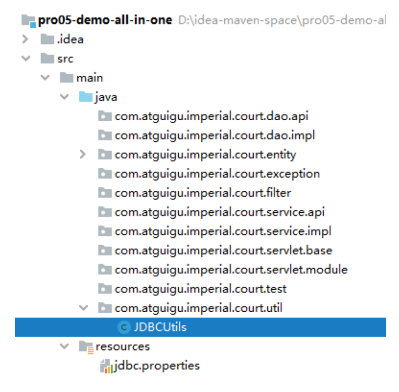
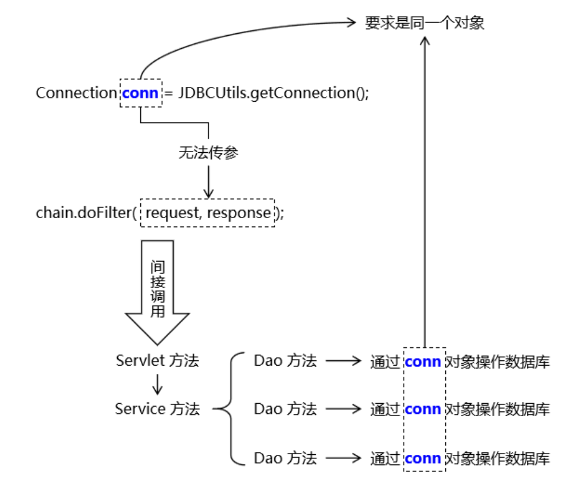
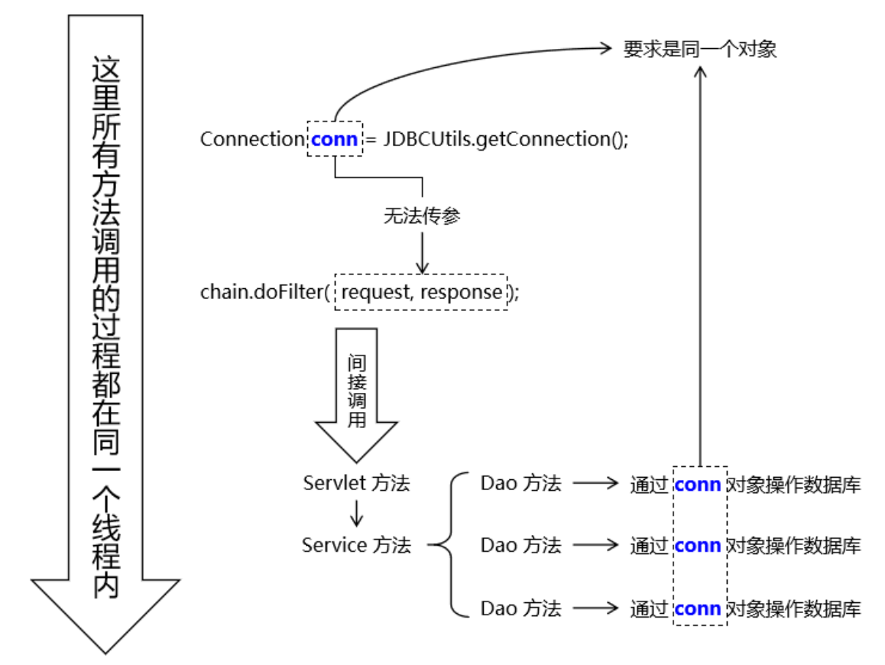
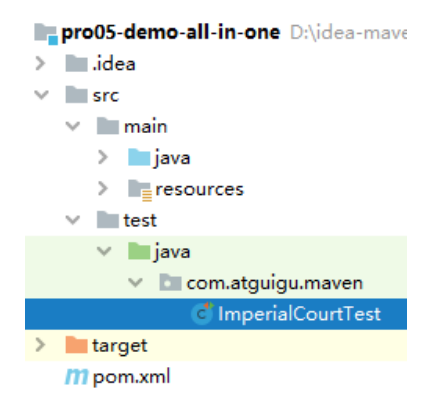
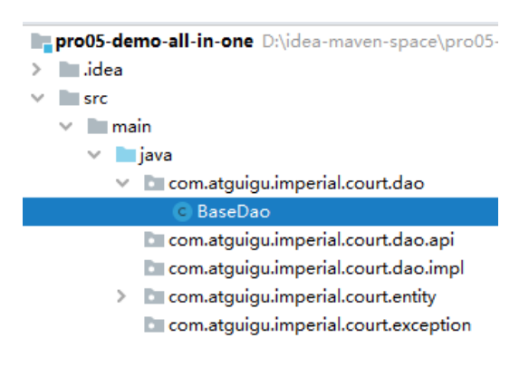
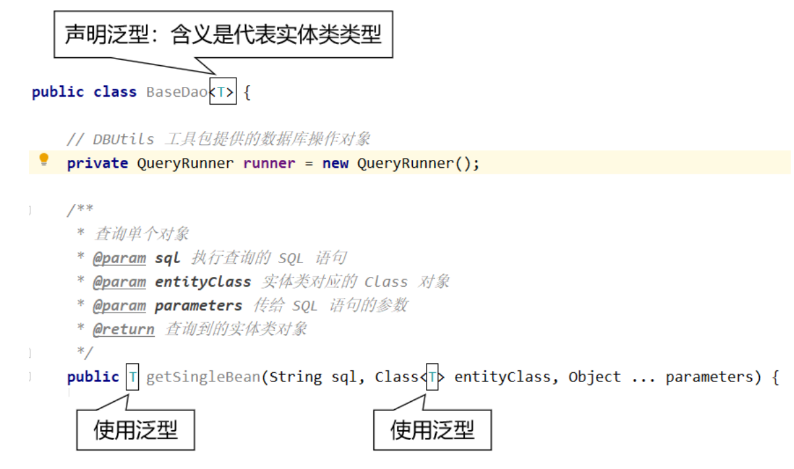
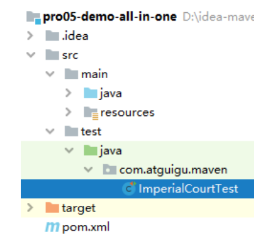
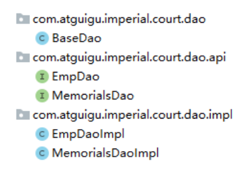

# 第二节 搭建环境：持久化层

## 1、数据建模

### ①物理建模

```sql
create database db_imperial_court;

use db_imperial_court;

create table t_emp
(
    emp_id         int primary key auto_increment,
    emp_name       char(100) not null,
    emp_position   char(100) not null,
    login_account  char(100) not null unique,
    login_password char(100) not null
);

insert into t_emp(emp_name, emp_position, login_account, login_password)
values ('爱新觉罗·玄烨', 'emperor', 'xiaoxuanzi1654', '25325C896624D444B2E241807DCAC98B'), # 16540504
       ('纳兰明珠', 'minister', 'brightball1635', 'A580D0EF93C22036C859E194C14CB777'),   # 16351119
       ('赫舍里·索额图', 'minister', 'tutu1636', 'E40FD7D49B8B7EF46F47407D583C3538'); # 17030921

create table t_memorials
(
    memorials_id          int primary key auto_increment,
    memorials_title       char(100)     not null,
    memorials_content     varchar(5000) not null,
    memorials_emp         int           not null,
    memorials_create_time char(100),
    feedback_time         char(100),
    feedback_content      varchar(1000),
    memorials_status      int           not null
);

insert into t_memorials(memorials_title,
                        memorials_content,
                        memorials_emp,
                        memorials_create_time,
                        feedback_time,
                        feedback_content,
                        memorials_status)
values ('浙江巡抚奏钱塘堤决口疏', '皇上啊，不好啦！钱塘江发大水啦！堤坝冲毁啦！您看这咋弄啊！', 2, '1690-05-07', null, null, 0),
       ('左都御史参鳌拜圈地疏', '皇上啊，鳌拜这厮不是东西呀！占老百姓的地哇！还打人呀！您看咋弄啊！', 3, '1690-04-14', null, null, 0),
       ('都察院劾吴三桂不臣疏', '皇上啊，不得了啦！吴三桂那孙子想造反呀！', 2, '1693-11-18', null, null, 0),
       ('兵部奏准噶尔犯境疏', '皇上啊，不得了啦！葛尔丹要打过来了呀！', 3, '1693-11-18', null, null, 0),
       ('朝鲜使臣朝拜事宜呈皇上御览', '皇上啊！朝鲜国的人要来啦！咱们请他们吃猪肉炖粉条子吧！', 2, '1680-06-11', null, null, 0),
       ('英吉利炮舰购买事宜疏', '皇上啊！英国的小船船咱们买多少啊？', 3, '1680-06-12', null, null, 0),
       ('劾杭州织造贪墨疏', '皇上啊！杭州织造有问题啊！', 2, '1680-06-13', null, null, 0),
       ('禀畅春园落成疏', '皇上啊！畅春园修好了哇！您啥时候过来看看呀！', 3, '1680-06-14', null, null, 0),
       ('请旨木兰秋狝疏', '皇上啊！秋天到啦，又该打猎啦！', 2, '1680-06-15', null, null, 0),
       ('核准西北军饷银两疏', '皇上啊！您看看这钱数算的对不对呀！', 3, '1680-06-16', null, null, 0),
       ('请旨裁撤三藩疏', '皇上啊！咱们不裁撤三藩就芭比Q了哇！', 2, '1680-06-17', null, null, 0),
       ('蒙古王公进京朝拜疏', '皇上啊！蒙古王公要来啦！咱们请他们吃猪肉炖粉条子吧！', 3, '1680-06-18', null, null, 0),
       ('礼部请旨九阿哥赐名疏', '皇上啊！您看九阿哥该叫什么名字呀？', 2, '1680-06-19', null, null, 0),
       ('户部尚书请旨告老还乡疏', '皇上啊！臣想回家养老啦！您看看啥时候给臣把俸禄结一下啊！', 3, '1680-06-20', null, null, 0),
       ('查江宁织造贪墨疏', '皇上啊！江宁织造有问题啊！', 2, '1680-06-21', null, null, 0)
;
```

### ②逻辑建模

#### [1] Emp 实体类

```java
public class Emp {

    private Integer empId;
    private String empName;
    private String empPosition;
    private String loginAccount;
    private String loginPassword;
}
```

#### [2] Memorials 实体类

```java
public class Memorials {

    private Integer memorialsId;
    private String memorialsTitle;
    private String memorialsContent;

    // 奏折摘要数据库没有，这里是为了配和页面显示
    private String memorialsContentDigest;
    private Integer memorialsEmp;

    // 员工姓名数据库没有，这里是为了配合页面显示
    private String memorialsEmpName;
    private String memorialsCreateTime;
    private String feedbackTime;
    private String feedbackContent;
    private Integer memorialsStatus;
}
```

## 2、数据库连接信息

说明：这是我们第一次用到 Maven 约定目录结构中的 resources 目录，这个目录存放各种配置文件。



```properties
driverClassName=com.mysql.jdbc.Driver
url=jdbc:mysql://192.168.198.100:3306/db_imperial_court
username=root
password=atguigu
initialSize=10
maxActive=20
maxWait=10000
```

## 3、获取数据库连接

### ①创建 JDBCUtils 工具类



### ②创建 javax.sql.DataSource 对象

```java
// 将数据源对象设置为静态属性，保证大对象的单一实例
private static DataSource dataSource;

static {

    // 1.创建一个用于存储外部属性文件信息的Properties对象
    Properties properties = new Properties();

    // 2.使用当前类的类加载器加载外部属性文件：jdbc.properties
    InputStream inputStream = JDBCUtils.class.getClassLoader().getResourceAsStream("jdbc.properties");

    try {

        // 3.将外部属性文件jdbc.properties中的数据加载到properties对象中
        properties.load(inputStream);

        // 4.创建数据源对象
        dataSource = DruidDataSourceFactory.createDataSource(properties);

    } catch (Exception e) {
        e.printStackTrace();
    }

}
```

### ③创建 ThreadLocal 对象

#### [1]提出需求

1. 在一个方法内控制事务

如果在每一个 Service 方法中都写下面代码，那么代码重复性就太高了：

```java
try{

	// 1、获取数据库连接
	// 重要：要保证参与事务的多个数据库操作（SQL 语句）使用的是同一个数据库连接
	Connection conn = JDBCUtils.getConnection();
	
	// 2、核心操作
	// ...
	
	// 3、核心操作成功结束，可以提交事务
	conn.commit();

}catch(Exception e){

	// 4、核心操作抛出异常，必须回滚事务
	conn.rollBack();

}finally{

	// 5、释放数据库连接
	JDBCUtils.releaseConnection(conn);
	
}
```

2. 将重复代码抽取到 Filter

所谓『当前请求覆盖的 Servlet 方法、Service 方法、Dao 方法』其实就是 chain.doFilter(request, response) 间接调用的方法。

```java
public void doFilter(ServletRequest request, ServletResponse response, FilterChain chain){

	try{

		// 1、获取数据库连接
		// 重要：要保证参与事务的多个数据库操作（SQL 语句）使用的是同一个数据库连接
		Connection conn = JDBCUtils.getConnection();
        
        // 重要操作：关闭自动提交功能
        connection.setAutoCommit(false);
		
		// 2、核心操作：通过 chain 对象放行当前请求
		// 这样就可以保证当前请求覆盖的 Servlet 方法、Service 方法、Dao 方法都在同一个事务中。
		// 同时各个请求都经过这个 Filter，所以当前事务控制的代码在这里只写一遍就行了，
		// 避免了代码的冗余。
		chain.doFilter(request, response);
		
		// 3、核心操作成功结束，可以提交事务
		conn.commit();

	}catch(Exception e){

		// 4、核心操作抛出异常，必须回滚事务
		conn.rollBack();

	}finally{

		// 5、释放数据库连接
		JDBCUtils.releaseConnection(conn);
		
	}

}
```


3. 数据的跨方法传递

通过 JDBCUtils 工具类获取到的 Connection 对象需要传递给 Dao 方法，让事务涉及到的所有 Dao 方法用的都是同一个 Connection 对象。

但是 Connection 对象无法通过 chain.doFilter() 方法以参数的形式传递过去。

所以从获取到 Connection 对象到使用 Connection 对象中间隔着很多不是我们自己声明的方法——我们无法决定它们的参数。



#### [2] ThreadLocal 对象的功能



* 全类名：java.lang.ThreadLocal<T>
* 泛型 T：要绑定到当前线程的数据的类型
* 具体三个主要的方法：

|  方法名     |  方法名     |
|:-----:|:-----:|
|   set(T value)    | 将数据绑定到当前线程      |
|  get()     |   从当前线程获取已绑定的数据    |
|  remove()     |  将数据从当前线程移除     |

#### [3] Java 代码

```java
// 由于 ThreadLocal 对象需要作为绑定数据时 k-v 对中的 key，所以要保证唯一性
// 加 static 声明为静态资源即可保证唯一性
private static ThreadLocal<Connection> threadLocal = new ThreadLocal<>();
```

### ④声明方法：获取数据库连接

```java
/**
 * 工具方法：获取数据库连接并返回
 * @return
 */
public static Connection getConnection() {

    Connection connection = null;

    try {
        // 1、尝试从当前线程检查是否存在已经绑定的 Connection 对象
        connection = threadLocal.get();

        // 2、检查 Connection 对象是否为 null
        if (connection == null) {
            
            // 3、如果为 null，则从数据源获取数据库连接
            connection = dataSource.getConnection();

            // 4、获取到数据库连接后绑定到当前线程
            threadLocal.set(connection);
            
        }
    } catch (SQLException e) {
        e.printStackTrace();
        
        // 为了调用工具方法方便，编译时异常不往外抛
        // 为了不掩盖问题，捕获到的编译时异常封装为运行时异常抛出
        throw new RuntimeException(e);
    }

    return connection;
}
```

### ⑤声明方法：释放数据库连接

```java
/**
 * 释放数据库连接
 */
public static void releaseConnection(Connection connection) {

    if (connection != null) {

        try {
            // 在数据库连接池中将当前连接对象标记为空闲
            connection.close();

            // 将当前数据库连接从当前线程上移除
            threadLocal.remove();

        } catch (SQLException e) {
            e.printStackTrace();
            throw new RuntimeException(e);
        }

    }

}
```

### ⑥初步测试



```java
public class ImperialCourtTest {

    @Test
    public void testGetConnection() {

        Connection connection = JDBCUtils.getConnection();
        System.out.println("connection = " + connection);

        JDBCUtils.releaseConnection(connection);

    }

}
```

### ⑦完整代码

[传送门](../../../pro05-demo-all-in-one/src/main/java/com/toxicant123/imperial/court/util/JDBCUtils.java)

## 4、BaseDao



### ①泛型的说明



### ②创建 QueryRunner 对象

```java
// DBUtils 工具包提供的数据库操作对象
private QueryRunner runner = new QueryRunner();
```

### ③通用增删改方法

特别说明：在 BaseDao 方法中获取数据库连接但是不做释放，因为我们要在控制事务的 Filter 中统一释放。

```java
/**
 * 通用的增删改方法，insert、delete、update 操作都可以用这个方法
 * @param sql 执行操作的 SQL 语句
 * @param parameters SQL 语句的参数
 * @return 受影响的行数
 */
public int update(String sql, Object ... parameters) {

    try {
        Connection connection = JDBCUtils.getConnection();

        int affectedRowNumbers = runner.update(connection, sql, parameters);
        
        return affectedRowNumbers;
    } catch (SQLException e) {
        e.printStackTrace();

        // 如果真的抛出异常，则将编译时异常封装为运行时异常抛出
        new RuntimeException(e);
        
        return 0;
    }

}
```

### ④查询单个对象

```java
/**
 * 查询单个对象
 * @param sql 执行查询的 SQL 语句
 * @param entityClass 实体类对应的 Class 对象
 * @param parameters 传给 SQL 语句的参数
 * @return 查询到的实体类对象
 */
public T getSingleBean(String sql, Class<T> entityClass, Object ... parameters) {

    try {
        // 获取数据库连接
        Connection connection = JDBCUtils.getConnection();

        return runner.query(connection, sql, new BeanHandler<>(entityClass), parameters);

    } catch (SQLException e) {
        e.printStackTrace();

        // 如果真的抛出异常，则将编译时异常封装为运行时异常抛出
        new RuntimeException(e);
    }

    return null;
}
```

### ⑤查询多个对象

```java
/**
 * 查询返回多个对象的方法
 * @param sql 执行查询操作的 SQL 语句
 * @param entityClass 实体类的 Class 对象
 * @param parameters SQL 语句的参数
 * @return 查询结果
 */
public List<T> getBeanList(String sql, Class<T> entityClass, Object ... parameters) {
    try {
        // 获取数据库连接
        Connection connection = JDBCUtils.getConnection();

        return runner.query(connection, sql, new BeanListHandler<>(entityClass), parameters);

    } catch (SQLException e) {
        e.printStackTrace();

        // 如果真的抛出异常，则将编译时异常封装为运行时异常抛出
        new RuntimeException(e);
    }

    return null;
}
```

### ⑥测试



```java
private BaseDao<Emp> baseDao = new BaseDao<>();

@Test
public void testGetSingleBean() {

    String sql = "select emp_id empId,emp_name empName,emp_position empPosition,login_account loginAccount,login_password loginPassword from t_emp where emp_id=?";

    Emp emp = baseDao.getSingleBean(sql, Emp.class, 1);

    System.out.println("emp = " + emp);

}

@Test
public void testGetBeanList() {

    String sql = "select emp_id empId,emp_name empName,emp_position empPosition,login_account loginAccount,login_password loginPassword from t_emp";

    List<Emp> empList = baseDao.getBeanList(sql, Emp.class);

    for (Emp emp : empList) {
        System.out.println("emp = " + emp);
    }

}

@Test
public void testUpdate() {

    String sql = "update t_emp set emp_position=? where emp_id=?";

    String empPosition = "minister";
    String empId = "3";

    int affectedRowNumber = baseDao.update(sql, empPosition, empId);

    System.out.println("affectedRowNumber = " + affectedRowNumber);

}
```

## 5、子类 Dao

创建接口和实现类如下：

