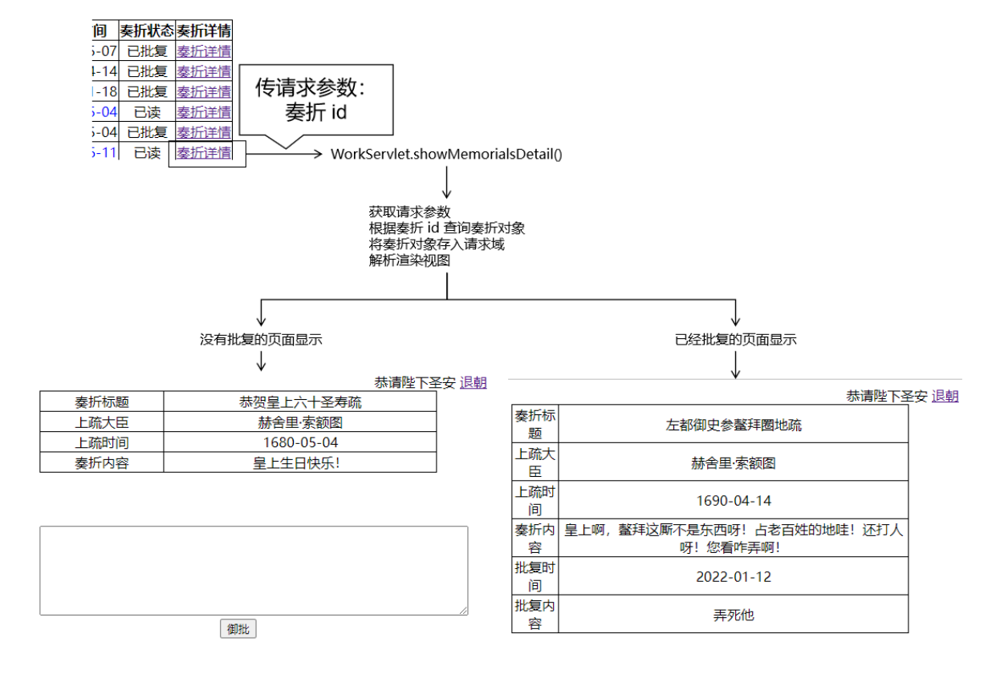
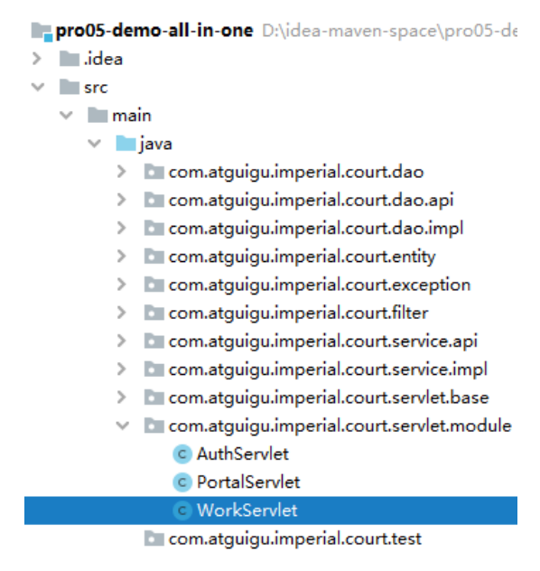
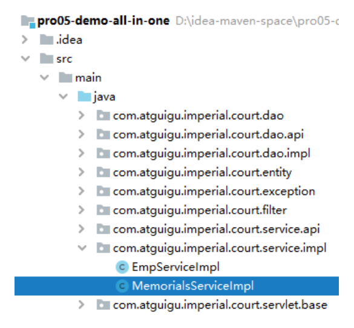
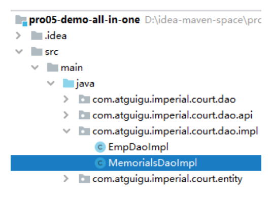
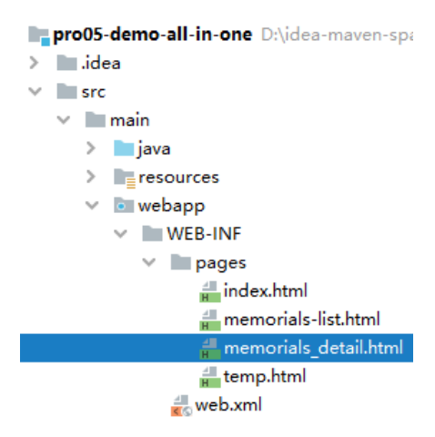
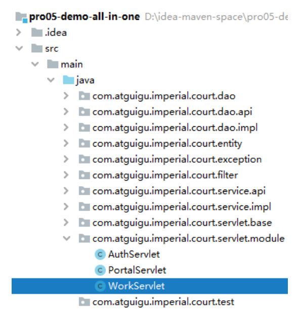
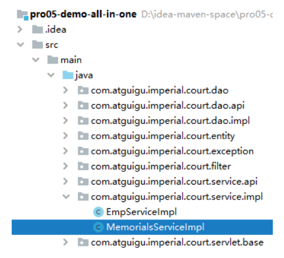
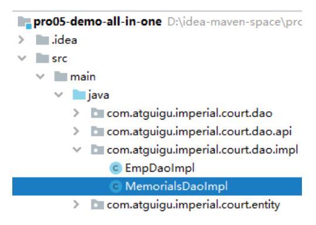

# 第八节 业务功能：显示奏折详情

## 1、流程图



## 2、调整奏折列表页面的超链接

```html
<a th:href="@{/work(method='showMemorialsDetail',memorialsId=${memorials.memorialsId})}">奏折详情</a>
```

## 3、WorkServlet 方法



```java
protected void showMemorialsDetail(
        HttpServletRequest request,
        HttpServletResponse response)
        throws ServletException, IOException {

    // 1、从请求参数读取 memorialsId
    String memorialsId = request.getParameter("memorialsId");

    // 2、根据 memorialsId 从 Service 中查询 Memorials 对象
    Memorials memorials = memorialsService.getMemorialsDetailById(memorialsId);

    // 3、将 Memorials 对象存入请求域
    request.setAttribute("memorials", memorials);

    // 4、解析渲染视图
    String templateName = "memorials_detail";
    processTemplate(templateName, request, response);

}
```

## 4、MemorialsService 方法



```java
@Override
public Memorials getMemorialsDetailById(String memorialsId){

        return memorialsDao.selectMemorialsById(memorialsId);

}
```

## 5、MemorialsDao 方法



```java
@Override
public Memorials selectMemorialsById(String memorialsId) {

    String sql = "select memorials_id memorialsId,\n" +
            "       memorials_title memorialsTitle,\n" +
            "       memorials_content memorialsContent,\n" +
            "       emp_name memorialsEmpName,\n" +
            "       memorials_create_time memorialsCreateTime,\n" +
            "       memorials_status memorialsStatus,\n" +
            "       feedback_time feedbackTime,\n" +
            "       feedback_content feedbackContent\n" +
            "from t_memorials m left join  t_emp e on m.memorials_emp=e.emp_id " +
            "where memorials_id=?;";

    return getSingleBean(sql, Memorials.class, memorialsId);
}
```

## 6、详情页



```html
<!-- 登录信息部分 -->
<div>
    <span th:if="${session.loginInfo.empPosition == 'emperor'}">恭请皇上圣安</span>
    <span th:if="${session.loginInfo.empPosition == 'minister'}">给<span th:text="${session.loginInfo.empName}">XXX</span>大人请安</span>
    <a th:href="@{/auth?method=logout}">退朝</a>
</div>

<table>
    <tr>
        <td>奏折标题</td>
        <td th:text="${memorials.memorialsTitle}"></td>
    </tr>
    <tr>
        <td>上疏大臣</td>
        <td th:text="${memorials.memorialsEmpName}"></td>
    </tr>
    <tr>
        <td>上疏时间</td>
        <td th:text="${memorials.memorialsCreateTime}"></td>
    </tr>
    <tr>
        <td>奏折内容</td>
        <td th:text="${memorials.memorialsContent}"></td>
    </tr>
    <tr th:if="${memorials.memorialsStatus == 2}">
        <td>批复时间</td>
        <td th:text="${memorials.feedbackTime}"></td>
    </tr>
    <tr th:if="${memorials.memorialsStatus == 2}">
        <td>批复时间</td>
        <td th:text="${memorials.feedbackContent}"></td>
    </tr>
</table>

<div th:if="${memorials.memorialsStatus != 2}">
    <form th:action="@{/work}" method="post">

        <input type="hidden" name="method" value="feedBack" />
        <input type="hidden" name="memorialsId" th:value="${memorials.memorialsId}"/>

        <textarea name="feedbackContent"></textarea>

        <button type="submit">御批</button>

    </form>
</div>

<a th:href="@{/work?method=showMemorialsDigestList}">返回列表</a>
```

## 7、更新状态

### ①业务逻辑规则

一份未读奏折，点击查看后，需要从未读变成已读。

### ②WorkServlet 方法



增加判断：

```java
protected void showMemorialsDetail(
        HttpServletRequest request,
        HttpServletResponse response)
        throws ServletException, IOException {

    // 1、从请求参数读取 memorialsId
    String memorialsId = request.getParameter("memorialsId");

    // 2、根据 memorialsId 从 Service 中查询 Memorials 对象
    Memorials memorials = memorialsService.getMemorialsDetailById(memorialsId);

    // **********************补充功能**********************
    // 获取当前奏折对象的状态
    Integer memorialsStatus = memorials.getMemorialsStatus();
    
    // 判断奏折状态
    if (memorialsStatus == 0) {
        // 更新奏折状态：数据库修改
        memorialsService.updateMemorialsStatusToRead(memorialsId);

        // 更新奏折状态：当前对象修改
        memorials.setMemorialsStatus(1);
    }
    // **********************补充功能**********************

    // 3、将 Memorials 对象存入请求域
    request.setAttribute("memorials", memorials);

    // 4、解析渲染视图
    String templateName = "memorials_detail";
    processTemplate(templateName, request, response);

}
```

### ③MemorialsService 方法



```java
@Override
public void updateMemorialsStatusToRead(String memorialsId) {
    memorialsDao.updateMemorialsStatusToRead(memorialsId);
}
```

### ④MemorialsDao 方法



```java
@Override
public void updateMemorialsStatusToRead(String memorialsId) {
    String sql = "update t_memorials set memorials_status=1 where memorials_id=?";
    update(sql, memorialsId);
}
```