# 第六节 业务功能：登录

## 1、显示首页

### ①流程图

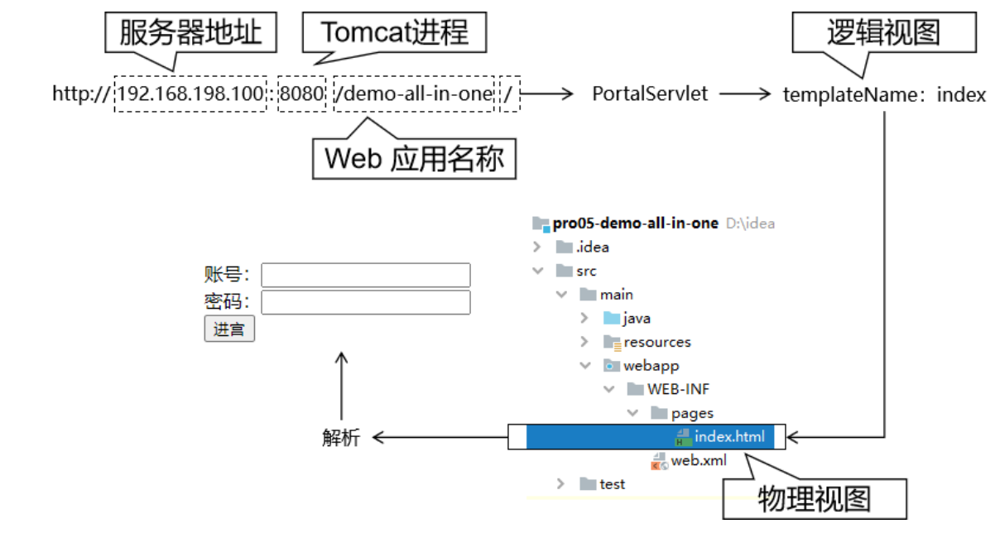

### ②创建 PortalServlet

#### [1]创建 Java 类

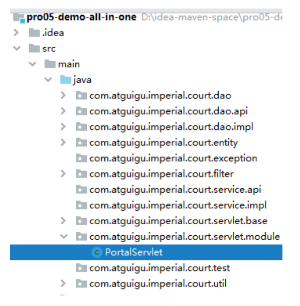

```java
public class PortalServlet extends ViewBaseServlet {

    @Override
    protected void doGet(HttpServletRequest req, HttpServletResponse resp) throws ServletException, IOException {
        doPost(req, resp);
    }

    @Override
    protected void doPost(HttpServletRequest req, HttpServletResponse resp) throws ServletException, IOException {
        // 声明要访问的首页的逻辑视图
        String templateName = "index";
        
        // 调用父类的方法根据逻辑视图名称渲染视图
        processTemplate(templateName, req, resp);
    }
}
```

#### [2]注册

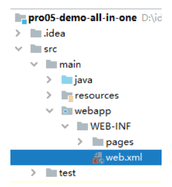

```xml
<servlet>
    <servlet-name>portalServlet</servlet-name>
    <servlet-class>com.atguigu.imperial.court.servlet.module.PortalServlet</servlet-class>
</servlet>
<servlet-mapping>
    <servlet-name>portalServlet</servlet-name>
    <url-pattern>/</url-pattern>
</servlet-mapping>
```

### ③在 index.html 中编写登录表单

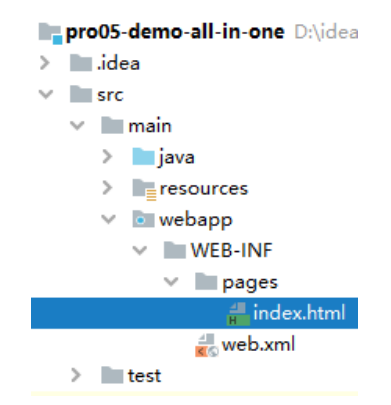

```html
<!DOCTYPE html>
<html lang="en" xml:th="http://www.thymeleaf.org">
<head>
    <meta charset="UTF-8">
    <title>Title</title>
</head>
<body>
<!-- @{/auth} 解析后：/demo/auth -->
<form th:action="@{/auth}" method="post">
    <!-- 传递 method 请求参数，目的是为了让当前请求调用 AuthServlet 中的 login() 方法 -->
    <input type="hidden" name="method" value="login" />

    <!-- th:text 解析表达式后会替换标签体 -->
    <!-- ${attrName} 从请求域获取属性名为 attrName 的属性值 -->
    <p th:text="${message}"></p>
    <p th:text="${systemMessage}"></p>
    
    账号：<input type="text" name="loginAccount"/><br/>
    密码：<input type="password" name="loginPassword"><br/>
    <button type="submit">进宫</button>
</form>

</body>
</html>
```

## 2、登录操作

### ①流程图

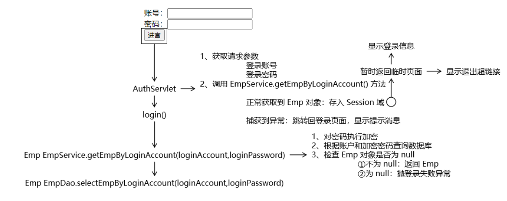

### ②创建 EmpService

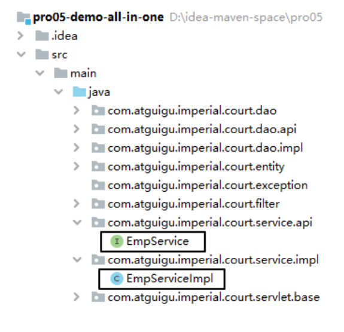

### ③创建登录失败异常

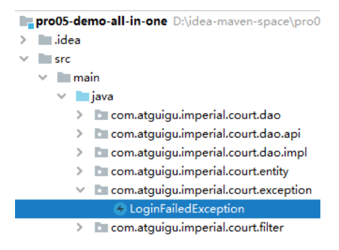

```java
public class LoginFailedException extends RuntimeException {

    public LoginFailedException() {
    }

    public LoginFailedException(String message) {
        super(message);
    }

    public LoginFailedException(String message, Throwable cause) {
        super(message, cause);
    }

    public LoginFailedException(Throwable cause) {
        super(cause);
    }

    public LoginFailedException(String message, Throwable cause, boolean enableSuppression, boolean writableStackTrace) {
        super(message, cause, enableSuppression, writableStackTrace);
    }
}
```

### ④增加常量声明

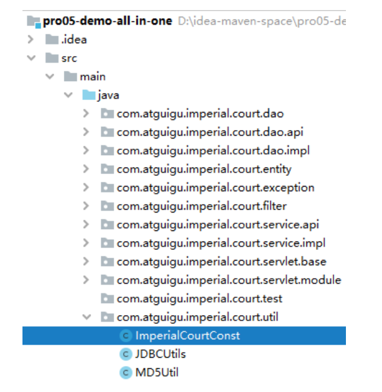

```java
public class ImperialCourtConst {

    public static final String LOGIN_FAILED_MESSAGE = "账号、密码错误，不可进宫！";
    public static final String ACCESS_DENIED_MESSAGE = "宫闱禁地，不得擅入！";
    public static final String LOGIN_EMP_ATTR_NAME = "loginInfo";

}
```

### ⑤创建 AuthServlet

#### [1]创建 Java 类

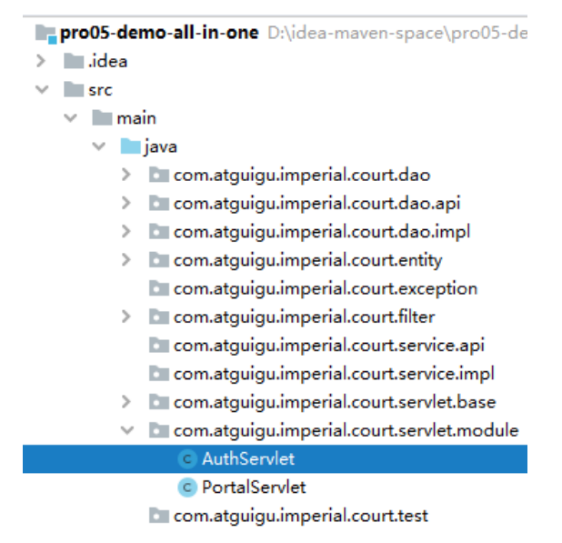

```java
public class AuthServlet extends ModelBaseServlet {

    private EmpService empService = new EmpServiceImpl();

    protected void login(
            HttpServletRequest request,
            HttpServletResponse response)
            throws ServletException, IOException {

        try {
            // 1、获取请求参数
            String loginAccount = request.getParameter("loginAccount");
            String loginPassword = request.getParameter("loginPassword");

            // 2、调用 EmpService 方法执行登录逻辑
            Emp emp = empService.getEmpByLoginAccount(loginAccount, loginPassword);

            // 3、通过 request 获取 HttpSession 对象
            HttpSession session = request.getSession();

            // 4、将查询到的 Emp 对象存入 Session 域
            session.setAttribute(ImperialCourtConst.LOGIN_EMP_ATTR_NAME, emp);

            // 5、前往指定页面视图
            String templateName = "temp";
            processTemplate(templateName, request, response);

        } catch (Exception e) {
            e.printStackTrace();

            // 6、判断此处捕获到的异常是否是登录失败异常
            if (e instanceof LoginFailedException) {
                // 7、如果是登录失败异常则跳转回登录页面
                // ①将异常信息存入请求域
                request.setAttribute("message", e.getMessage());

                // ②处理视图：index
                processTemplate("index", request, response);

            }else {
                // 8、如果不是登录异常则封装为运行时异常继续抛出
                throw new RuntimeException(e);

            }

        }

    }
}
```

#### [2]注册

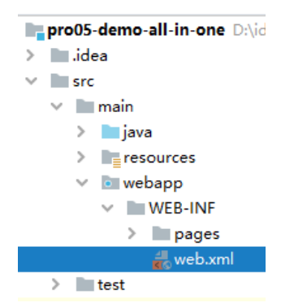

```xml
<servlet>
    <servlet-name>authServlet</servlet-name>
    <servlet-class>com.atguigu.imperial.court.servlet.module.AuthServlet</servlet-class>
</servlet>
<servlet-mapping>
    <servlet-name>authServlet</servlet-name>
    <url-pattern>/auth</url-pattern>
</servlet-mapping>
```

### ⑥EmpService 方法

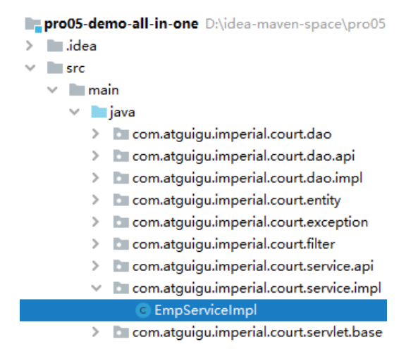

```java
public class EmpServiceImpl implements EmpService {

    private EmpDao empDao = new EmpDaoImpl();

    @Override
    public Emp getEmpByLoginAccount(String loginAccount, String loginPassword) {

        // 1、对密码执行加密
        String encodedLoginPassword = MD5Util.encode(loginPassword);

        // 2、根据账户和加密密码查询数据库
        Emp emp = empDao.selectEmpByLoginAccount(loginAccount, encodedLoginPassword);

        // 3、检查 Emp 对象是否为 null
        if (emp != null) {
            //	①不为 null：返回 Emp
            return emp;
        } else {
            //	②为 null：抛登录失败异常
            throw new LoginFailedException(ImperialCourtConst.LOGIN_FAILED_MESSAGE);
        }
    }
}
```

### ⑦EmpDao 方法

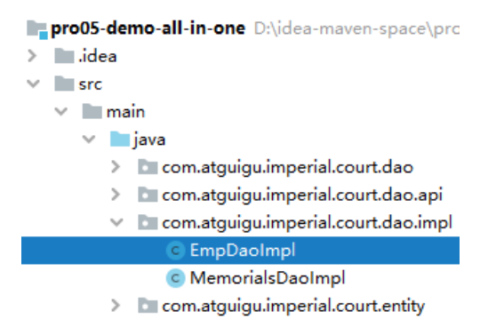

```java
public class EmpDaoImpl extends BaseDao<Emp> implements EmpDao {
    @Override
    public Emp selectEmpByLoginAccount(String loginAccount, String encodedLoginPassword) {

        // 1、编写 SQL 语句
        String sql = "select emp_id empId," +
                "emp_name empName," +
                "emp_position empPosition," +
                "login_account loginAccount," +
                "login_password loginPassword " +
                "from t_emp where login_account=? and login_password=?";

        // 2、调用父类方法查询单个对象
        return super.getSingleBean(sql, Emp.class, loginAccount, encodedLoginPassword);
    }
}
```

### ⑧临时页面

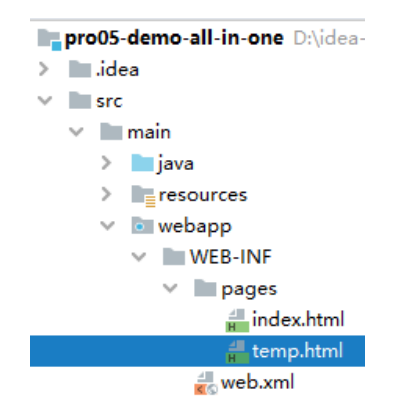

```html
<!DOCTYPE html>
<html lang="en" xml:th="http://www.thymeleaf.org">
<head>
    <meta charset="UTF-8">
    <title>临时</title>
</head>
<body>

    <p th:text="${session.loginInfo}"></p>

</body>
</html>
```

## 3、退出登录

### ①在临时页面编写超链接

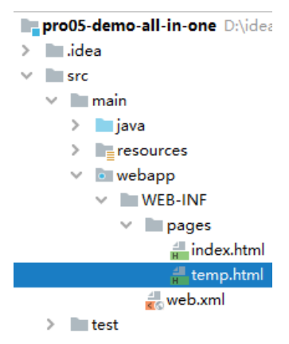

```html
<a th:href="@{/auth?method=logout}">退朝</a>
```

### ②在 AuthServlet 编写退出逻辑

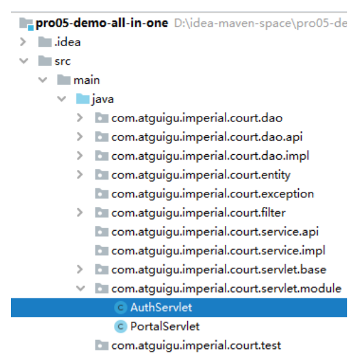

```java
protected void logout(HttpServletRequest request, HttpServletResponse response) throws ServletException, IOException {

    // 1、通过 request 对象获取 HttpSession 对象
    HttpSession session = request.getSession();

    // 2、将 HttpSession 对象强制失效
    session.invalidate();

    // 3、回到首页
    String templateName = "index";
    processTemplate(templateName, request, response);
}
```