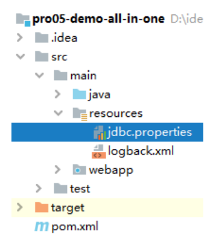
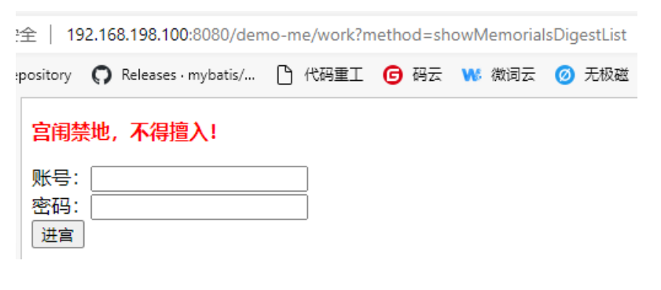

# 第十一节 打包部署

## 1、适配部署环境

MySQL 连接信息中，IP 地址部分需要改成 localhost。



```properties
url=jdbc:mysql://localhost:3306/db_imperial_court
```
## 2、跳过测试打包

```text
mvn clean package -Dmaven.test.skip=true
```

可以人为指定最终 war 包名称：

```xml
<!-- 对构建过程进行自己的定制 -->
<build>
    <!-- 当前工程在构建过程中使用的最终名称 -->
    <finalName>demo-me</finalName>
</build>
```

## 3、部署执行

### ①上传 war 包

### ②启动 Tomcat

```shell
/opt/apache-tomcat-8.5.75/bin/startup.sh
```

### ③访问测试

