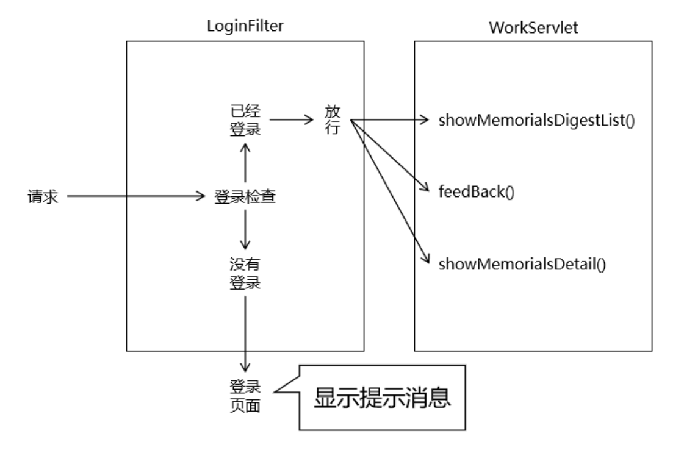
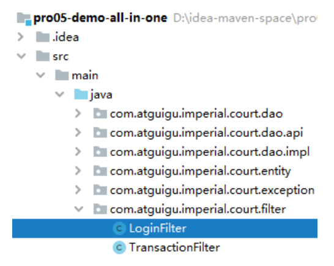
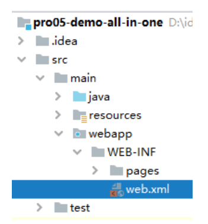

# 第十节 业务功能：登录检查

## 1、流程图



## 2、创建 LoginFilter

### ①创建 Java 类



```java
public class LoginFilter implements Filter {
    @Override
    public void init(FilterConfig filterConfig) throws ServletException {}

    @Override
    public void doFilter(ServletRequest servletRequest, ServletResponse servletResponse, FilterChain filterChain) throws IOException, ServletException {
        // 1、获取 HttpSession 对象
        HttpServletRequest request = (HttpServletRequest) servletRequest;

        HttpSession session = request.getSession();
        
        // 2、尝试从 Session 域获取已登录的对象
        Object loginEmp = session.getAttribute(ImperialCourtConst.LOGIN_EMP_ATTR_NAME);
        
        // 3、判断 loginEmp 是否为空
        if (loginEmp != null) {
            
            // 4、若不为空则说明当前请求已登录，直接放行
            filterChain.doFilter(request, servletResponse);
            
            return ;
        }
        
        // 5、若为空说明尚未登录，则回到登录页面
        request.setAttribute("systemMessage", ImperialCourtConst.ACCESS_DENIED_MESSAGE);
        request.getRequestDispatcher("/").forward(request, servletResponse);
    }

    @Override
    public void destroy() {}
}
```

### ②注册



把 LoginFilter 放在 TransactionFilter 前面声明，原因是：如果登录检查失败不放行，直接跳转到页面，此时将不必执行 TransactionFilter 中的事务操作，可以节约性能。

```xml
<filter>
    <filter-name>loginFilter</filter-name>
    <filter-class>com.atguigu.imperial.court.filter.LoginFilter</filter-class>
</filter>
<filter-mapping>
    <filter-name>loginFilter</filter-name>
    <url-pattern>/work</url-pattern>
</filter-mapping>
```