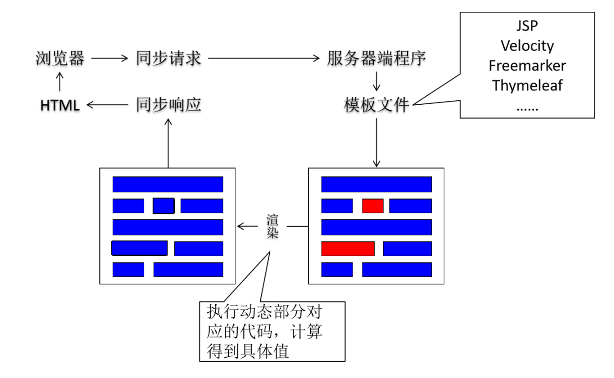
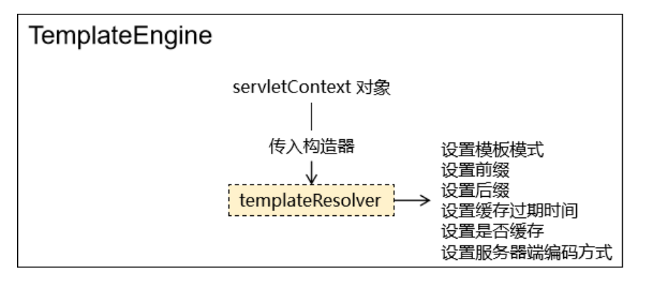
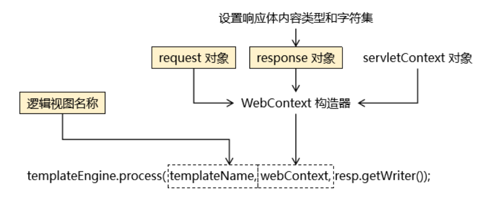
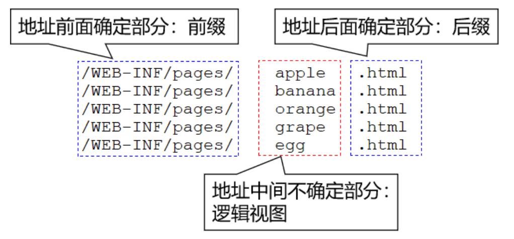
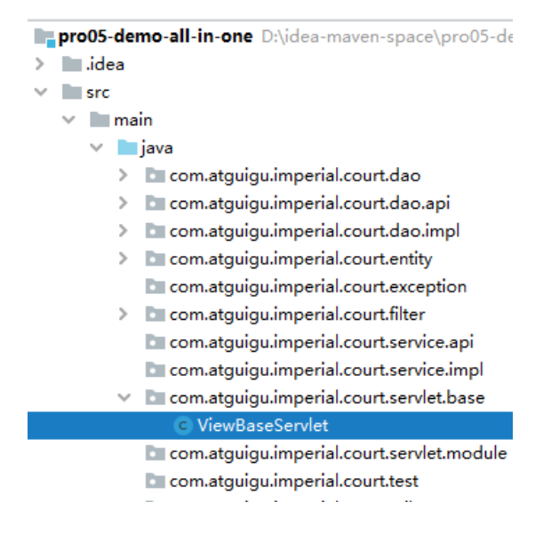
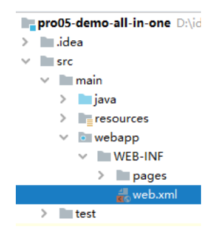
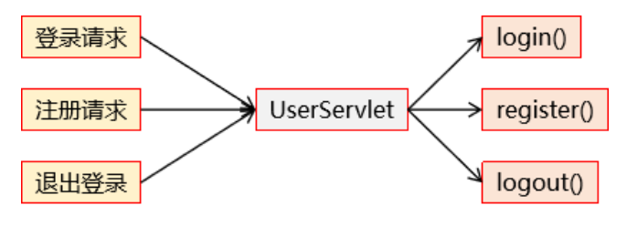
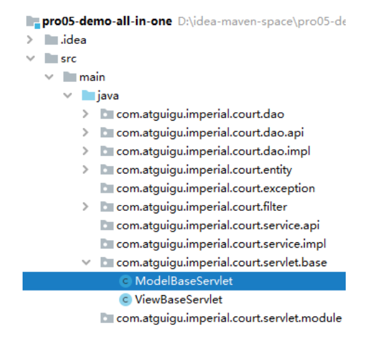
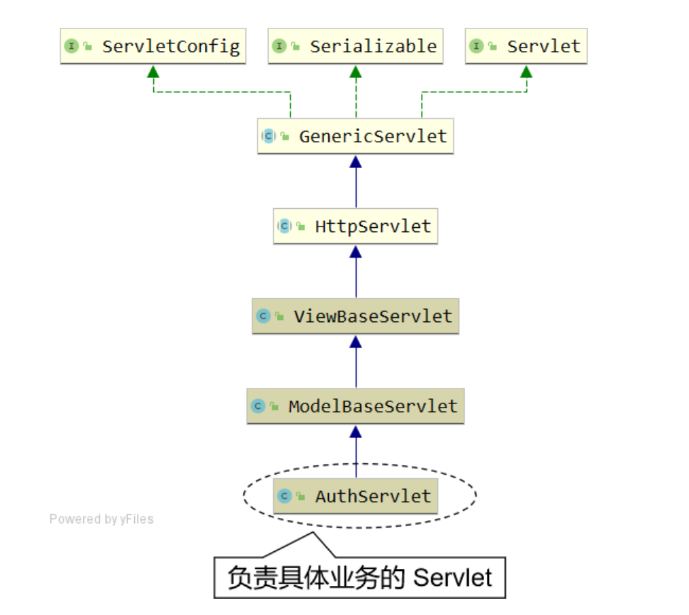

# 第四节 搭建环境：表述层

## 1、视图模板技术 Thymeleaf

### ①服务器端渲染

[参考资料](datum/后端工程师与前端工程师交互.md)




### ②Thymeleaf 简要工作机制

#### [1]初始化阶段

* 目标：创建 TemplateEngine 对象
* 封装：因为对每一个请求来说，TemplateEngine 对象使用的都是同一个，所以在初始化阶段准备好



#### [2]请求处理阶段



#### ③逻辑视图与物理视图

假设有下列页面地址：

```text
/WEB-INF/pages/apple.html
/WEB-INF/pages/banana.html
/WEB-INF/pages/orange.html
/WEB-INF/pages/grape.html
/WEB-INF/pages/egg.html
```

这样的地址可以直接访问到页面本身，我们称之为：物理视图。而将物理视图中前面、后面的固定内容抽取出来，让每次请求指定中间变化部分即可，那么中间变化部分就叫：逻辑视图。



### ④ViewBaseServlet 完整代码

为了简化视图页面处理过程，我们将 Thymeleaf 模板引擎的初始化和请求处理过程封装到一个 Servlet 基类中：ViewBaseServlet。以后负责具体模块业务功能的 Servlet 继承该基类即可直接使用。

[传送门](../../../pro05-demo-all-in-one/src/main/java/com/toxicant123/imperial/court/servlet/base/ViewBaseServlet.java)

特别提醒：这个类不需要掌握，因为以后都被框架封装了，我们现在只是暂时用一下。



### ⑤声明初始化参数



```xml
<!-- 配置 Web 应用初始化参数指定视图前缀、后缀 -->
<!-- 
    物理视图举例：/WEB-INF/pages/index.html
    对应逻辑视图：index
-->
<context-param>
    <param-name>view-prefix</param-name>
    <param-value>/WEB-INF/pages/</param-value>
</context-param>
<context-param>
    <param-name>view-suffix</param-name>
    <param-value>.html</param-value>
</context-param>
```

### ⑥Thymeleaf 的页面语法

[传送门](http://heavy_code_industry.gitee.io/code_heavy_industry/pro001-javaweb/lecture/chapter08)

## 2、ModelBaseServlet

### ①提出问题

#### [1]我们的需求



#### [2]HttpServlet 的局限

* doGet() 方法：处理 GET 请求
* doPost() 方法：处理 POST 请求

### ②解决方案

* 每个请求附带一个请求参数，表明自己要调用的目标方法
* Servlet 根据目标方法名通过反射调用目标方法

### ③ModelBaseServlet 完整代码



特别提醒：为了配合 TransactionFilter 实现事务控制，捕获的异常必须抛出。

[传送门](../../../pro05-demo-all-in-one/src/main/java/com/toxicant123/imperial/court/servlet/base/ModelBaseServlet.java)

### ④继承关系

