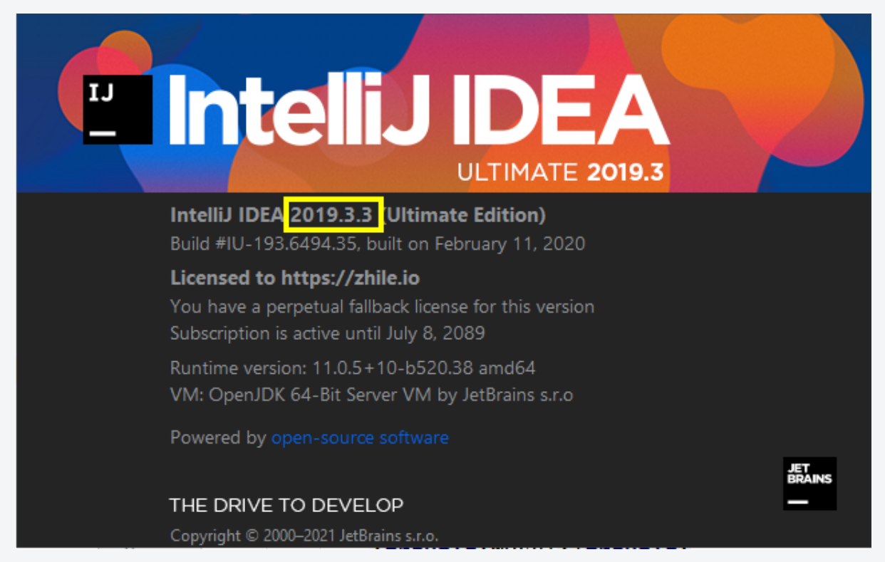
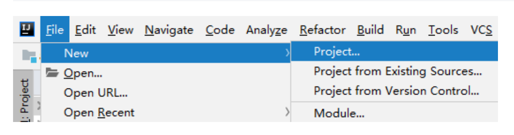
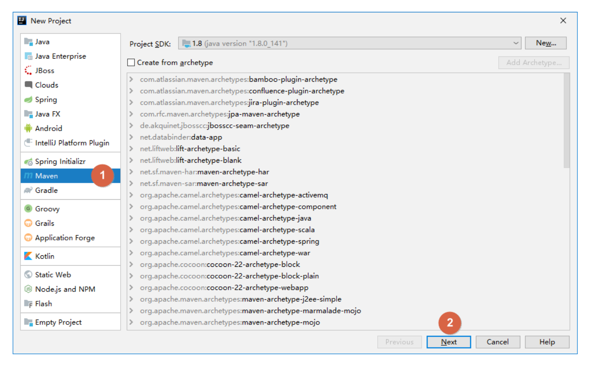
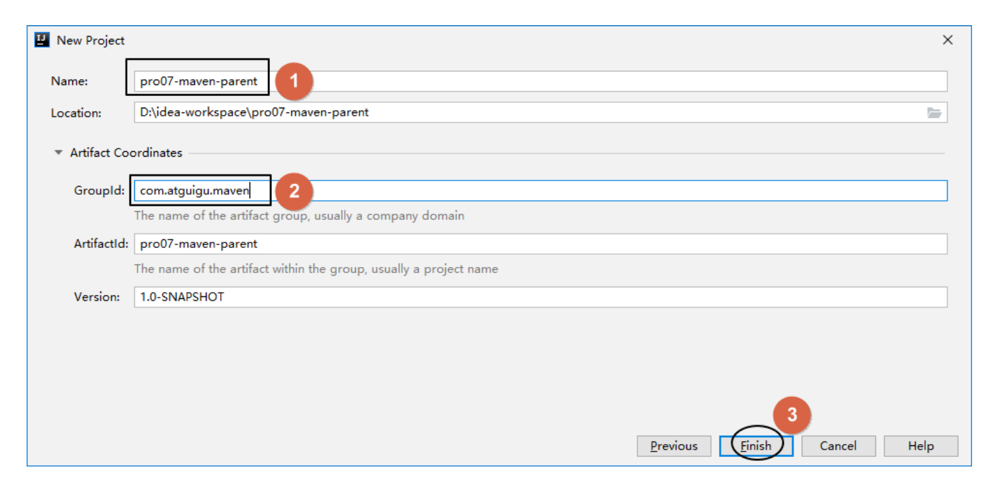
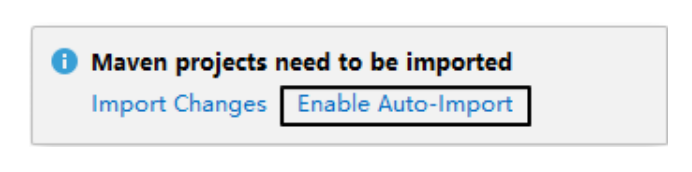
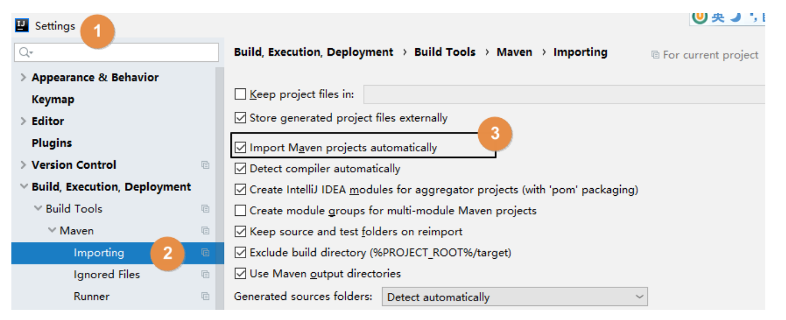

# 第一节 创建父工程

各个 IDEA 不同版本在具体操作方面存在一定差异，这里我们以 2019.3.3 版本为例进行演示。其它版本大家灵活变通即可。

## 第一节 创建父工程

### 1、创建 Project

### 2、开启自动导入

创建 Project 后，IDEA 会自动弹出下面提示，我们选择『Enable Auto-Import』，意思是启用自动导入。

这个自动导入一定要开启，因为 Project、Module 新创建或 pom.xml 每次修改时都应该让 IDEA 重新加载 Maven 信息。这对 Maven 目录结构认定、Java 源程序编译、依赖 jar 包的导入都有非常关键的影响。

另外也可以通过 IDEA 的 Settings 设置来开启：

