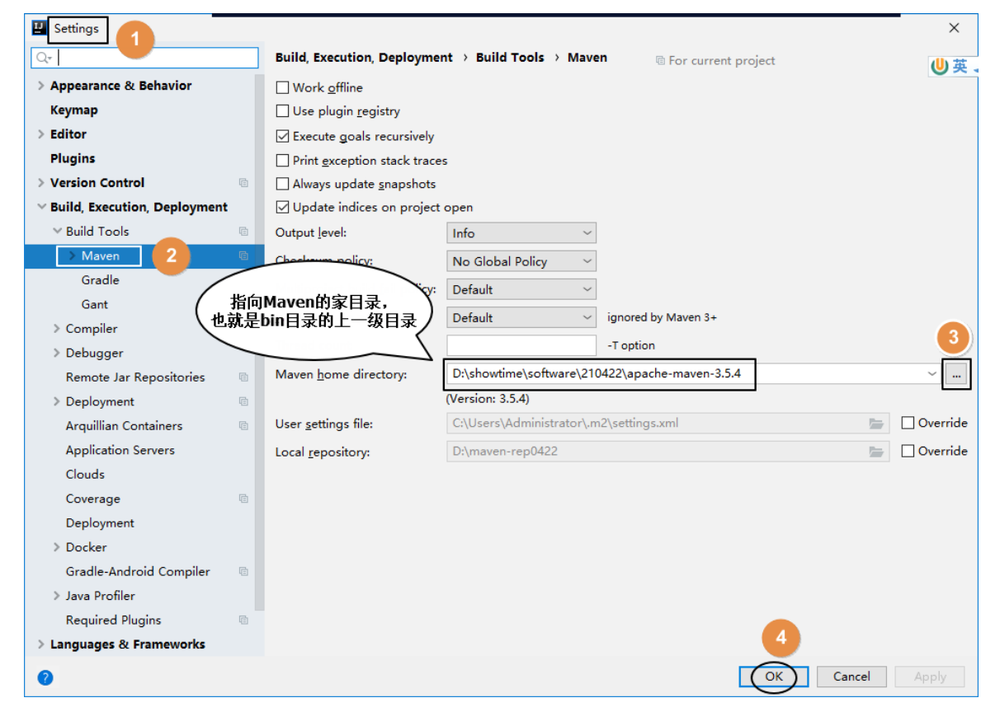

# 第二节 配置 Maven 信息

每次创建 Project 后都需要设置 Maven 家目录位置，否则 IDEA 将使用内置的 Maven 核心程序（不稳定）并使用默认的本地仓库位置。这样一来，我们在命令行操作过程中已下载好的 jar 包就白下载了，默认的本地仓库通常在 C 盘，还影响系统运行。

配置之后，IDEA 会根据我们在这里指定的 Maven 家目录自动识别到我们在 settings.xml 配置文件中指定的本地仓库。

