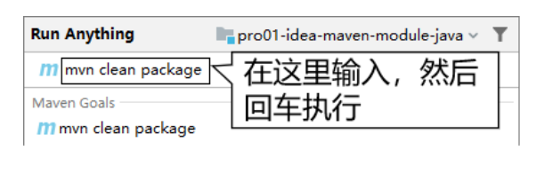

# 第五节 其他操作

## 1、在IDEA中执行Maven命令

### ①直接执行


### ②手动输入




如果有需要，还可以给命令后面附加参数：


```text
# -D 表示后面要附加命令的参数，字母 D 和后面的参数是紧挨着的，中间没有任何其它字符
# maven.test.skip=true 表示在执行命令的过程中跳过测试
mvn clean install -Dmaven.test.skip=true
```

## 2、在IDEA中查看某个模块的依赖信息


## 3、工程导入

Maven工程除了自己创建的，还有很多情况是别人创建的。而为了参与开发或者是参考学习，我们都需要导入到 IDEA 中。下面我们分几种不同情况来说明：

### ①来自版本控制系统

目前我们通常使用的都是 Git（本地库） + 码云（远程库）的版本控制系统。

### ②来自工程目录

直接使用 IDEA 打开工程目录即可。下面咱们举个例子：

#### 工程压缩包

假设别人发给我们一个 Maven 工程的 zip 压缩包：maven-rest-demo.zip。从码云或GitHub上也可以以 ZIP 压缩格式对项目代码打包下载。

#### 解压

如果你的所有 IDEA 工程有一个专门的目录来存放，而不是散落各处，那么首先我们就把 ZIP 包解压到这个指定目录中。


#### 打开

只要我们确认在解压目录下可以直接看到 pom.xml，那就能证明这个解压目录就是我们的工程目录。那么接下来让 IDEA 打开这个目录就可以了。


#### 设置 Maven 核心程序位置

打开一个新的 Maven 工程，和新创建一个 Maven 工程是一样的，此时 IDEA 的 settings 配置中关于 Maven 仍然是默认值：


所以我们还是需要像新建 Maven 工程那样，指定一下 Maven 核心程序位置：


## 4、模块导入

### ①情景重现

在实际开发中，通常会忽略模块（也就是module）所在的项目（也就是project）仅仅导入某一个模块本身。这么做很可能是类似这样的情况：比如基于 Maven 学习 SSM 的时候，做练习需要导入老师发给我们的代码参考。


### ②导入 Java 类型模块

#### 找到老师发的工程目录


#### 粘贴到我们自己工程目录下

这个工程（project）是我们事先在 IDEA 中创建好的。


#### 在 IDEA 中执行导入


#### 修改 pom.xml

刚刚导入的 module 的父工程坐标还是以前的，需要改成我们自己的 project。


#### 最终效果


#### ③导入 Web 类型模块

其它操作和上面演示的都一样，只是多一步：删除多余的、不正确的 web.xml 设置。如下图所示：

