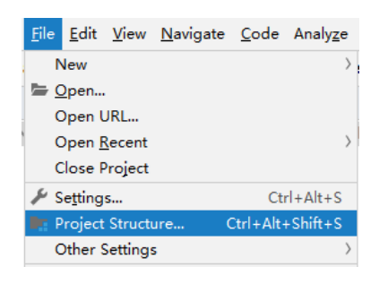
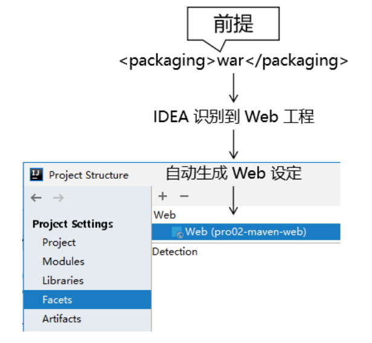
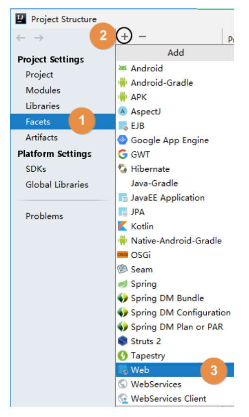
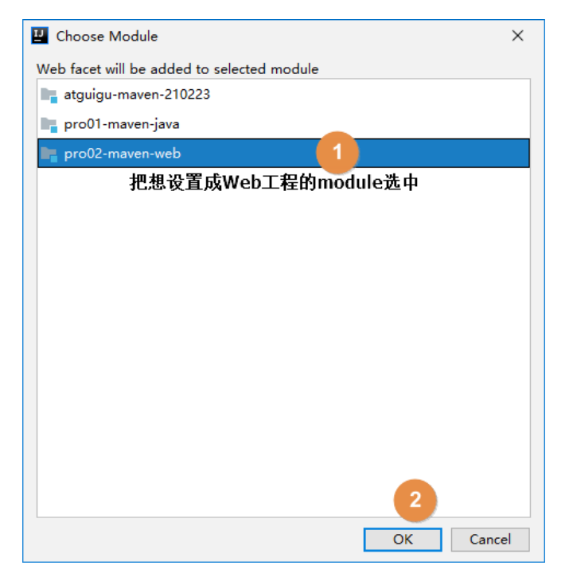
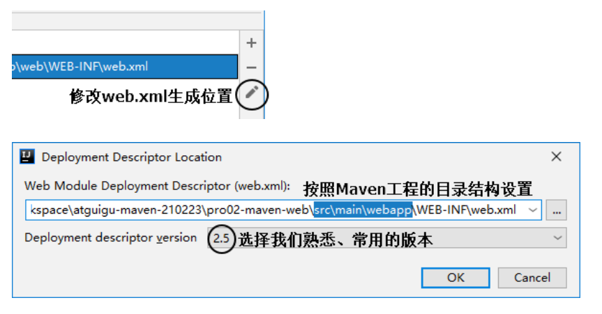
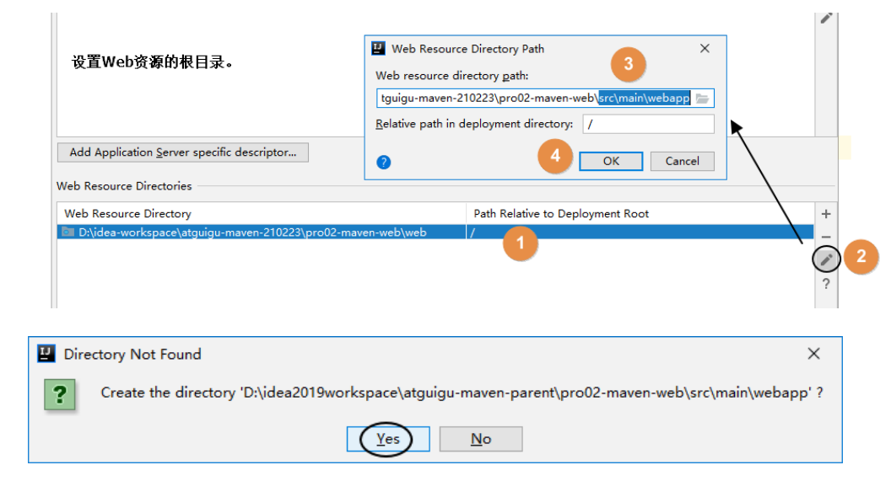

# 第四节 创建 Web 模块工程

## 1、创建模块

按照前面的同样操作创建模块，此时这个模块其实还是一个Java模块。

## 2、修改打包方式

Web 模块将来打包当然应该是 war 包。

```xml
<packaging>war</packaging>
```

## 3、Web 设定

首先打开项目结构菜单：

v

然后到 Facets 下查看 IDEA 是否已经帮我们自动生成了 Web 设定。正常来说只要我们确实设置了打包方式为 war，那么 IDEA 2019 版就会自动生成 Web 设定。



另外，对于 IDEA 2018 诸版本没有自动生成 Web 设定，那么请参照下面两图，我们自己创建：





## 4、借助IDEA生成web.xml



## 5、设置 Web 资源的根目录

结合 Maven 的目录结构，Web 资源的根目录需要设置为 src/main/webapp 目录。

