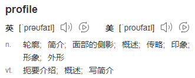

# 第七节 profile 详解

## 1、profile 概述

### ①单词释义



这里我们可以对接 profile 这个单词中『侧面』这个含义：项目的每一个运行环境，相当于是项目整体的一个侧面。


### ②项目的不同运行环境


通常情况下，我们至少有三种运行环境：

* 开发环境：供不同开发工程师开发的各个模块之间互相调用、访问；内部使用
* 测试环境：供测试工程师对项目的各个模块进行功能测试；内部使用
* 生产环境：供最终用户访问——所以这是正式的运行环境，对外提供服务
* 
而我们这里的『环境』仍然只是一个笼统的说法，实际工作中一整套运行环境会包含很多种不同服务器：

* MySQL
* Redis
* ElasticSearch
* RabbitMQ
* FastDFS
* Nginx
* Tomcat
* ……

就拿其中的 MySQL 来说，不同环境下的访问参数肯定完全不同：

| 开发环境                                                                                                                              | 测试环境                                                                                                                                       | 生产环境                                                                                                                                                    |
|:----------------------------------------------------------------------------------------------------------------------------------|:-------------------------------------------------------------------------------------------------------------------------------------------|:--------------------------------------------------------------------------------------------------------------------------------------------------------|
| dev.driver=com.mysql.jdbc.Driver<br/>dev.url=jdbc:mysql://124.71.36.17:3306/db-sys<br/>dev.username=root<br/>dev.password=atguigu | test.driver=com.mysql.jdbc.Driver<br/>test.url=jdbc:mysql://124.71.36.89:3306/db-sys<br/>test.username=dev-team<br/>test.password=atguigu  | product.driver=com.mysql.jdbc.Driver<br/>product.url=jdbc:mysql://39.107.88.164:3306/prod-db-sys<br/>product.username=root<br/>product.password=atguigu |


可是代码只有一套。如果在 jdbc.properties 里面来回改，那就太麻烦了，而且很容易遗漏或写错，增加调试的难度和工作量。所以最好的办法就是把适用于各种不同环境的配置信息分别准备好，部署哪个环境就激活哪个配置。

在 Maven 中，使用 profile 机制来管理不同环境下的配置信息。但是解决同类问题的类似机制在其他框架中也有，而且从模块划分的角度来说，持久化层的信息放在构建工具中配置也违反了『高内聚，低耦合』的原则。

所以 Maven 的 profile 我们了解一下即可，不必深究。

### ③profile 声明和使用的基本逻辑

* 首先为每一个环境声明一个 profile

  - 环境 A：profile A
  - 环境 B：profile B
  - 环境 C：profile C
  - ……

* 然后激活某一个 profile

### ④默认 profile

其实即使我们在 pom.xml 中不配置 profile 标签，也已经用到 profile了。为什么呢？因为根标签 project 下所有标签相当于都是在设定默认的 profile。这样一来我们也就很容易理解下面这句话：project 标签下除了 modelVersion 和坐标标签之外，其它标签都可以配置到 profile 中。

## 2、profile 配置

### ①外部视角：配置文件

从外部视角来看，profile 可以在下面两种配置文件中配置：

* settings.xml：全局生效。其中我们最熟悉的就是配置 JDK 1.8。
* pom.xml：当前 POM 生效

### ②内部实现：具体标签

从内部视角来看，配置 profile 有如下语法要求：

#### [1] profiles/profile 标签

* 由于 profile 天然代表众多可选配置中的一个所以由复数形式的 profiles 标签统一管理。
* 由于 profile 标签覆盖了 pom.xml 中的默认配置，所以 profiles 标签通常是 pom.xml 中的最后一个标签。

#### [2]id 标签

每个 profile 都必须有一个 id 标签，指定该 profile 的唯一标识。这个 id 标签的值会在命令行调用 profile 时被用到。这个命令格式是：-D<profile id>。

#### [3]其它允许出现的标签

一个 profile 可以覆盖项目的最终名称、项目依赖、插件配置等各个方面以影响构建行为。

* build
  - defaultGoal
  - finalName
  - resources
  - testResources
  - plugins
* reporting
* modules
* dependencies
* dependencyManagement
* repositories
* pluginRepositories
* properties

## 3、激活 profile

### ①默认配置默认被激活

前面提到了，POM 中没有在 profile 标签里的就是默认的 profile，当然默认被激活。

### ②基于环境信息激活

环境信息包含：JDK 版本、操作系统参数、文件、属性等各个方面。一个 profile 一旦被激活，那么它定义的所有配置都会覆盖原来 POM 中对应层次的元素。大家可以参考下面的标签结构：

```xml
<profile>
	<id>dev</id>
    <activation>
        <!-- 配置是否默认激活 -->
    	<activeByDefault>false</activeByDefault>
        <jdk>1.5</jdk>
        <os>
        	<name>Windows XP</name>
            <family>Windows</family>
            <arch>x86</arch>
            <version>5.1.2600</version>
        </os>
        <property>
        	<name>mavenVersion</name>
            <value>2.0.5</value>
        </property>
        <file>
        	<exists>file2.properties</exists>
            <missing>file1.properties</missing>
        </file>
    </activation>
</profile>
```

这里有个问题是：多个激活条件之间是什么关系呢？

* Maven 3.2.2 之前：遇到第一个满足的条件即可激活——或的关系。
* Maven 3.2.2 开始：各条件均需满足——且的关系。

下面我们来看一个具体例子。假设有如下 profile 配置，在 JDK 版本为 1.6 时被激活：

```xml
<profiles>
	<profile>
    	<id>JDK1.6</id>
        <activation>
            <!-- 指定激活条件为：JDK 1.6 -->
        	<jdk>1.6</jdk>
        </activation>
        ……
    </profile>
</profiles>
```

这里需要指出的是：Maven 会自动检测当前环境安装的 JDK 版本，只要 JDK 版本是以 1.6 开头都算符合条件。下面几个例子都符合：

* 1.6.0_03
* 1.6.0_02
* ……

### ③命令行激活

#### [1]列出活动的 profile

```text
# 列出所有激活的 profile，以及它们在哪里定义
mvn help:active-profiles
```

#### [2]指定某个具体 profile

```text
mvn compile -P<profile id>
```

## 4、操作举例

### ①编写 Lambda 表达式代码

Lambda 表达式代码要求 JDK 版本必须是 1.8，我们可以以此来判断某个指定更低 JDK 版本的 profile 是否被激活生效。

```java
@Test
public void test() {
    new Thread(()->{
        System.out.println(Thread.currentThread().getName() + " is working");
    }).start();
}
```

以目前配置运行这个测试方法：


### ②配置 profile

```xml
<profiles>
    <profile>
        <id>myJDKProfile</id>
        <!-- build 标签：意思是告诉 Maven，你的构建行为，我要开始定制了！ -->
        <build>
            <!-- plugins 标签：Maven 你给我听好了，你给我构建的时候要用到这些插件！ -->
            <plugins>
                <!-- plugin 标签：这是我要指定的一个具体的插件 -->
                <plugin>
                    <!-- 插件的坐标。此处引用的 maven-compiler-plugin 插件不是第三方的，是一个 Maven 自带的插件。 -->
                    <groupId>org.apache.maven.plugins</groupId>
                    <artifactId>maven-compiler-plugin</artifactId>
                    <version>3.1</version>

                    <!-- configuration 标签：配置 maven-compiler-plugin 插件 -->
                    <configuration>
                        <!-- 具体配置信息会因为插件不同、需求不同而有所差异 -->
                        <source>1.6</source>
                        <target>1.6</target>
                        <encoding>UTF-8</encoding>
                    </configuration>
                </plugin>
            </plugins>
        </build>
    </profile>
</profiles>
```

### ③执行构建命令

```text
mvn clean test -PmyJDKProfile
```


## 5、资源属性过滤

### ①简介

Maven 为了能够通过 profile 实现各不同运行环境切换，提供了一种『资源属性过滤』的机制。通过属性替换实现不同环境使用不同的参数。

### ②操作演示

#### [1]配置 profile

```xml
<profiles>
    <profile>
        <id>devJDBCProfile</id>
        <properties>
            <dev.jdbc.user>root</dev.jdbc.user>
            <dev.jdbc.password>atguigu</dev.jdbc.password>
            <dev.jdbc.url>http://localhost:3306/db_good</dev.jdbc.url>
            <dev.jdbc.driver>com.mysql.jdbc.Driver</dev.jdbc.driver>
        </properties>
        <build>
            <resources>
                <resource>
                    <!-- 表示为这里指定的目录开启资源过滤功能 -->
                    <directory>src/main/resources</directory>

                    <!-- 将资源过滤功能打开 -->
                    <filtering>true</filtering>
                </resource>
            </resources>
        </build>
    </profile>
</profiles>
```

#### [2]创建待处理的资源文件

```properties
dev.user=${dev.jdbc.user}
dev.password=${dev.jdbc.password}
dev.url=${dev.jdbc.url}
dev.driver=${dev.jdbc.driver}
```

#### [3]执行处理资源命令

```text
mvn clean resources:resources -PdevJDBCProfile
```

#### [4]找到处理得到的资源文件


#### [5]延伸

我们时不时会在 resource 标签下看到 includes 和 excludes 标签。它们的作用是：

* includes：指定执行 resource 阶段时要包含到目标位置的资源
* excludes：指定执行 resource 阶段时要排除的资源

情看下面的例子：

```xml
<build>
    <resources>
        <resource>
            <!-- 表示为这里指定的目录开启资源过滤功能 -->
            <directory>src/main/resources</directory>

            <!-- 将资源过滤功能打开 -->
            <filtering>true</filtering>

            <includes>
                <include>*.properties</include>
            </includes>

            <excludes>
                <exclude>happy.properties</exclude>
            </excludes>
        </resource>
    </resources>
</build>
```

执行处理资源命令：

```text
mvn clean resources:resources -PdevJDBCProfile
```

执行效果如下：


当然我们这里只是以 properties 文件为例，并不是只能处理 properties 文件。