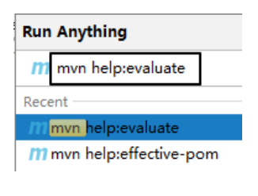
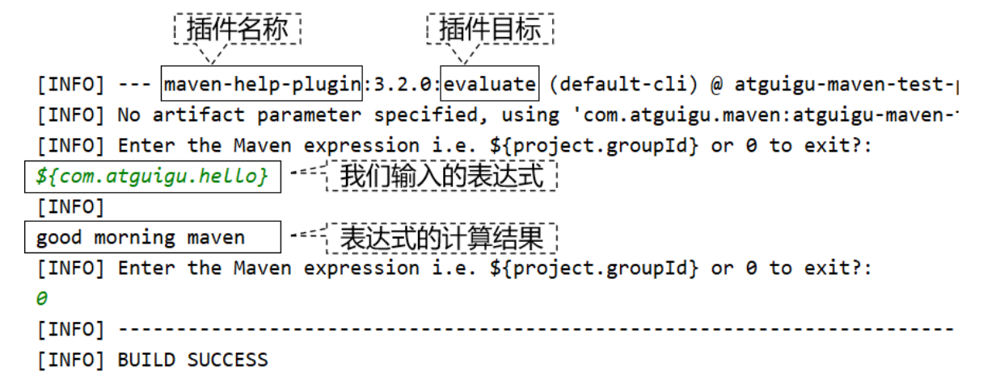
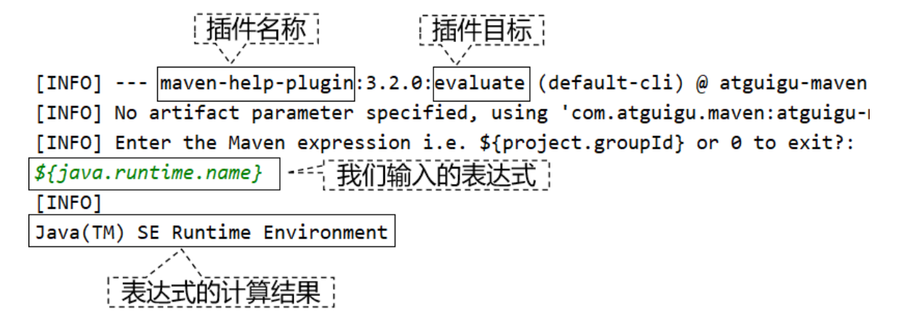
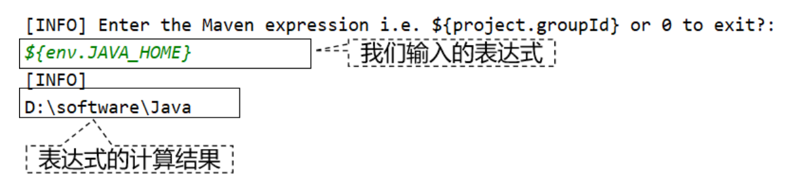
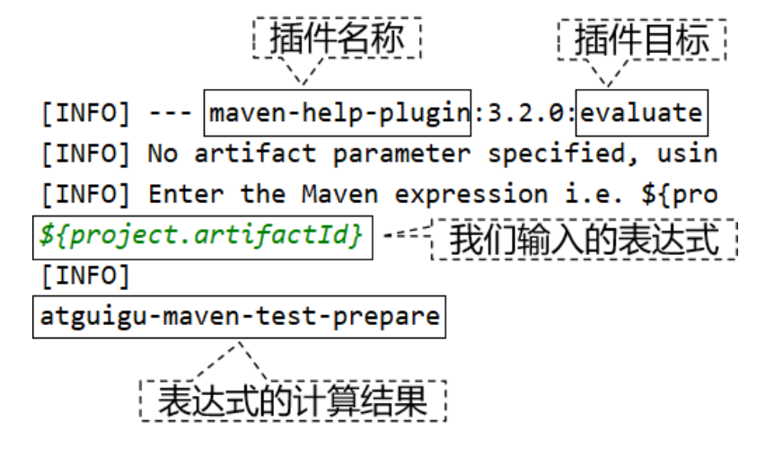
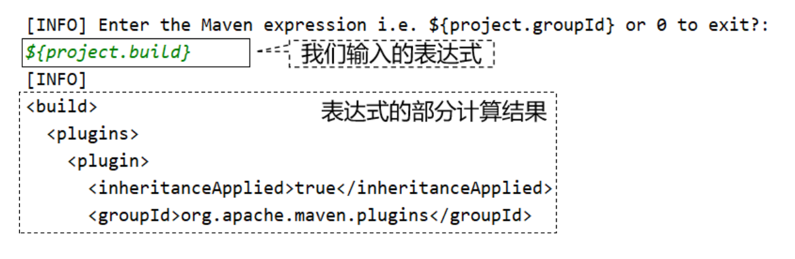
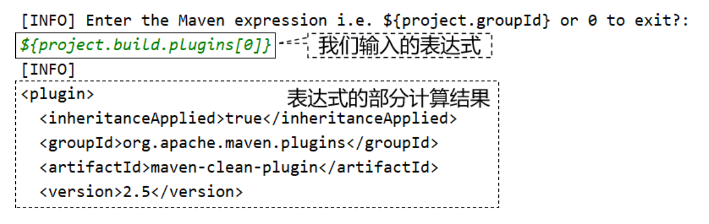
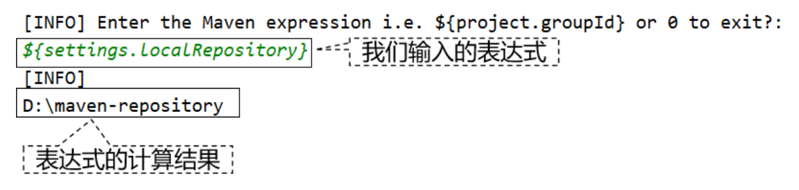

# 第三节 属性的声明与引用

## 1、help 插件的各个目标

官网说明地址：https://maven.apache.org/plugins/maven-help-plugin

|           目标            |                说明                |
|:-----------------------:|:--------------------------------:|
|  help:active-profiles   |         列出当前已激活的 profile         |
|    help:all-profiles    |        列出当前工程所有可用 profile        |
|      help:describe      |        描述一个插件和/或 Mojo 的属性        |
|   help:effective-pom    |         以 XML 格式展示有效 POM         |
| help:effective-settings | 为当前工程以 XML 格式展示计算得到的 settings 配置 |
|      help:evaluate      |     计算用户在交互模式下给出的 Maven 表达式      |
|       help:system       |      显示平台详细信息列表，如系统属性和环境变量       |

## 2、使用 help:evaluate 查看属性值

### ①定义属性

```xml
<properties>
    <com.atguigu.hello>good morning maven</com.atguigu.hello>
</properties>
```

### ②运行命令



### ③运行结果



## 3、通过 Maven 访问系统属性

### ① Java 系统属性一览

#### [1] Java 代码

```java
Properties properties = System.getProperties();
Set<Object> propNameSet = properties.keySet();
for (Object propName : propNameSet) {
    String propValue = properties.getProperty((String) propName);
    System.out.println(propName + " = " + propValue);
}
```

#### [2]运行结果

```text
java.runtime.name = Java(TM) SE Runtime Environment
sun.boot.library.path = D:\software\Java\jre\bin
java.vm.version = 25.141-b15
java.vm.vendor = Oracle Corporation
java.vendor.url = http://java.oracle.com/
path.separator = ;
java.vm.name = Java HotSpot(TM) 64-Bit Server VM
file.encoding.pkg = sun.io
user.country = CN
user.script =
sun.java.launcher = SUN_STANDARD
sun.os.patch.level =
java.vm.specification.name = Java Virtual Machine Specification
user.dir = D:\idea2019workspace\atguigu-maven-test-prepare
java.runtime.version = 1.8.0_141-b15
java.awt.graphicsenv = sun.awt.Win32GraphicsEnvironment
java.endorsed.dirs = D:\software\Java\jre\lib\endorsed
os.arch = amd64
java.io.tmpdir = C:\Users\ADMINI~1\AppData\Local\Temp\
line.separator =
java.vm.specification.vendor = Oracle Corporation
user.variant =
os.name = Windows 10
sun.jnu.encoding = GBK
java.library.path = D:\software\Java\bin;C:\WINDOWS\Sun\Java\bin;C:\WIN……
java.specification.name = Java Platform API Specification
java.class.version = 52.0
sun.management.compiler = HotSpot 64-Bit Tiered Compilers
os.version = 10.0
user.home = C:\Users\Administrator
user.timezone =
java.awt.printerjob = sun.awt.windows.WPrinterJob
file.encoding = UTF-8
java.specification.version = 1.8
java.class.path = D:\software\Java\jre\lib\charsets.jar;D:\softw……
user.name = Administrator
java.vm.specification.version = 1.8
sun.java.command = com.atguigu.maven.MyTest
java.home = D:\software\Java\jre
sun.arch.data.model = 64
user.language = zh
java.specification.vendor = Oracle Corporation
awt.toolkit = sun.awt.windows.WToolkit
java.vm.info = mixed mode
java.version = 1.8.0_141
java.ext.dirs = D:\software\Java\jre\lib\ext;C:\WINDOWS\Sun\Java\lib\ext
sun.boot.class.path = D:\software\Java\jre\lib\resources.jar;D:\sof……
java.vendor = Oracle Corporation
file.separator = \
java.vendor.url.bug = http://bugreport.sun.com/bugreport/
sun.io.unicode.encoding = UnicodeLittle
sun.cpu.endian = little
sun.desktop = windows
sun.cpu.isalist = amd64
```

### ②使用 Maven 访问系统属性



## 4、访问系统环境变量

${env.系统环境变量名}



## 5、访问 project 属性

### ①含义

使用表达式 ${project.xxx} 可以访问当前 POM 中的元素值。

### ②访问一级标签

${project.标签名}



### ③访问子标签

${project.标签名.子标签名}



### ④访问列表标签

${project.标签名[下标]}



## 6、访问 settings 全局配置

${settings.标签名} 可以访问 settings.xml 中配置的元素值。



## 7、用途

* 在当前 pom.xml 文件中引用属性

例如：

```xml
<properties>
    <mysql>5.1.37</mysql>
</properties>

<dependencies>
    <dependency>
        <groupId>mysql</groupId>
        <artifactId>mysql-connector-java</artifactId>
        <version>${mysql}</version>
    </dependency>
</dependencies>
```

* 资源过滤功能：在非 Maven 配置文件中引用属性，由 Maven 在处理资源时将引用属性的表达式替换为属性值