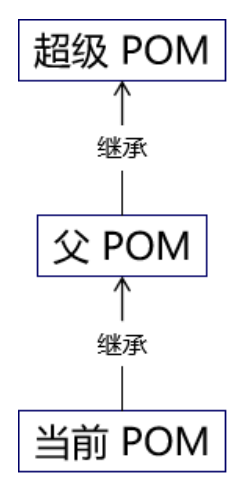

# 第二节 POM 的四个层次

## 1、超级 POM

经过我们前面的学习，我们看到 Maven 在构建过程中有很多默认的设定。例如：源文件存放的目录、测试源文件存放的目录、构建输出的目录……等等。但是其实这些要素也都是被 Maven 定义过的。定义的位置就是：超级 POM。

关于超级 POM，Maven 官网是这样介绍的：

> The Super POM is Maven's default POM. All POMs extend the Super POM unless explicitly set, meaning the configuration specified in the Super POM is inherited by the POMs you created for your projects.
> 
> 译文：Super POM 是 Maven 的默认 POM。除非明确设置，否则所有 POM 都扩展 Super POM，这意味着 Super POM 中指定的配置由您为项目创建的 POM 继承。

所以我们自己的 POM 即使没有明确指定一个父工程（父 POM），其实也默认继承了超级 POM。就好比一个 Java 类默认继承了 Object 类。

那么超级 POM 中定义了哪些东西呢？点击[这里](datum/超级POM.md)查看。

## 2、父 POM

和 Java 类一样，POM 之间其实也是单继承的。如果我们给一个 POM 指定了父 POM，那么继承关系如下图所示：



## 3、有效 POM

### ①概念

有效 POM 英文翻译为 effective POM，它的概念是这样的——在 POM 的继承关系中，子 POM 可以覆盖父 POM 中的配置；如果子 POM 没有覆盖，那么父 POM 中的配置将会被继承。按照这个规则，继承关系中的所有 POM 叠加到一起，就得到了一个最终生效的 POM。显然 Maven 实际运行过程中，执行构建操作就是按照这个最终生效的 POM 来运行的。这个最终生效的 POM 就是有效 POM，英文叫effective POM。

### ②查看有效 POM

```shell
mvn help:effective-pom
```

运行效果点击[这里](datum/Effective%20POM.xml)查看。

## 4、小结

综上所述，平时我们使用和配置的 POM 其实大致是由四个层次组成的：

* 超级 POM：所有 POM 默认继承，只是有直接和间接之分。
* 父 POM：这一层可能没有，可能有一层，也可能有很多层。
* 当前 pom.xml 配置的 POM：我们最多关注和最多使用的一层。
* 有效 POM：隐含的一层，但是实际上真正生效的一层。