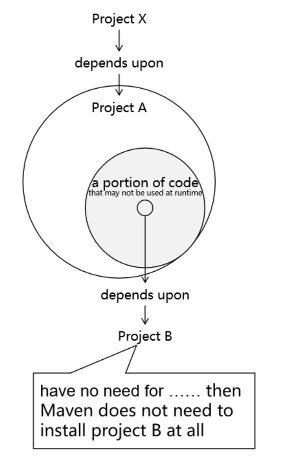
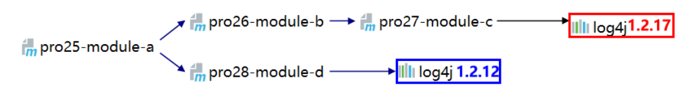
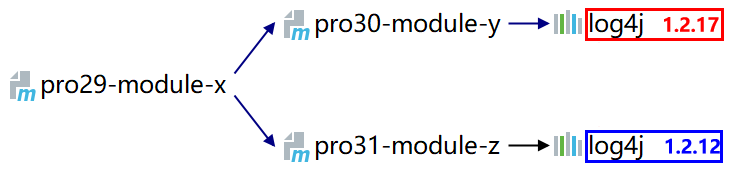

# 第五节 依赖配置补充

[Maven 官网介绍依赖机制](https://maven.apache.org/guides/introduction/introduction-to-dependency-mechanism.html)

### 1、依赖范围

### ①import

管理依赖最基本的办法是继承父工程，但是和 Java 类一样，Maven 也是单继承的。如果不同体系的依赖信息封装在不同 POM 中了，没办法继承多个父工程怎么办？这时就可以使用 import 依赖范围。

典型案例当然是在项目中引入 SpringBoot、SpringCloud 依赖：

```xml
<dependencyManagement>
    <dependencies>

        <!-- SpringCloud 依赖导入 -->
        <dependency>
            <groupId>org.springframework.cloud</groupId>
            <artifactId>spring-cloud-dependencies</artifactId>
            <version>Hoxton.SR9</version>
            <type>pom</type>
            <scope>import</scope>
        </dependency>

        <!-- SpringCloud Alibaba 依赖导入 -->
        <dependency>
            <groupId>com.alibaba.cloud</groupId>
            <artifactId>spring-cloud-alibaba-dependencies</artifactId>
            <version>2.2.6.RELEASE</version>
            <type>pom</type>
            <scope>import</scope>
        </dependency>

        <!-- SpringBoot 依赖导入 -->
        <dependency>
            <groupId>org.springframework.boot</groupId>
            <artifactId>spring-boot-dependencies</artifactId>
            <version>2.3.6.RELEASE</version>
            <type>pom</type>
            <scope>import</scope>
        </dependency>
    </dependencies>
</dependencyManagement>
```

import 依赖范围使用要求：

* 打包类型必须是 pom
* 必须放在 dependencyManagement 中

### ②system

以 Windows 系统环境下开发为例，假设现在 D:\tempare\atguigu-maven-test-aaa-1.0-SNAPSHOT.jar 想要引入到我们的项目中，此时我们就可以将依赖配置为 system 范围：

```xml
<dependency>
    <groupId>com.atguigu.maven</groupId>
    <artifactId>atguigu-maven-test-aaa</artifactId>
    <version>1.0-SNAPSHOT</version>
    <systemPath>D:\tempare\atguigu-maven-test-aaa-1.0-SNAPSHOT.jar</systemPath>
    <scope>system</scope>
</dependency>
```

但是很明显：这样引入依赖完全不具有可移植性，所以不要使用。如果需要引入体系外 jar 包我们后面会讲专门的办法。

### ③runtime

专门用于编译时不需要，但是运行时需要的 jar 包。比如：编译时我们根据接口调用方法，但是实际运行时需要的是接口的实现类。典型案例是：

```xml
<!--热部署 -->
<dependency>
    <groupId>org.springframework.boot</groupId>
    <artifactId>spring-boot-devtools</artifactId>
    <scope>runtime</scope>
    <optional>true</optional>
</dependency>
```

## 2、可选依赖

### ①配置举例

```xml
<!--热部署 -->
<dependency>
    <groupId>org.springframework.boot</groupId>
    <artifactId>spring-boot-devtools</artifactId>
    <scope>runtime</scope>
    <optional>true</optional>
</dependency>
```

### ②本质含义

可选其实就是『可有可无』。

其核心含义是：Project X 依赖 Project A，A 中一部分 X 用不到的代码依赖了 B，那么对 X 来说 B 就是『可有可无』的。



## 3、版本仲裁

### ①最短路径优先

在下图的例子中，对模块 pro25-module-a 来说，Maven 会采纳 1.2.12 版本。



### ②路径相同时先声明者优先



此时 Maven 采纳哪个版本，取决于在 pro29-module-x 中，对 pro30-module-y 和 pro31-module-z 两个模块的依赖哪一个先声明。

### ③小结

其实 Maven 的版本仲裁机制只是在没有人为干预的情况下，自主决定 jar 包版本的一个办法。而实际上我们要使用具体的哪一个版本，还要取决于项目中的实际情况。所以在项目正常运行的情况下，jar 包版本可以由 Maven 仲裁，不必我们操心；而发生冲突时 Maven 仲裁决定的版本无法满足要求，此时就应该由程序员明确指定 jar 包版本。