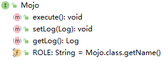
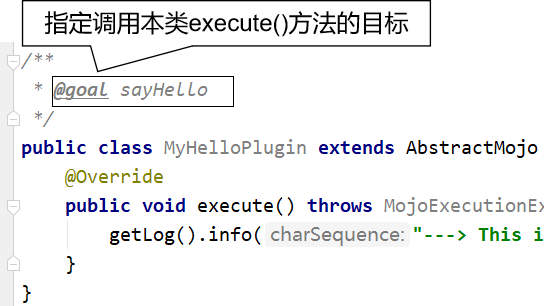
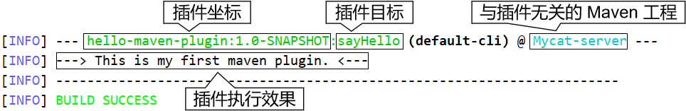
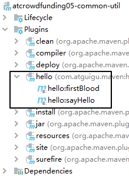
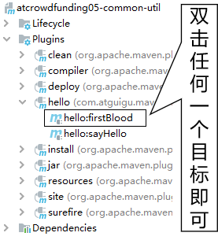
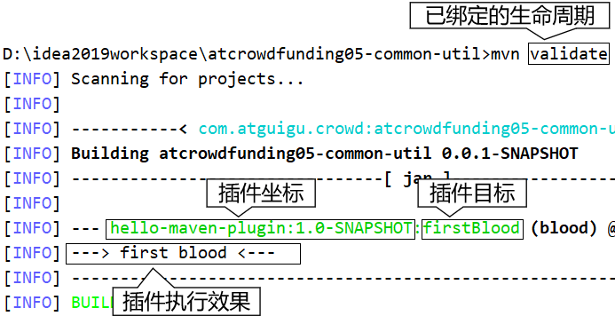

# 第六节 Maven 自定义插件

## 1、本节定位

其实实际开发中几乎没有什么场景需要我们开发自定义 Maven 插件，所以本节只是通过这个角度帮助我们更好的理解插件的目标和生命周期阶段之间的关系。

## 2、插件开发

### ①创建工程

### ②设定打包方式

```xml
<packaging>maven-plugin</packaging>
```

### ③引入依赖

下面两种方式二选一：

#### [1]将来在文档注释中使用注解

```xml
<dependency>
    <groupId>org.apache.maven</groupId>
    <artifactId>maven-plugin-api</artifactId>
    <version>3.5.2</version>
</dependency>
```

#### [2]将来直接使用注解

```xml
<dependency>
    <groupId>org.apache.maven.plugin-tools</groupId>
    <artifactId>maven-plugin-annotations</artifactId>
    <version>3.5.2</version>
</dependency>
```

### ④创建 Mojo 类

Mojo 类是一个 Maven 插件的核心类。

Mojo 这个单词的意思是：Maven Old Java Object，其实 mojo 这个单词本身包含魔力;符咒(袋);护身符;(人的)魅力的含义，Maven 用 Mojo 是因为它是对 POJO 开的一个小玩笑。

#### [1] Mojo 接口

每一个 Mojo 都需要实现 org.apache.maven.plugin.Mojo 接口。



#### [2] AbstractMojo 抽象类

我们实现 Mojo 接口比较困难，幸好可以继承 AbstractMojo，此时我们只要实现 execute() 这一个方法即可。

```java
public class MyHelloPlugin extends AbstractMojo {
    @Override
    public void execute() throws MojoExecutionException, MojoFailureException {
        getLog().info("---> This is my first maven plugin. <---");
    }
}
```

## 3、插件配置

### ①Mojo 类中的配置

#### [1]文档注释中用注解

对应的 pom.xml 中的依赖： maven-plugin-api



#### [2]直接在类上标记注解

对应 pom.xml 中的依赖：maven-plugin-annotations

```java
// name 属性：指定目标名称
@Mojo(name = "firstBlood")
public class MyPluginOfFistBlood extends AbstractMojo {
    @Override
    public void execute() throws MojoExecutionException, MojoFailureException {
        getLog().info("---> first blood <---");
    }
}
```

### ②安装插件

要在后续使用插件，就必须至少将插件安装到本地仓库。

### ③注册插件

我们需要将插件坐标中的 groupId 部分注册到 settings.xml 中。

```xml
<pluginGroups>
	<!-- pluginGroup
	 | Specifies a further group identifier to use for plugin lookup.
	<pluginGroup>com.your.plugins</pluginGroup>
	-->
	<pluginGroup>com.atguigu.maven</pluginGroup>
</pluginGroups>
```

## 4、使用插件

### ①识别插件前缀

Maven 根据插件的 artifactId 来识别插件前缀。例如下面两种情况：

#### [1]前置匹配

* 匹配规则：${prefix}-maven-plugin
* artifactId：hello-maven-plugin
* 前缀：hello

#### [2]中间匹配

* 匹配规则：maven-${prefix}-plugin
* artifactId：maven-good-plugin
* 前缀：good

### ②在命令行直接用

* 命令：

```text
mvn hello:sayHello
```

* 效果：



### ③配置到 build 标签里

这里找一个和插件无关的 Maven 工程配置才有说服力。

#### [1]配置

```xml
<build>
	<plugins>
		<plugin>
			<groupId>com.atguigu.maven</groupId>
			<artifactId>hello-maven-plugin</artifactId>
			<version>1.0-SNAPSHOT</version>
			<executions>
				<execution>
                    <id>hello</id>
                    <!-- 指定和目标关联的生命周期阶段 -->
					<phase>clean</phase>
					<goals>
						<goal>sayHello</goal>
					</goals>
				</execution>
                <execution>
                    <id>blood</id>
                    <phase>validate</phase>
                    <goals>
                        <goal>firstBlood</goal>
                    </goals>
                </execution>
			</executions>
		</plugin>
	</plugins>
</build>
```

#### [2]效果



#### [3]图形化界面使用



#### [4]命令行使用

执行已和插件目标绑定的生命周期：

