# 第四节 build 标签详解

## 1、一睹真容

在实际使用 Maven 的过程中，我们会发现 build 标签有时候有，有时候没，这是怎么回事呢？其实通过有效 POM 我们能够看到，build 标签的相关配置其实一直都在，只是在我们需要定制构建过程的时候才会通过配置 build 标签覆盖默认值或补充配置。这一点我们可以通过打印有效 POM 来看到。

所以本质上来说：我们配置的 build 标签都是对超级 POM 配置的叠加。那我们又为什么要在默认配置的基础上叠加呢？很简单，在默认配置无法满足需求的时候定制构建过程。

## 2、build 标签组成

从完整示例中我们能够看到，build 标签的子标签大致包含三个主体部分：

### ①定义约定的目录结构

参考示例中的如下部分：

```xml
<sourceDirectory>D:\idea2019workspace\atguigu-maven-test-prepare\src\main\java</sourceDirectory>
<scriptSourceDirectory>D:\idea2019workspace\atguigu-maven-test-prepare\src\main\scripts</scriptSourceDirectory>
<testSourceDirectory>D:\idea2019workspace\atguigu-maven-test-prepare\src\test\java</testSourceDirectory>
<outputDirectory>D:\idea2019workspace\atguigu-maven-test-prepare\target\classes</outputDirectory>
<testOutputDirectory>D:\idea2019workspace\atguigu-maven-test-prepare\target\test-classes</testOutputDirectory>
<resources>
    <resource>
        <directory>D:\idea2019workspace\atguigu-maven-test-prepare\src\main\resources</directory>
    </resource>
</resources>
<testResources>
    <testResource>
        <directory>D:\idea2019workspace\atguigu-maven-test-prepare\src\test\resources</directory>
    </testResource>
</testResources>
<directory>D:\idea2019workspace\atguigu-maven-test-prepare\target</directory>
```

我们能看到各个目录的作用如下：

|    构建结果输出目录    |          目录名           |
|:--------------:|:----------------------:|
|       作用       |    sourceDirectory     |
|   主体源程序存放目录    | scriptSourceDirectory  |
|   脚本源程序存放目录    |  testSourceDirectory   |
|   测试源程序存放目录    |    outputDirectory     |
| 主体源程序编译结果输出目录  |  testOutputDirectory   |
| 测试源程序编译结果输出目录  |       resources        |
|   主体资源文件存放目录   |     testResources      |
|   测试资源文件存放目录   |       directory        |

### ②备用插件管理

pluginManagement 标签存放着几个极少用到的插件：

* maven-antrun-plugin
* maven-assembly-plugin
* maven-dependency-plugin
* maven-release-plugin

通过 pluginManagement 标签管理起来的插件就像 dependencyManagement 一样，子工程使用时可以省略版本号，起到在父工程中统一管理版本的效果。情看下面例子：

* 被 spring-boot-dependencies 管理的插件信息：

```xml
<plugin>
	<groupId>org.springframework.boot</groupId>
	<artifactId>spring-boot-maven-plugin</artifactId>
	<version>2.6.2</version>
</plugin>
```

* 子工程使用的插件信息：

```xml
<build>
    <plugins>
        <plugin>
            <groupId>org.springframework.boot</groupId>
            <artifactId>spring-boot-maven-plugin</artifactId>
        </plugin>
    </plugins>
</build>
```

## ③生命周期插件

plugins 标签存放的是默认生命周期中实际会用到的插件，这些插件想必大家都不陌生，所以抛开插件本身不谈，我们来看看 plugin 标签的结构：

```xml
<plugin>
    <artifactId>maven-compiler-plugin</artifactId>
    <version>3.1</version>
    <executions>
        <execution>
            <id>default-compile</id>
            <phase>compile</phase>
            <goals>
                <goal>compile</goal>
            </goals>
        </execution>
        <execution>
            <id>default-testCompile</id>
            <phase>test-compile</phase>
            <goals>
                <goal>testCompile</goal>
            </goals>
        </execution>
    </executions>
</plugin>
```

#### [1]坐标部分

artifactId 和 version 标签定义了插件的坐标，作为 Maven 的自带插件这里省略了 groupId。

#### [2]执行部分

executions 标签内可以配置多个 execution 标签，execution 标签内：

* id：指定唯一标识
* phase：关联的生命周期阶段
* goals/goal：关联指定生命周期的目标
  - goals 标签中可以配置多个 goal 标签，表示一个生命周期环节可以对应当前插件的多个目标。

另外，插件目标的执行过程可以进行配置，例如 maven-site-plugin 插件的 site 目标：

```xml
<execution>
    <id>default-site</id>
    <phase>site</phase>
    <goals>
        <goal>site</goal>
    </goals>
    <configuration>
        <outputDirectory>D:\idea2019workspace\atguigu-maven-test-prepare\target\site</outputDirectory>
        <reportPlugins>
            <reportPlugin>
                <groupId>org.apache.maven.plugins</groupId>
                <artifactId>maven-project-info-reports-plugin</artifactId>
            </reportPlugin>
        </reportPlugins>
    </configuration>
</execution>
```

configuration 标签内进行配置时使用的标签是插件本身定义的。就以 maven-site-plugin 插件为例，它的核心类是 org.apache.maven.plugins.site.render.SiteMojo，在这个类中我们看到了 outputDirectory 属性：

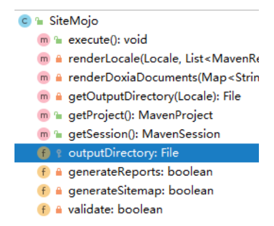

SiteMojo 的父类是：AbstractSiteRenderingMojo，在父类中我们看到 reportPlugins 属性：

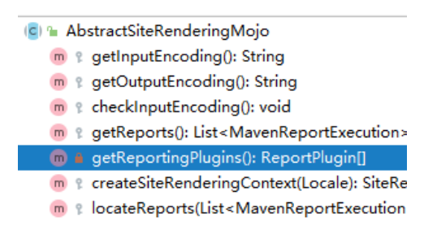

结论：每个插件能够做哪些设置都是各个插件自己规定的，无法一概而论。

## 3、典型应用：指定 JDK 版本

### ①提出问题

前面我们在 settings.xml 中配置了 JDK 版本，那么将来把 Maven 工程部署都服务器上，脱离了 settings.xml 配置，如何保证程序正常运行呢？思路就是我们直接把 JDK 版本信息告诉负责编译操作的 maven-compiler-plugin 插件，让它在构建过程中，按照我们指定的信息工作。

### ②暂时取消 settings.xml 配置

为了测试对 maven-compiler-plugin 插件进行配置的效果，我们暂时取消 settings.xml 中的 profile 配置。

```xml
<!-- 配置Maven工程的默认JDK版本 -->
<!-- <profile>
  <id>jdk-1.8</id>
  <activation>
	<activeByDefault>true</activeByDefault>
	<jdk>1.8</jdk>
  </activation>
  <properties>
	<maven.compiler.source>1.8</maven.compiler.source>
	<maven.compiler.target>1.8</maven.compiler.target>
	<maven.compiler.compilerVersion>1.8</maven.compiler.compilerVersion>
  </properties>
</profile> -->
```

### ③编写源文件代码

很明显这里用到了 Lambda 表达式，这是 JDK 1.8 才支持的语法。

```java
package com.atguigu.maven;

public class Hello {

    public void hello() {
        new Thread(()->{
            System.out.println("thread ...");
        }).start();
    }

}
```

此时我们执行编译命令：

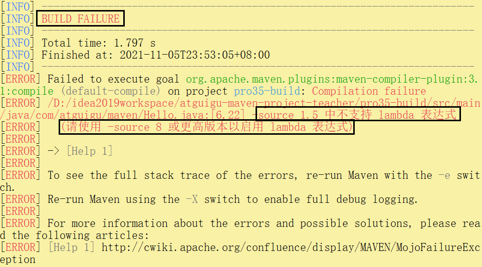

### ④配置构建过程

```xml
<!-- build 标签：意思是告诉 Maven，你的构建行为，我要开始定制了！ -->
<build>
    <!-- plugins 标签：Maven 你给我听好了，你给我构建的时候要用到这些插件！ -->
    <plugins>
        <!-- plugin 标签：这是我要指定的一个具体的插件 -->
        <plugin>
            <!-- 插件的坐标。此处引用的 maven-compiler-plugin 插件不是第三方的，是一个 Maven 自带的插件。 -->
            <groupId>org.apache.maven.plugins</groupId>
            <artifactId>maven-compiler-plugin</artifactId>
            <version>3.1</version>
            
            <!-- configuration 标签：配置 maven-compiler-plugin 插件 -->
            <configuration>
                <!-- 具体配置信息会因为插件不同、需求不同而有所差异 -->
                <source>1.8</source>
                <target>1.8</target>
                <encoding>UTF-8</encoding>
            </configuration>
        </plugin>
    </plugins>
</build>
```

### ⑤再次执行编译命令

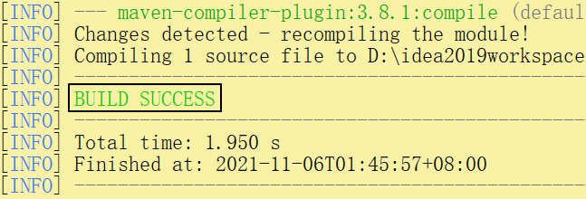

### ⑥两种配置方式比较

* settings.xml 中配置：仅在本地生效，如果脱离当前 settings.xml 能够覆盖的范围，则无法生效。
* 在当前 Maven 工程 pom.xml 中配置：无论在哪个环境执行编译等构建操作都有效。

### ⑦补充说明

#### [1]source 标签含义

查看 [Maven 官网页面](https://maven.apache.org/plugins/maven-compiler-plugin/compile-mojo.html)，我们找到 source 标签的介绍：

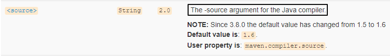

翻译过来就是：调用 Java 编译器命令时传入的 -source 参数。那对编译器来说，-source 参数是啥意思呢？

```text
C:\Users\13655>javac -help
用法: javac <options> <source files>
其中, 可能的选项包括:
  @<filename>                  从文件读取选项和文件名
  -Akey[=value]                传递给注释处理程序的选项
  --add-modules <模块>(,<模块>)*
        除了初始模块之外要解析的根模块; 如果 <module>
                为 ALL-MODULE-PATH, 则为模块路径中的所有模块。
  --boot-class-path <path>, -bootclasspath <path>
        覆盖引导类文件的位置
  --class-path <path>, -classpath <path>, -cp <path>
        指定查找用户类文件和注释处理程序的位置
  -d <directory>               指定放置生成的类文件的位置
  -deprecation                 输出使用已过时的 API 的源位置
  --enable-preview             启用预览语言功能。要与 -source 或 --release 一起使用。
  -encoding <encoding>         指定源文件使用的字符编码
  -endorseddirs <dirs>         覆盖签名的标准路径的位置
  -extdirs <dirs>              覆盖所安装扩展的位置
  -g                           生成所有调试信息
  -g:{lines,vars,source}       只生成某些调试信息
  -g:none                      不生成任何调试信息
  -h <directory>               指定放置生成的本机标头文件的位置
  --help, -help, -?            输出此帮助消息
  --help-extra, -X             输出额外选项的帮助
  -implicit:{none,class}       指定是否为隐式引用文件生成类文件
  -J<flag>                     直接将 <标记> 传递给运行时系统
  --limit-modules <模块>(,<模块>)*
        限制可观察模块的领域
  --module <模块>(,<模块>)*, -m <模块>(,<模块>)*
        只编译指定的模块，请检查时间戳
  --module-path <path>, -p <path>
        指定查找应用程序模块的位置
  --module-source-path <module-source-path>
        指定查找多个模块的输入源文件的位置
  --module-version <版本>        指定正在编译的模块版本
  -nowarn                      不生成任何警告
  -parameters                  生成元数据以用于方法参数的反射
  -proc:{none,only}            控制是否执行注释处理和/或编译。
  -processor <class1>[,<class2>,<class3>...]
        要运行的注释处理程序的名称; 绕过默认的搜索进程
  --processor-module-path <path>
        指定查找注释处理程序的模块路径
  --processor-path <path>, -processorpath <path>
        指定查找注释处理程序的位置
  -profile <profile>           请确保使用的 API 在指定的配置文件中可用
  --release <release>
        为指定的 Java SE 发行版编译。支持的发行版：7, 8, 9, 10, 11, 12, 13, 14, 15, 16, 17
  -s <directory>               指定放置生成的源文件的位置
  --source <release>, -source <release>
        提供与指定的 Java SE 发行版的源兼容性。支持的发行版：7, 8, 9, 10, 11, 12, 13, 14, 15, 16, 17
  --source-path <path>, -sourcepath <path>
        指定查找输入源文件的位置
  --system <jdk>|none          覆盖系统模块位置
  --target <release>, -target <release>
        生成适合指定的 Java SE 发行版的类文件。支持的发行版：7, 8, 9, 10, 11, 12, 13, 14, 15, 16, 17
  --upgrade-module-path <path>
        覆盖可升级模块位置
  -verbose                     输出有关编译器正在执行的操作的消息
  --version, -version          版本信息
  -Werror                      出现警告时终止编译
```

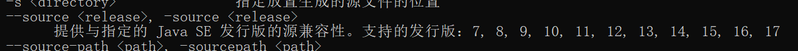

『提供与指定发行版的源兼容性』这句话的意思是：

* 我们写代码是按 JDK 1.8 写的——这就是『源兼容性』里的『源』。
* 指定发行版就是我们指定的 JDK 1.8。
* 『兼容性』是谁和谁兼容呢？现在源代码是既定的，所以就是要求编译器使用指定的 JDK 版本来兼容我们的源代码。

另外我们还看到：

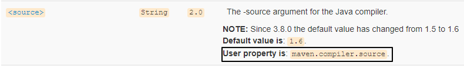

这个功能还可以通过在 properties 标签中配置 maven.compiler.source 属性来实现。所以我们也经常会看到类似这样的配置：

```xml
<properties>
    <maven.compiler.source>1.8</maven.compiler.source>
    <maven.compiler.target>1.8</maven.compiler.target>
    <project.build.sourceEncoding>UTF-8</project.build.sourceEncoding>
</properties>
```

#### [2]target 标签含义

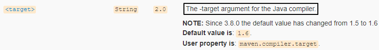

翻译过来就是：调用 Java 编译器命令时传入的 -target 参数。那对编译器来说，-target 参数是啥意思呢？

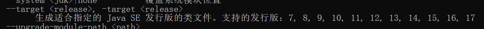

『生成特定 VM 版本的类文件』这句话的意思是：

* VM 指 JVM
* 类文件指 *.class 字节码文件
* 整体意思就是源文件编译后，生成的 *.class 字节码文件要符合指定的 JVM 版本

## 4、典型应用：SpringBoot 定制化打包

### ①需求

很显然 spring-boot-maven-plugin 并不是 Maven 自带的插件，而是 SpringBoot 提供的，用来改变 Maven 默认的构建行为。具体来说是改变打包的行为。默认情况下 Maven 调用 maven-jar-plugin 插件的 jar 目标，生成普通的 jar 包。

普通 jar 包没法使用 java -jar xxx.jar 这样的命令来启动、运行，但是 SpringBoot 的设计理念就是每一个『微服务』导出为一个 jar 包，这个 jar 包可以使用 java -jar xxx.jar 这样的命令直接启动运行。

这样一来，打包的方式肯定要进行调整。所以 SpringBoot 提供了 spring-boot-maven-plugin 这个插件来定制打包行为。

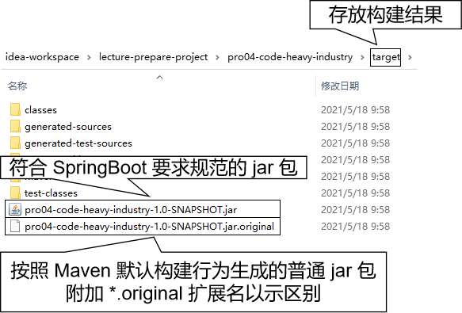

### ②示例代码

所有的一切已经都被 SpringBoot 封装好了，所以配置非常简单，提供插件坐标即可。

```xml
<build>
	<plugins>
		<plugin>
			<groupId>org.springframework.boot</groupId>
			<artifactId>spring-boot-maven-plugin</artifactId>
			<version>2.5.5</version>
		</plugin>
	</plugins>
</build>
```

### ③插件的七个目标

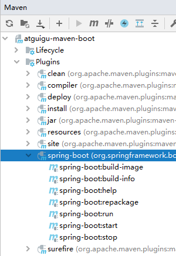

|          目标名称           |                                                                                                                                作用                                                                                                                                |
|:-----------------------:|:----------------------------------------------------------------------------------------------------------------------------------------------------------------------------------------------------------------------------------------------------------------:|
| spring-boot:build-image |                                                                                                    Package an application into a OCI image using a buildpack.                                                                                                    |
| spring-boot:build-info  |                                                                                     Generate a build-info.properties file based on the content of the current MavenProject.                                                                                      |
|    spring-boot:help     |                                                          Display help information on spring-boot-maven-plugin. Call mvn spring-boot:help -Ddetail=true -Dgoal=<goal-name> to display parameter details.                                                          |
|  spring-boot:repackage  |              Repackage existing JAR and WAR archives so that they can be executed from the command line using java -jar. With layout=NONE can also be used simply to package a JAR with nested dependencies (and no main class, so not executable).              |
|     spring-boot:run     |                                                                                                                  	Run an application in place.                                                                                                                   |
|    spring-boot:start    | Start a spring application. Contrary to the run goal, this does not block and allows other goals to operate on the application. This goal is typically used in integration test scenario where the application is started before a test suite and stopped after. |
|    spring-boot:stop     |                                                                        Stop an application that has been started by the 'start' goal. Typically invoked once a test suite has completed.                                                                         |

## 5、典型应用：Mybatis 逆向工程

使用 Mybatis 的逆向工程需要使用如下配置，MBG 插件的特点是需要提供插件所需的依赖：

```xml
<!-- 控制 Maven 在构建过程中相关配置 -->
<build>
		
	<!-- 构建过程中用到的插件 -->
	<plugins>
		
		<!-- 具体插件，逆向工程的操作是以构建过程中插件形式出现的 -->
		<plugin>
			<groupId>org.mybatis.generator</groupId>
			<artifactId>mybatis-generator-maven-plugin</artifactId>
			<version>1.3.0</version>
	
			<!-- 插件的依赖 -->
			<dependencies>
				
				<!-- 逆向工程的核心依赖 -->
				<dependency>
					<groupId>org.mybatis.generator</groupId>
					<artifactId>mybatis-generator-core</artifactId>
					<version>1.3.2</version>
				</dependency>
					
				<!-- 数据库连接池 -->
				<dependency>
					<groupId>com.mchange</groupId>
					<artifactId>c3p0</artifactId>
					<version>0.9.2</version>
				</dependency>
					
				<!-- MySQL驱动 -->
				<dependency>
					<groupId>mysql</groupId>
					<artifactId>mysql-connector-java</artifactId>
					<version>5.1.8</version>
				</dependency>
			</dependencies>
		</plugin>
	</plugins>
</build>
```

## #6、小结

不知大家有没有发现，通常需要用到 build 标签的时候底层都会帮我们封装好，需要我们配置的地方不多。即使有些地方需要我们配置，也不会真的我们自己去写，把现成的案例复制过来就行。

所以对 build 标签来说，我们的掌握要求就是：能大致看懂就行。