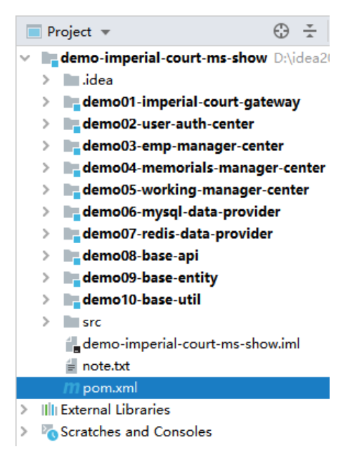

# 第二节 父工程管理依赖



```xml
<dependencyManagement>
    <dependencies>

        <!-- SpringCloud 依赖导入 -->
        <dependency>
            <groupId>org.springframework.cloud</groupId>
            <artifactId>spring-cloud-dependencies</artifactId>
            <version>Hoxton.SR9</version>
            <type>pom</type>
            <scope>import</scope>
        </dependency>

        <!-- SpringCloud Alibaba 依赖导入 -->
        <dependency>
            <groupId>com.alibaba.cloud</groupId>
            <artifactId>spring-cloud-alibaba-dependencies</artifactId>
            <version>2.2.6.RELEASE</version>
            <type>pom</type>
            <scope>import</scope>
        </dependency>

        <!-- SpringBoot 依赖导入 -->
        <dependency>
            <groupId>org.springframework.boot</groupId>
            <artifactId>spring-boot-dependencies</artifactId>
            <version>2.3.6.RELEASE</version>
            <type>pom</type>
            <scope>import</scope>
        </dependency>

        <!-- 通用 Mapper 依赖 -->
        <dependency>
            <groupId>tk.mybatis</groupId>
            <artifactId>mapper-spring-boot-starter</artifactId>
            <version>2.1.5</version>
        </dependency>

        <!-- Druid 数据源依赖 -->
        <dependency>
            <groupId>com.alibaba</groupId>
            <artifactId>druid-spring-boot-starter</artifactId>
            <version>1.1.10</version>
        </dependency>

        <!-- JPA 依赖 -->
        <dependency>
            <groupId>javax.persistence</groupId>
            <artifactId>persistence-api</artifactId>
            <version>1.0</version>
        </dependency>
    </dependencies>
</dependencyManagement>
```