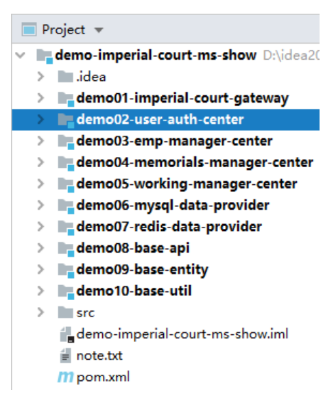
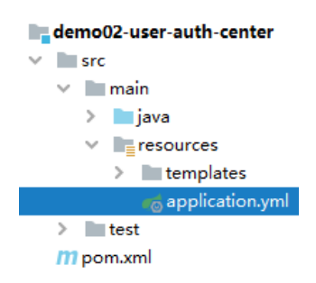
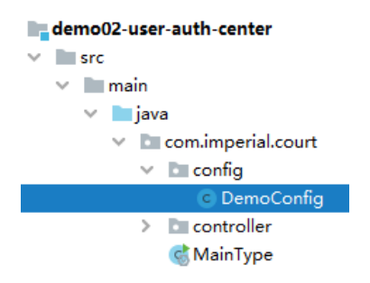
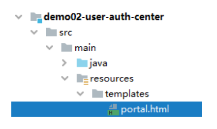
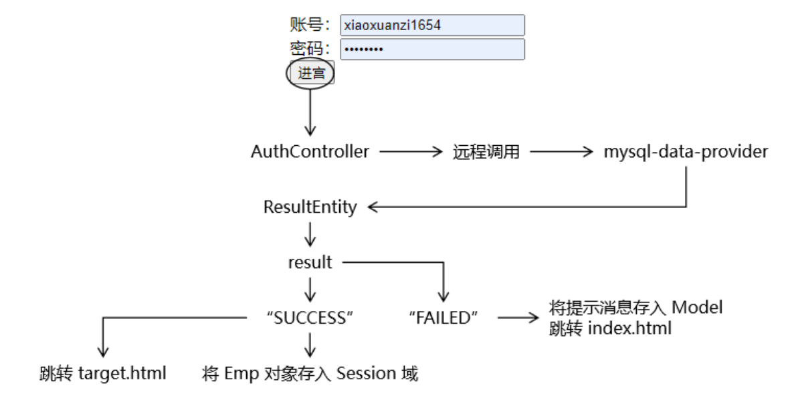
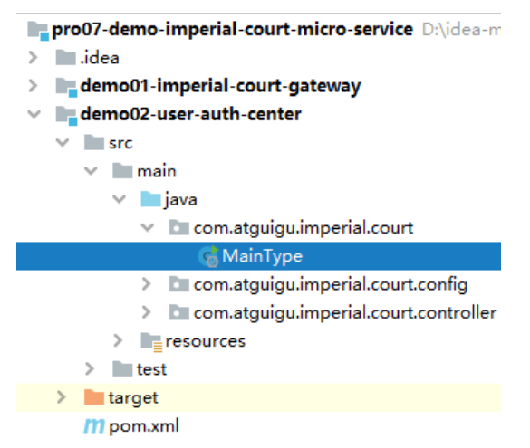

# 第五节 用户登录认证服务：消费端

## 1、所在工程



## 2、引入依赖

```xml
<!-- Nacos 服务注册发现启动器 -->
<dependency>
    <groupId>com.alibaba.cloud</groupId>
    <artifactId>spring-cloud-starter-alibaba-nacos-discovery</artifactId>
</dependency>

<!-- web启动器依赖 -->
<dependency>
    <groupId>org.springframework.boot</groupId>
    <artifactId>spring-boot-starter-web</artifactId>
</dependency>

<!-- 视图模板技术 thymeleaf -->
<dependency>
    <groupId>org.springframework.boot</groupId>
    <artifactId>spring-boot-starter-thymeleaf</artifactId>
</dependency>

<dependency>
    <groupId>com.atguigu.demo</groupId>
    <artifactId>demo08-base-api</artifactId>
    <version>1.0-SNAPSHOT</version>
</dependency>
```

## 3、YAML 配置文件



```yaml
server:
  port: 10002
spring:
  application:
    name: demo02-user-auth-center
  cloud:
    nacos:
      discovery:
        server-addr: localhost:8848
```

> TIP
> 
> 就 Thymeleaf 而言，有两个常用属性，但我们全部都使用的是默认值，所以可以省略

## 4、显示首页

### ①配置 view-controller



```java
@SpringBootConfiguration
public class DemoConfig implements WebMvcConfigurer {

    @Override
    public void addViewControllers(ViewControllerRegistry registry) {
        registry.addViewController("/").setViewName("portal");
    }
}
```

### ②Thymeleaf 视图模板页面



```html
<!DOCTYPE html>
<html lang="en" xml:th="http://www.thymeleaf.org">
<head>
    <meta charset="UTF-8">
    <title>首页</title>
</head>
<body>

<form th:action="@{/consumer/do/login}" method="post">
    <p style="color: red;font-weight: bold;" th:if="${not #strings.isEmpty(authMessage)}" th:text="${authMessage}">
        这里根据条件显示登录失败消息</p>
    <p style="color: red;font-weight: bold;" th:if="${not #strings.isEmpty(systemMessage)}" th:text="${systemMessage}">
        这里根据条件显示系统消息</p>
    账号：<input type="text" name="loginAccount"/><br/>
    密码：<input type="password" name="loginPassword"><br/>
    <button type="submit">进宫</button>
</form>
</body>
</html>
```

## 5、登录验证

### ①流程图



### ②主启动类

注意：一定要标记 @EnableFeignClients 注解。



```java
@EnableFeignClients
@EnableDiscoveryClient
@SpringBootApplication
public class MainType {

    public static void main(String[] args) {
        SpringApplication.run(MainType.class, args);
    }

}
```

### ③AuthController

#### [1]装配远程接口分析


```java
@Controller
public class AuthController {

    // 1、本地使用 @Autowired 注解装配远程接口类型即可实现方法的远程调用，
    // 看起来就像是调用本地方法一样，我们管这种特性叫方法的声明式远程调用。
    // 2、凭啥通过 @Autowired 注解就能够导入远程接口对应的 bean
    //      ①当前环境包含 Feign 相关 jar 包。
    //      ②当前微服务的主启动类上标记 @EnableFeignClients
    //      ③符合 SpringBoot 自动扫描包的约定规则：默认情况下主启动类所在的包、以及主启动类所在包的子包都会被自动扫描
    //          主启动类所在包：     com.atguigu.imperial.court
    //          被扫描的接口所在的包：com.atguigu.imperial.court.api
    @Autowired
    private MySQLProvider mySQLProvider;

}
```

#### [2]执行登录验证的方法

```java
@RequestMapping("/consumer/do/login")
public String doLogin(@RequestParam("loginAccount") String loginAccount,
                      @RequestParam("loginPassword") String loginPassword, HttpSession session, Model model) {

    // 1、调用远程接口根据登录账号、密码查询 Emp 对象
    ResultEntity<Emp> resultEntity = mySQLProvider.getEmpByLoginInfo(loginAccount, loginPassword);

    // 2、验证远程接口调用是否成功
    String result = resultEntity.getResult();
    
    if ("SUCCESS".equals(result)) {

        // 3、从 ResultEntity 中获取查询得到的 Emp 对象
        Emp emp = resultEntity.getData();
        
        // 4、将 Emp 对象存入 Session 域
        session.setAttribute("loginInfo", emp);

        // 5、前往 target 页面
        return "target";
    } else {
        
        // 6、获取失败消息
        String message = resultEntity.getMessage();
        
        // 7、将失败消息存入模型
        model.addAttribute("message", message);
        
        // 8、回到登录页面
        return "index";

    }
}
```