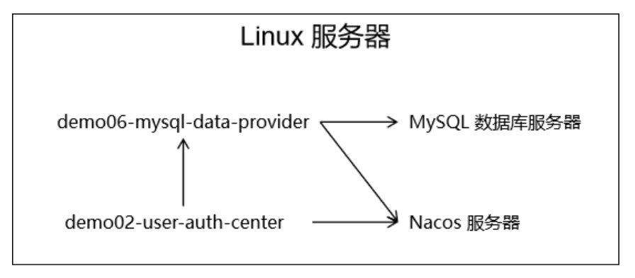
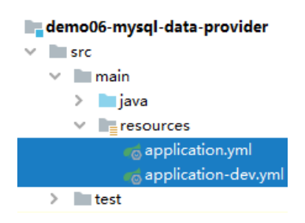
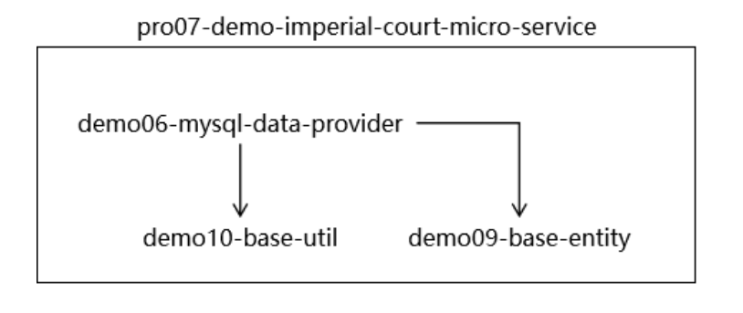
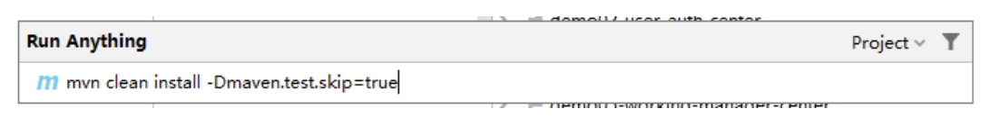
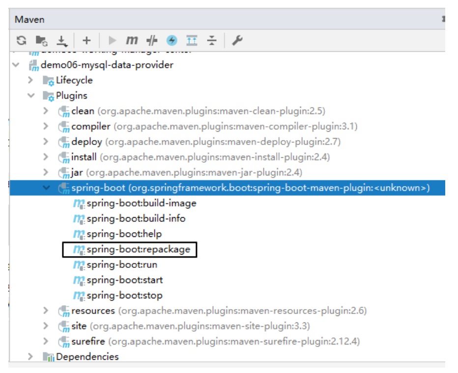
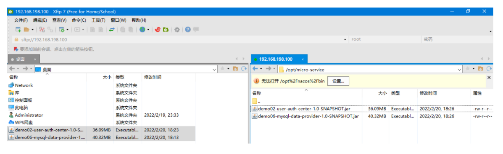

# 第六节 部署运行

## 1、最终目标



## 2、微服务打包

### ①修改 MySQL 连接信息



```yaml
server:
  port: 10001
spring:
  datasource:
    driver-class-name: com.mysql.jdbc.Driver
    
    # 当前微服务和 MySQL 位于同一个服务器上，需要把访问地址改成 localhost
    url: jdbc:mysql://localhost:3306/db_imperial_court
    username: root
    password: atguigu
    type: com.alibaba.druid.pool.DruidDataSource
  application:
    name: demo06-mysql-data-provider
  cloud:
    nacos:
      discovery:
        server-addr: localhost:8848
```

### ②在父工程执行 install 命令

#### [1]Why parent？工程间关系梳理

正确的安装顺序：

* ①父工程：pro07-demo-imperial-court-micro-service
* ②被依赖的 module：demo10-base-util 或 demo09-base-entity
* ③当前 module：demo06-mysql-data-provider



#### [2]执行命令



### ③生成微服务可运行 jar 包

#### [1]应用微服务打包插件

可以以 SpringBoot 微服务形式直接运行的 jar 包包括：

* 当前微服务本身代码
* 当前微服务所依赖的 jar 包
* 内置 Tomcat（Servlet 容器）
* 与 jar 包可以通过 java -jar 方式直接启动相关的配置

要加入额外的资源、相关配置等等，仅靠 Maven 自身的构建能力是不够的，所以要通过 build 标签引入下面的插件。

```xml
<!-- build 标签：用来配置对构建过程的定制 -->
<build>
    <!-- plugins 标签：定制化构建过程中所使用到的插件 -->
	<plugins>
        <!-- plugin 标签：一个具体插件 -->
		<plugin>
			<groupId>org.springframework.boot</groupId>
			<artifactId>spring-boot-maven-plugin</artifactId>
		</plugin>
	</plugins>
</build>
```

加入这个插件后的效果：



提示：IDEA 对于我们这里 build 标签里加入的 plugin 的配置没有能够很好的识别到插件的版本。如果我们能够保证其它操作都正常执行完成，准备工作都准备好了，那么这里我们判定是 IDEA 识别能力不足导致。一切以实际执行的结果为准：运行结果是最高权威

请对 demo02-user-auth-center 和 demo06-mysql-data-provider 都添加上面的 build 配置。

#### [2]执行插件目标

请对 demo02-user-auth-center 和 demo06-mysql-data-provider 都执行下面的命令：

* clean 子命令：清理之前构建的结果
* package 子命令：我们真正要调用的 spring-boot:repackage 要求必须将当前微服务本身的 jar 包提前准备好，所以必须在它之前执行 package 子命令。
* spring-boot:repackage 子命令：调用 spring-boot 插件的 repackage 目标
* -Dmaven.test.skip=true 参数：跳过测试

```text
mvn clean package spring-boot:repackage -Dmaven.test.skip=true
```

## 3、执行部署

### ①启动 Nacos

```shell
sh /opt/nacos/bin/startup.sh -m standalone
```

### ②上传微服务 jar 包



### ③启动微服务

````shell
nohup java -jar demo06-mysql-data-provider-1.0-SNAPSHOT.jar>demo06.log 2>&1 &
nohup java -jar demo02-user-auth-center-1.0-SNAPSHOT.jar>demo02.log 2>&1 &
````

[nohup命令详解](http://heavy_code_industry.gitee.io/code_heavy_industry/pro006-Linux/lecture/chapter03/verse04-07-nohup.html)