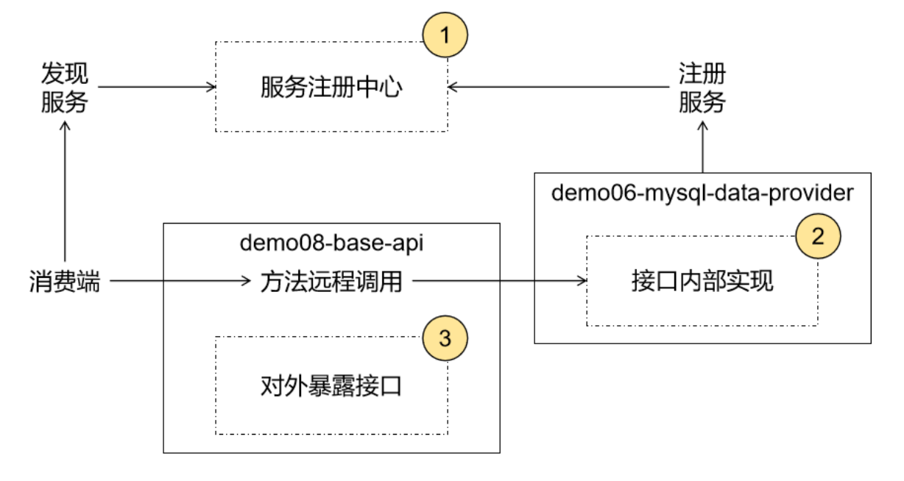
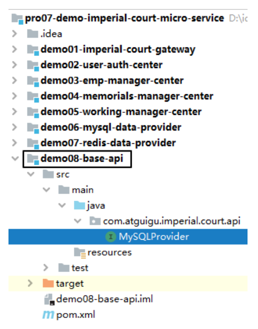
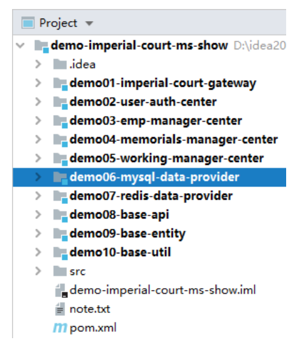
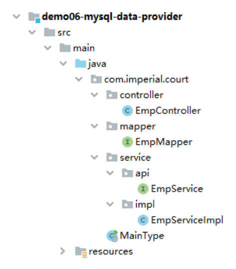
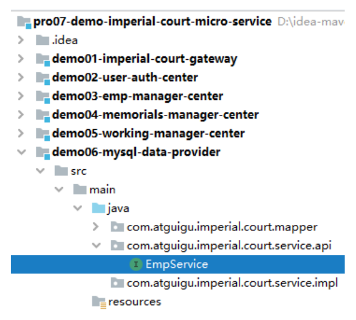
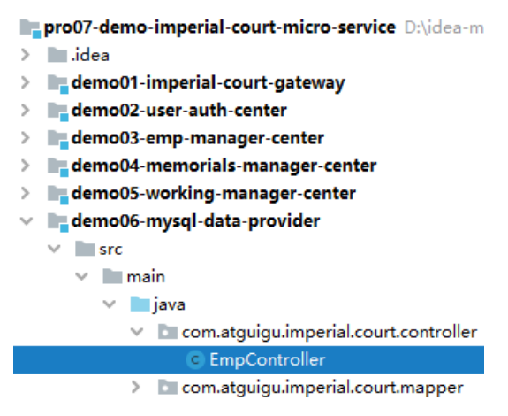
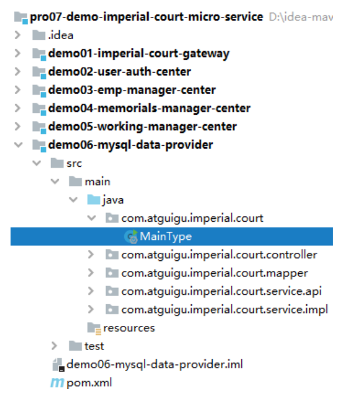
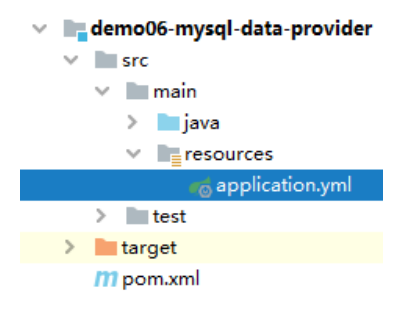

# 第四节 用户登录认证服务：提供端

## 1、总体分析



## 2、注册中心

在本地启动 Nacos 注册中心：

```text
d:\software\nacos\bin>startup.cmd -m standalone
```

## 3、声明接口，暴露服务

### ①接口文档

[接口文档](datum/用户登录验证接口.md)

### ② Feign 接口代码

#### [1]接口位置



#### [2]引入依赖

```xml
<!-- OpenFeign 专用依赖 -->
<dependency>
    <groupId>org.springframework.cloud</groupId>
    <artifactId>spring-cloud-starter-openfeign</artifactId>
</dependency>

<!-- 提供 Emp 实体类使用 -->
<dependency>
    <groupId>com.atguigu.demo</groupId>
    <artifactId>demo09-base-entity</artifactId>
    <version>1.0-SNAPSHOT</version>
</dependency>

<!-- 提供 ResultEntity 工具类使用 -->
<dependency>
    <groupId>com.atguigu.demo</groupId>
    <artifactId>demo10-base-util</artifactId>
    <version>1.0-SNAPSHOT</version>
</dependency>
```

#### [3]接口代码

注意：@FeignClient 注解中指定的是提供服务的微服务名称，要和注册中心注册的一致

```java
// @FeignClient 注解将当前接口标记为服务暴露接口
// name 属性：指定被暴露服务的微服务名称
@FeignClient(name = "demo06-mysql-data-provider")
public interface MySQLProvider {

    @RequestMapping("/remote/get/emp/by/login/info")
    ResultEntity<Emp> getEmpByLoginInfo(

            // @RequestParam 无论如何不能省略
            @RequestParam("loginAccount") String loginAccount,
            @RequestParam("loginPassword") String loginPassword);
}
```

## 4、实现接口

### ①所在工程



### ②引入依赖

```xml
<!-- Nacos 服务注册发现启动器 -->
<dependency>
    <groupId>com.alibaba.cloud</groupId>
    <artifactId>spring-cloud-starter-alibaba-nacos-discovery</artifactId>
</dependency>

<!--通用mapper启动器依赖-->
<dependency>
    <groupId>tk.mybatis</groupId>
    <artifactId>mapper-spring-boot-starter</artifactId>
</dependency>

<!--mysql驱动-->
<dependency>
    <groupId>mysql</groupId>
    <artifactId>mysql-connector-java</artifactId>
</dependency>

<!--druid启动器依赖-->
<dependency>
    <groupId>com.alibaba</groupId>
    <artifactId>druid-spring-boot-starter</artifactId>
</dependency>

<!--web启动器依赖-->
<dependency>
    <groupId>org.springframework.boot</groupId>
    <artifactId>spring-boot-starter-web</artifactId>
</dependency>

<!--编码工具包-->
<dependency>
    <groupId>org.apache.commons</groupId>
    <artifactId>commons-lang3</artifactId>
</dependency>

<!--单元测试启动器-->
<dependency>
    <groupId>org.springframework.boot</groupId>
    <artifactId>spring-boot-starter-test</artifactId>
    <scope>test</scope>
</dependency>

<!--热部署 -->
<dependency>
    <groupId>org.springframework.boot</groupId>
    <artifactId>spring-boot-devtools</artifactId>
    <scope>runtime</scope>
    <optional>true</optional>
</dependency>
<dependency>
    <groupId>com.atguigu.demo</groupId>
    <artifactId>demo09-base-entity</artifactId>
    <version>1.0-SNAPSHOT</version>
</dependency>

<dependency>
    <groupId>com.atguigu.demo</groupId>
    <artifactId>demo10-base-util</artifactId>
    <version>1.0-SNAPSHOT</version>
</dependency>
```

### ③Java 代码

#### [1]总体结构



#### [2]EmpMapper

继承 tk.mybatis.mapper.common.Mapper 后就可以使用通用 Mapper 提供的常规代码实现。除非有非常规需求，否则我们自己什么都不用写。


```java
public interface EmpMapper extends Mapper<Emp> {
}
```

#### [3]Service 接口



```java
public interface EmpService {
    Emp getEmpByLoginInfo(String loginAccount, String loginPassword);
}
```

#### [4]Service 实现

```java
@Service
@Transactional(propagation = Propagation.REQUIRES_NEW, readOnly = true)
public class EmpServiceImpl implements EmpService {

    @Autowired
    private EmpMapper empMapper;

    @Override
    public Emp getEmpByLoginInfo(String loginAccount, String loginPassword) {

        String encodedLoginPassword = MD5Util.encode(loginPassword);

        Example example = new Example(Emp.class);

        example
                .createCriteria()
                .andEqualTo("loginAccount", loginAccount)
                .andEqualTo("loginPassword", encodedLoginPassword);

        List<Emp> empList = empMapper.selectByExample(example);

        if (empList == null || empList.size() == 0) {
            throw new LoginFailedException(ImperialCourtConst.LOGIN_FAILED_MESSAGE);
        }

        return empList.get(0);
    }
}
```

#### [5]EmpController



```java
@RestController
public class EmpController {

    @Autowired
    private EmpService empService;

    @RequestMapping("remote/get/emp/by/login/info")
    ResultEntity<Emp> getEmpByLoginInfo(
            @RequestParam("loginAccount") String loginAccount,
            @RequestParam("loginPassword") String loginPassword) {

        try {
            Emp emp = empService.getEmpByLoginInfo(loginAccount, loginPassword);

            return ResultEntity.successWithData(emp);

        } catch (Exception e) {
            e.printStackTrace();
            String message = e.getMessage();
            return ResultEntity.failed(message);
        }

    }

}
```

#### [6]主启动类



```java
// 为了让当前微服务对接（注册或发现服务）注册中心
@EnableDiscoveryClient

// SpringBoot 标配注解
@SpringBootApplication

// 扫描通用 Mapper 的 Mapper 接口所在包
// 这个注解全类名：tk.mybatis.spring.annotation.MapperScan
// basePackage 属性：指定要扫描的 Mapper 接口所在的包
@MapperScan(basePackages = "com.atguigu.imperial.court.mapper")
public class MainType {

    public static void main(String[] args) {
        SpringApplication.run(MainType.class, args);
    }

}
```

### ④YAML 配置文件



```yaml
server:
  port: 10001
spring:
  datasource:
    driver-class-name: com.mysql.jdbc.Driver
    url: jdbc:mysql://192.168.198.100:3306/db_imperial_court
    username: root
    password: atguigu
    type: com.alibaba.druid.pool.DruidDataSource
  application:
    name: demo06-mysql-data-provider
  cloud:
    nacos:
      discovery:
        server-addr: localhost:8848
```