# 第一节 搭建 Maven 私服：Nexus

## 1、Nexus 安装

### ①下载地址

https://download.sonatype.com/nexus/3/latest-unix.tar.gz

### ②上传、解压

上传到 Linux 系统，解压后即可使用，不需要安装。但是需要注意：必须提前安装 JDK。

```text
[root@x nexus-3.37.0-01]# ll
总用量 96
drwxr-xr-x. 3 root root 4096 2月 13 17:33 bin
drwxr-xr-x. 2 root root 4096 2月 13 17:33 deploy
drwxr-xr-x. 7 root root 4096 2月 13 17:33 etc
drwxr-xr-x. 5 root root 4096 2月 13 17:33 lib
-rw-r--r--. 1 root root 651 11月 20 01:40 NOTICE.txt
-rw-r--r--. 1 root root 17321 11月 20 01:40 OSS-LICENSE.txt
-rw-r--r--. 1 root root 41954 11月 20 01:40 PRO-LICENSE.txt
drwxr-xr-x. 3 root root 4096 2月 13 17:33 public
drwxr-xr-x. 3 root root 4096 2月 13 17:33 replicator
drwxr-xr-x. 23 root root 4096 2月 13 17:33 system
```

### ③启动 Nexus

```text
[root@x ~]# /opt/nexus-3.37.0-01/bin/nexus start
WARNING: ************************************************************
WARNING: Detected execution as "root" user. This is NOT recommended!
WARNING: ************************************************************
Starting nexus
[root@x ~]# /opt/nexus-3.37.0-01/bin/nexus status
WARNING: ************************************************************
WARNING: Detected execution as "root" user. This is NOT recommended!
WARNING: ************************************************************
nexus is running.
```

### ④查看端口占用情况

```text
[root@x ~]# netstat -anp | grep java
tcp 0 0 127.0.0.1:45614 0.0.0.0:* LISTEN 9872/java
tcp 0 0 0.0.0.0:8081 0.0.0.0:* LISTEN 9872/java
```

上面 45614 这个每次都不一样，不用管它。我们要访问的是 8081 这个端口。但是需要注意：8081 端口的这个进程要在启动 /opt/nexus-3.37.0-01/bin/nexus 这个主体程序一、两分钟后才会启动，请耐心等待。

### ⑤访问 Nexus 首页

首页地址：http://[Linux 服务器地址]:8081/

初始化界面还是很酷的：

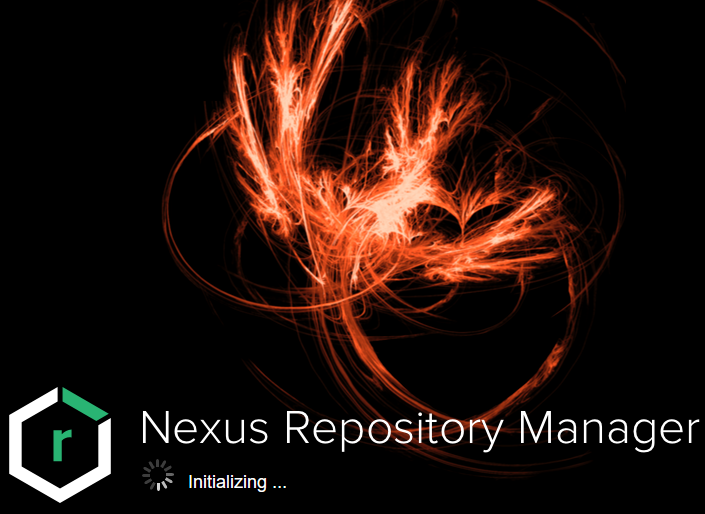

## 2、初始设置

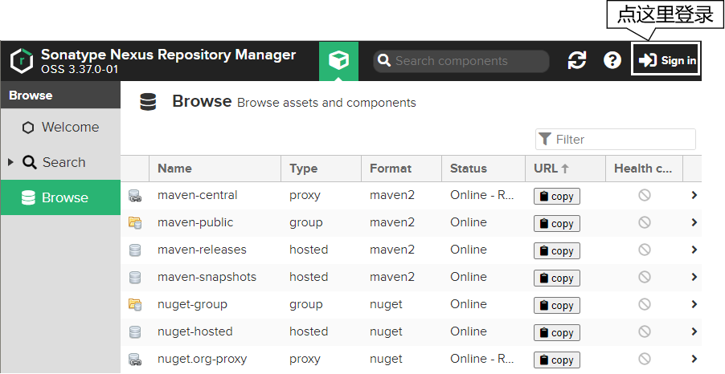

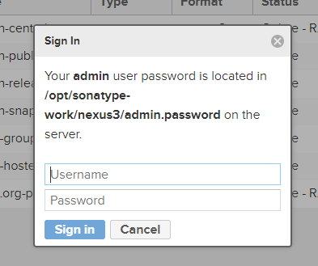

这里参考提示：

* 用户名：admin
* 密码：查看 /opt/sonatype-work/nexus3/admin.password 文件

```text
[root@hello ~]# cat /opt/sonatype-work/nexus3/admin.password
ed5e96a8-67aa-4dca-9ee8-1930b1dd5415
```

所以登录信息输入如下：

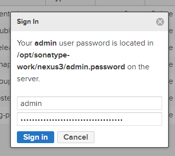

继续执行初始化：

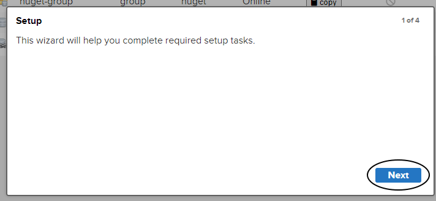

给 admin 用户指定新密码：

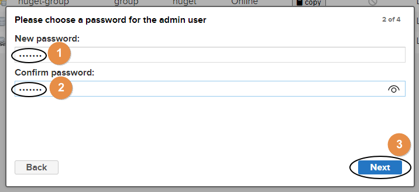

匿名登录，启用还是禁用？由于启用匿名登录后，后续操作比较简单，这里我们演示禁用匿名登录的操作方式：

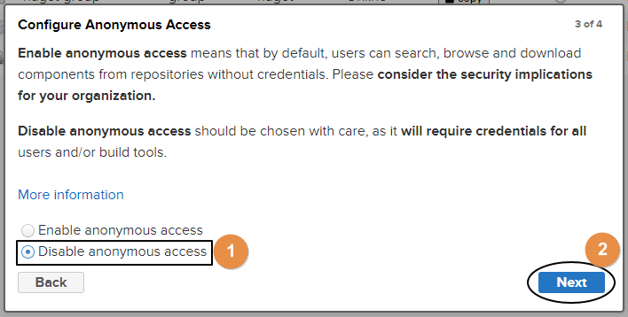

完成：

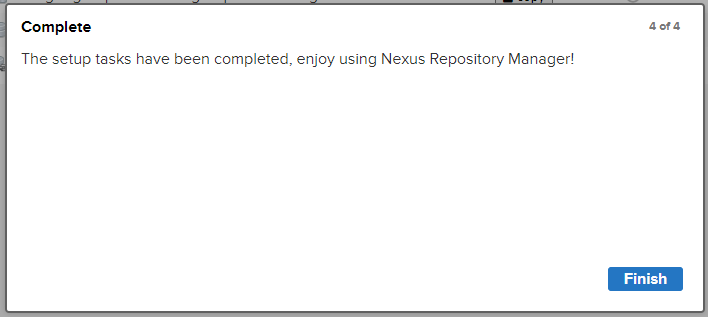

## 3、对接 Nexus

### ①通过 Nexus 下载 jar 包

#### [1]了解 Nexus 上的各种仓库

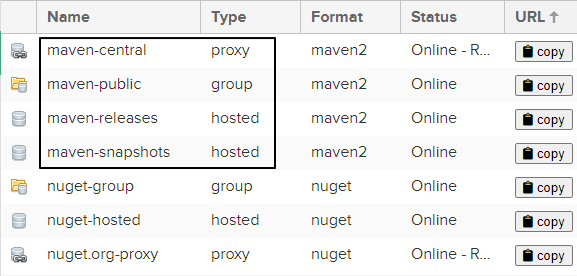

|  仓库类型  |              说明               |
|:------:|:-----------------------------:|
| proxy  |           某个远程仓库的代理           |
| group  |   存放：通过 Nexus 获取的第三方 jar 包    |
| hosted | 存放：本团队其他开发人员部署到 Nexus 的 jar 包 |

|      仓库名称       |                       说明                       |
|:---------------:|:----------------------------------------------:|
|  maven-central  |             Nexus 对 Maven 中央仓库的代理              |
|  maven-public   |            Nexus 默认创建，供开发人员下载使用的组仓库            |
| maven-releasse  | Nexus 默认创建，供开发人员部署自己 jar 包的宿主仓库要求 releasse 版本  |
| maven-snapshots | Nexus 默认创建，供开发人员部署自己 jar 包的宿主仓库要求 snapshots 版本 |

初始状态下，这几个仓库都没有内容：

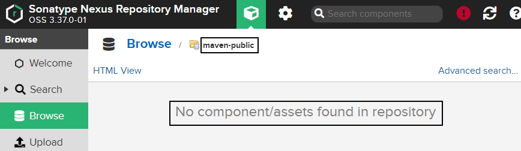

#### [2]使用空的本地仓库

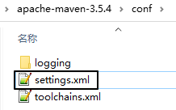

```xml
  <!-- 配置一个新的 Maven 本地仓库 -->
  <localRepository>D:/maven-repository-new</localRepository>
```

#### [3]指定 Nexus 服务器地址

把我们原来配置阿里云仓库地址的 mirror 标签改成下面这样：

```xml
<mirror>
	<id>nexus-mine</id>
	<mirrorOf>central</mirrorOf>
	<name>Nexus mine</name>
	<url>http://192.168.198.100:8081/repository/maven-public/</url>
</mirror>
```

这里的 url 标签是这么来的：

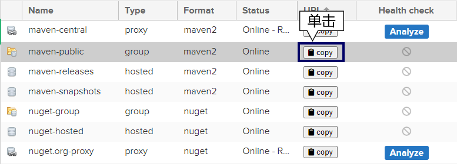

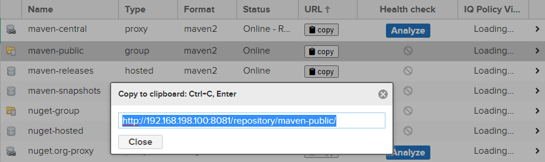

把上图中看到的地址复制出来即可。如果我们在前面允许了匿名访问，到这里就够了。但如果我们禁用了匿名访问，那么接下来我们还要继续配置 settings.xml：

```xml
<server>
  <id>nexus-mine</id>
  <username>admin</username>
  <password>atguigu</password>
</server>
```

这里需要格外注意：server 标签内的 id 标签值必须和 mirror 标签中的 id 值一样。

#### [4]效果

找一个用到框架的 Maven 工程，执行命令：

```text
mvn clean compile
```

下载过程日志：

```text
Downloading from nexus-mine: http://192.168.198.100:8081/repository/maven-public/com/jayway/jsonpath/json-path/2.4.0/json-path-2.4.0.pom
Downloaded from nexus-mine: http://192.168.198.100:8081/repository/maven-public/com/jayway/jsonpath/json-path/2.4.0/json-path-2.4.0.pom (2.6 kB at 110 kB/s)
Downloading from nexus-mine: http://192.168.198.100:8081/repository/maven-public/net/minidev/json-smart/2.3/json-smart-2.3.pom
Downloaded from nexus-mine: http://192.168.198.100:8081/repository/maven-public/net/minidev/json-smart/2.3/json-smart-2.3.pom (9.0 kB at 376 kB/s)
Downloading from nexus-mine: http://192.168.198.100:8081/repository/maven-public/net/minidev/minidev-parent/2.3/minidev-parent-2.3.pom
Downloaded from nexus-mine: http://192.168.198.100:8081/repository/maven-public/net/minidev/minidev-parent/2.3/minidev-parent-2.3.pom (8.5 kB at 404 kB/s)
Downloading from nexus-mine: http://192.168.198.100:8081/repository/maven-public/net/minidev/accessors-smart/1.2/accessors-smart-1.2.pom
Downloaded from nexus-mine: http://192.168.198.100:8081/repository/maven-public/net/minidev/accessors-smart/1.2/accessors-smart-1.2.pom (12 kB at 463 kB/s)
```

下载后，Nexus 服务器上就有了 jar 包：

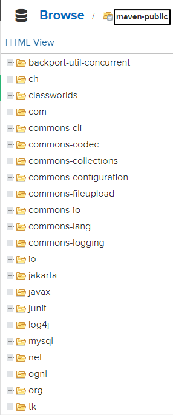

### ②将 jar 包部署到 Nexus

#### [1]配置 Maven 工程

```xml
<distributionManagement>
    <snapshotRepository>
        <id>nexus-mine</id>
        <name>Nexus Snapshot</name>
        <url>http://192.168.198.100:8081/repository/maven-snapshots/</url>
    </snapshotRepository>
</distributionManagement>
```

这里 snapshotRepository 的 id 标签也必须和 settings.xml 中指定的 mirror 标签的 id 属性一致。

#### [2]执行部署命令

```text
mvn deploy
```

```text
Uploading to nexus-mine: http://192.168.198.100:8081/repository/maven-snapshots/com/atguigu/demo/demo07-redis-data-provider/1.0-SNAPSHOT/maven-metadata.xml
Uploaded to nexus-mine: http://192.168.198.100:8081/repository/maven-snapshots/com/atguigu/demo/demo07-redis-data-provider/1.0-SNAPSHOT/maven-metadata.xml (786 B at 19 kB/s)
Uploading to nexus-mine: http://192.168.198.100:8081/repository/maven-snapshots/com/atguigu/demo/demo07-redis-data-provider/maven-metadata.xml
Uploaded to nexus-mine: http://192.168.198.100:8081/repository/maven-snapshots/com/atguigu/demo/demo07-redis-data-provider/maven-metadata.xml (300 B at 6.5 kB/s)
[INFO] ------------------------------------------------------------------------
[INFO] Reactor Summary:
[INFO]
[INFO] demo-imperial-court-ms-show 1.0-SNAPSHOT ........... SUCCESS [ 1.875 s]
[INFO] demo09-base-entity ................................. SUCCESS [ 21.883 s]
[INFO] demo10-base-util ................................... SUCCESS [ 0.324 s]
[INFO] demo08-base-api .................................... SUCCESS [ 1.171 s]
[INFO] demo01-imperial-court-gateway ...................... SUCCESS [ 0.403 s]
[INFO] demo02-user-auth-center ............................ SUCCESS [ 2.932 s]
[INFO] demo03-emp-manager-center .......................... SUCCESS [ 0.312 s]
[INFO] demo04-memorials-manager-center .................... SUCCESS [ 0.362 s]
[INFO] demo05-working-manager-center ...................... SUCCESS [ 0.371 s]
[INFO] demo06-mysql-data-provider ......................... SUCCESS [ 6.779 s]
[INFO] demo07-redis-data-provider 1.0-SNAPSHOT ............ SUCCESS [ 0.273 s]
```

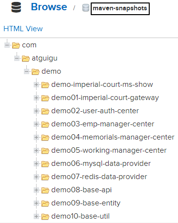

### ③引用别人部署的 jar 包

#### [1]提出问题

* 默认访问的 Nexus 仓库：maven-public
* 存放别人部署 jar 包的仓库：maven-snapshots

#### [2]配置 Maven 工程

```xml
<repositories>
    <repository>
        <id>nexus-mine</id>
        <name>nexus-mine</name>
        <url>http://192.168.198.100:8081/repository/maven-snapshots/</url>
        <snapshots>
            <enabled>true</enabled>
        </snapshots>
        <releases>
            <enabled>true</enabled>
        </releases>
    </repository>
</repositories>
```

## 4、修改仓库配置

举例：修改 maven-central 仓库代理的远程库地址

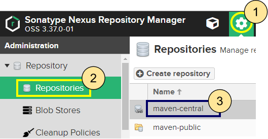

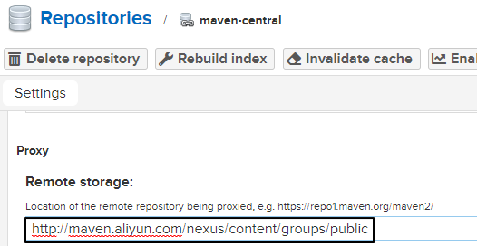