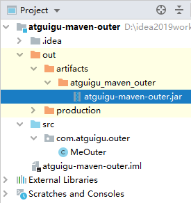
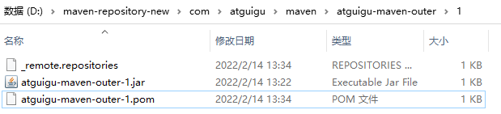

# 第三节 体系外 jar 包引入

## 1、提出问题
『体系外 jar 包』这个名字的来源是这样——目前来说我们在 Maven 工程中用到的 jar 包都是通过 Maven 本身的机制导入进来的。

而实际开发中确实有可能用到一些 jar 包并非是用 Maven 的方式发布，那自然也没法通过 Maven 导入。

此时如果我们能够拿到该 jar 包的源码那还可以自己建一个 Maven 工程，自己打包。可是如果连源码都没有呢？

这方面的例子包括一些人脸识别用的 jar 包、海康视频监控 jar 包等等。

## 2、解决办法

### ①准备一个体系外 jar 包

我们通过学 Maven 以前的方式创建一个 Java 工程，然后导出 jar 包即可用来测试。




### ②将该 jar 包安装到 Maven 仓库

这里我们使用 install 插件的 install-file 目标：

```text
mvn install:install-file -Dfile=[体系外 jar 包路径] \
-DgroupId=[给体系外 jar 包强行设定坐标] \
-DartifactId=[给体系外 jar 包强行设定坐标] \
-Dversion=1 \
-Dpackage=jar
```

例如（Windows 系统下使用 ^ 符号换行；Linux 系统用 \）：

```text
mvn install:install-file -Dfile=D:\idea2019workspace\atguigu-maven-outer\out\artifacts\atguigu_maven_outer\atguigu-maven-outer.jar ^
-DgroupId=com.atguigu.maven ^
-DartifactId=atguigu-maven-outer ^
-Dversion=1 ^
-Dpackaging=jar
```

执行结果：


再看本地仓库中确实有：



我们打开 POM 文件看看：

```xml
<?xml version="1.0" encoding="UTF-8"?>
<project xsi:schemaLocation="http://maven.apache.org/POM/4.0.0 http://maven.apache.org/xsd/maven-4.0.0.xsd" xmlns="http://maven.apache.org/POM/4.0.0"
    xmlns:xsi="http://www.w3.org/2001/XMLSchema-instance">
  <modelVersion>4.0.0</modelVersion>
  <groupId>com.atguigu.maven</groupId>
  <artifactId>atguigu-maven-outer</artifactId>
  <version>1</version>
  <description>POM was created from install:install-file</description>
</project>
```

### ③测试

在其它地方依赖这个 jar 包：

```xml
<dependency>
    <groupId>com.atguigu.maven</groupId>
    <artifactId>atguigu-maven-outer</artifactId>
    <version>1</version>
</dependency>
```

创建对象、调用方法：

