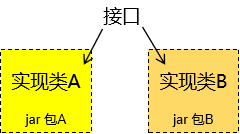
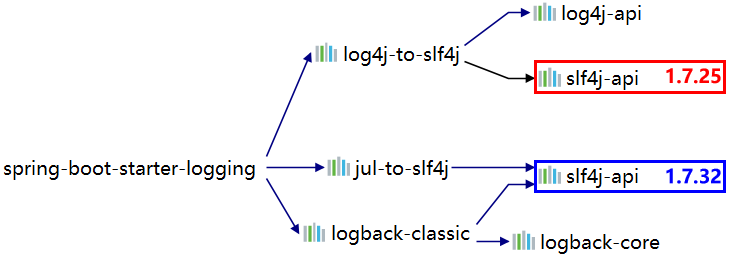
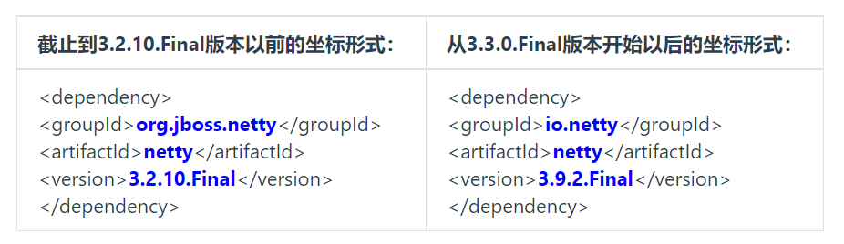
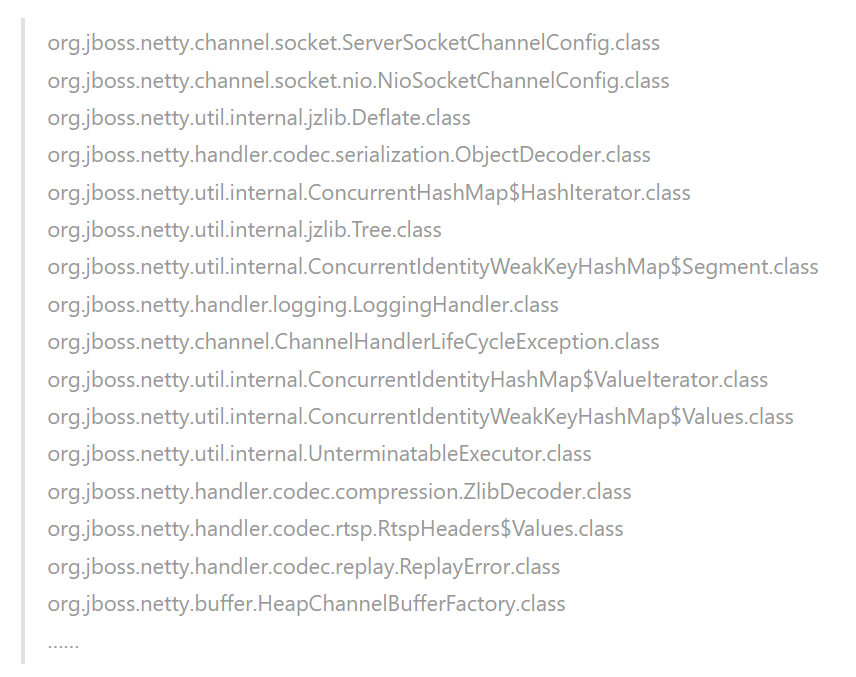
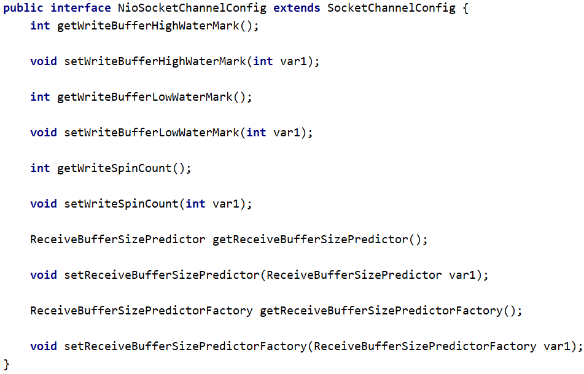
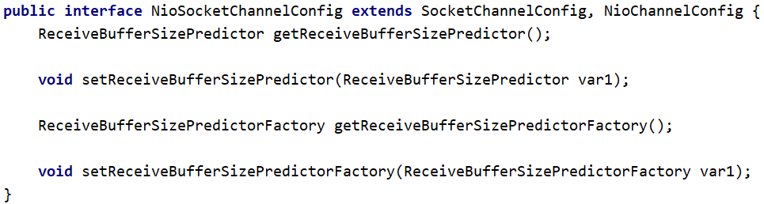

# 第二节 jar 包冲突问题

## 1、谁需要面对 jar 包冲突？

先给结论：编订依赖列表的程序员。初次设定一组依赖，因为尚未经过验证，所以确实有可能存在各种问题，需要做有针对性的调整。那么谁来做这件事呢？我们最不希望看到的就是：团队中每个程序员都需要自己去找依赖，即使是做同一个项目，每个模块也各加各的依赖，没有统一管理。那前人踩过的坑，后人还要再踩一遍。而且大家用的依赖有很多细节都不一样，版本更是五花八门，这就让事情变得更加复杂。

所以虽然初期需要根据项目开发和实际运行情况对依赖配置不断调整，最终确定一个各方面都 OK 的版本。但是一旦确定下来，放在父工程中做依赖管理，各个子模块各取所需，这样基本上就能很好的避免问题的扩散。

即使开发中遇到了新问题，也可以回到源头检查、调整 dependencyManagement 配置的列表——而不是每个模块都要改。所以学完这一节你应该就会对前面讲过的『继承』有了更深的理解。

## 2、表现形式

由于实际开发时我们往往都会整合使用很多大型框架，所以一个项目中哪怕只是一个模块也会涉及到大量 jar 包。数以百计的 jar 包要彼此协调、精密配合才能保证程序正常运行。而规模如此庞大的 jar 包组合在一起难免会有磕磕碰碰。最关键的是由于 jar 包冲突所导致的问题非常诡异，这里我们只能罗列较为典型的问题，而没法保证穷举。

但是我们仍然能够指出一点：一般来说，由于我们自己编写代码、配置文件写错所导致的问题通常能够在异常信息中看到我们自己类的全类名或配置文件的所在路径。如果整个错误信息中完全没有我们负责的部分，全部是框架、第三方工具包里面的类报错，这往往就是 jar 包的问题所引起的。

而具体的表现形式中，主要体现为找不到类或找不到方法。

### ①抛异常：找不到类

此时抛出的常见的异常类型：

* java.lang.ClassNotFoundException：编译过程中找不到类
* java.lang.NoClassDefFoundError：运行过程中找不到类
* java.lang.LinkageError：不同类加载器分别加载的多个类有相同的全限定名

我们来举个例子：

```xml
<dependency>
    <groupId>org.apache.httpcomponents</groupId>
    <artifactId>httpclient</artifactId>
    <version>4.x.x</version>
</dependency>
```

httpclient 这个 jar 包中有一个类：org.apache.http.conn.ssl.NoopHostnameVerifier。这个类在较低版本中没有，但在较高版本存在。比如：

| jar 包版本 | 是否存在 |
|:-------:|:----:|
|  4.3.6  |  否   |
|   4.4   |  是   |

那当我们确实需要用到 NoopHostnameVerifier 这个类，我们看到 Maven 通过依赖传递机制引入了这个 jar 包，所以没有明确地显式声明对这个 jar 包的依赖。可是 Maven 传递过来的 jar 包是 4.3.6 版本，里面没有包含我们需要的类，就会抛出异常。

而『冲突』体现在：4.3.6 和 4.4 这两个版本的 jar 包都被框架所依赖的 jar 包给传递进来了，但是假设 Maven 根据『版本仲裁』规则实际采纳的是 4.3.6。

### ②抛异常：找不到方法

程序找不到符合预期的方法。这种情况多见于通过反射调用方法，所以经常会导致：java.lang.NoSuchMethodError。比如 antlr:antlr:x.x.x 这个包中有一个接口：antlr.collections.AST

|  版本   | getLine()方法 |
|:-----:|:-----------:|
| 2.7.2 |      无      |
| 2.7.6 |      有      |


### ③没报错但结果不对

发生这种情况比较典型的原因是：两个 jar 包中的类分别实现了同一个接口，这本来是很正常的。但是问题在于：由于没有注意命名规范，两个不同实现类恰巧是同一个名字。



具体例子是有的同学在实际工作中遇到过：项目中部分模块使用 log4j 打印日志；其它模块使用 logback，编译运行都不会冲突，但是会引起日志服务降级，让你的 log 配置文件失效。比如：你指定了 error 级别输出，但是冲突就会导致 info、debug 都在输出。

## 3、本质

以上表现形式归根到底是两种基本情况导致的：

### ①同一jar包的不同版本



### ③不同jar包中包含同名类

这里我们拿 netty 来举个例子，netty 是一个类似 Tomcat 的 Servlet 容器。通常我们不会直接依赖它，所以基本上都是框架传递进来的。那么当我们用到的框架很多时，就会有不同的框架用不同的坐标导入 netty。大家可以参照下表对比一下两组坐标：



但是偏偏这两个『不同的包』里面又有很多『全限定名相同』的类。例如：



其实还有很多，这里列出的只是冰山一角。

当然，如果全限定名相同，类中的代码也完全相同，那么用着也行。问题是如果『全限定名相同』，但是『代码不同』，那可太坑了。我们随便找一个来看看：

坐标信息：org.jboss.netty:netty:jar:3.2.10.Final

代码截图：



坐标信息：io.netty:netty:jar:3.9.2.Final

代码截图：



## 4、解决办法

### ①概述

很多情况下常用框架之间的整合容易出现的冲突问题都有人总结过了，拿抛出的异常搜索一下基本上就可以直接找到对应的 jar 包。我们接下来要说的是通用方法。

不管具体使用的是什么工具，基本思路无非是这么两步：

* 第一步：把彼此冲突的 jar 包找到
* 第二步：在冲突的 jar 包中选定一个。具体做法无非是通过 exclusions 排除依赖，或是明确声明依赖。

### ②IDEA 的 Maven Helper 插件

这个插件是 IDEA 中安装的插件，不是 Maven 插件。它能够给我们罗列出来同一个 jar 包的不同版本，以及它们的来源。但是对不同 jar 包中同名的类没有办法。

* [在 IDEA 中安装 Maven helper 插件](datum/在%20IDEA%20中安装%20Maven%20helper%20插件.md)
* [基于 pom.xml 的依赖冲突分析](datum/基于%20pom.xml%20的依赖冲突分析.md)

### ③Maven 的 enforcer 插件

使用 Maven 的 enforcer 插件既可以检测同一个 jar 包的不同版本，又可以检测不同 jar 包中同名的类。

#### [1]引入 netty 依赖

这里我们引入两个对 netty 的依赖，展示不同 jar 包中有同名类的情况。

```xml
<dependencies>
    <dependency>
        <groupId>org.jboss.netty</groupId>
        <artifactId>netty</artifactId>
        <version>3.2.10.Final</version>
    </dependency>

    <dependency>
        <groupId>io.netty</groupId>
        <artifactId>netty</artifactId>
        <version>3.9.2.Final</version>
    </dependency>
</dependencies>
```

#### [2]配置 enforcer 插件

```xml
<build>
    <pluginManagement>
        <plugins>
            <plugin>
                <groupId>org.apache.maven.plugins</groupId>
                <artifactId>maven-enforcer-plugin</artifactId>
                <version>1.4.1</version>
                <executions>
                    <execution>
                        <id>enforce-dependencies</id>
                        <phase>validate</phase>
                        <goals>
                            <goal>display-info</goal>
                            <goal>enforce</goal>
                        </goals>
                    </execution>
                </executions>
                <dependencies>
                    <dependency>
                        <groupId>org.codehaus.mojo</groupId>
                        <artifactId>extra-enforcer-rules</artifactId>
                        <version>1.0-beta-4</version>
                    </dependency>
                </dependencies>
                <configuration>
                    <rules>
                        <banDuplicateClasses>
                            <findAllDuplicates>true</findAllDuplicates>
                        </banDuplicateClasses>
                    </rules>
                </configuration>
            </plugin>
        </plugins>
    </pluginManagement>
</build>
```

#### [3]测试

执行如下 Maven 命令：

```text
mvn clean package enforcer:enforce
```

部分运行结果：

```text
[INFO] --- maven-enforcer-plugin:1.4.1:enforce (default-cli) @ pro32-duplicate-class ---
[WARNING] Rule 0: org.apache.maven.plugins.enforcer.BanDuplicateClasses failed with message:
Duplicate classes found:

Found in:
io.netty:netty:jar:3.9.2.Final:compile
org.jboss.netty:netty:jar:3.2.10.Final:compile
Duplicate classes:
org/jboss/netty/channel/socket/ServerSocketChannelConfig.class
org/jboss/netty/channel/socket/nio/NioSocketChannelConfig.class
org/jboss/netty/util/internal/jzlib/Deflate.class
org/jboss/netty/handler/codec/serialization/ObjectDecoder.class
org/jboss/netty/util/internal/ConcurrentHashMap$HashIterator.class
...
```