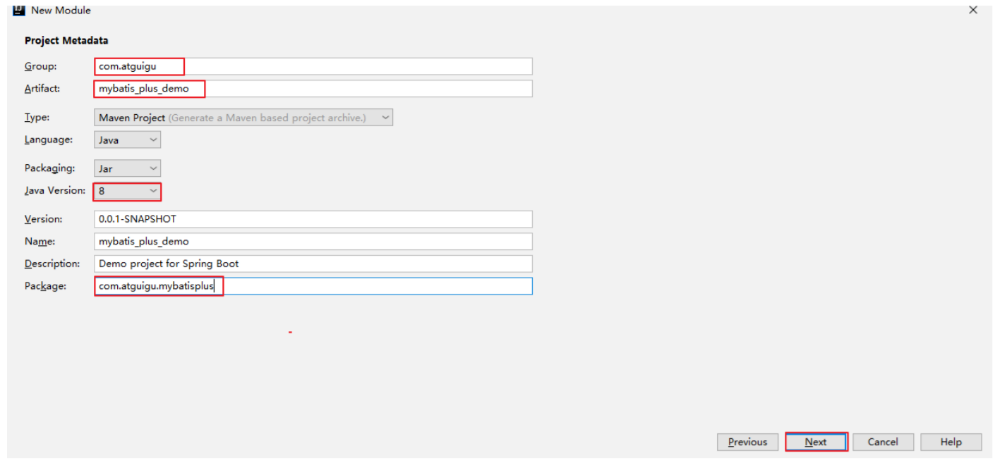
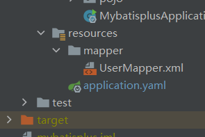

# MyBatis-Plus


## 一、MyBatis-Plus简介

### 1. 简介

**MyBatis-Plus（简称 MP）是一个 MyBatis的增强工具，在 MyBatis 的基础上只做增强不做改变，为简化开发、提高效率而生**。

> 愿景
> 
> 我们的愿景是成为 MyBatis 最好的搭档，就像魂斗罗中的 1P、2P，基友搭配，效率翻倍。


### 2、特性

* **无侵入**：只做增强不做改变，引入它不会对现有工程产生影响，如丝般顺滑
* **损耗小**：启动即会自动注入基本 CURD，性能基本无损耗，直接面向对象操作
* **强大的 CRUD 操作**：内置通用 Mapper、通用 Service，仅仅通过少量配置即可实现单表大部分 CRUD 操作，更有强大的条件构造器，满足各类使用需求
* **支持 Lambda 形式调用**：通过 Lambda 表达式，方便的编写各类查询条件，无需再担心字段写错
* **支持主键自动生成**：支持多达 4 种主键策略（内含分布式唯一 ID 生成器 - Sequence），可自由配置，完美解决主键问题
* **支持 ActiveRecord 模式**：支持 ActiveRecord 形式调用，实体类只需继承 Model 类即可进行强大的 CRUD 操作
* **支持自定义全局通用操作**：支持全局通用方法注入（ Write once, use anywhere ）
* **内置代码生成器**：采用代码或者 Maven 插件可快速生成 Mapper 、 Model 、 Service 、 Controller 层代码，支持模板引擎，更有超多自定义配置等您来使用
* **内置分页插件**：基于 MyBatis 物理分页，开发者无需关心具体操作，配置好插件之后，写分页等同于普通 List 查询
* **分页插件支持多种数据库**：支持 MySQL、MariaDB、Oracle、DB2、H2、HSQL、SQLite、Postgre、SQLServer 等多种数据库
* **内置性能分析插件**：可输出 SQL 语句以及其执行时间，建议开发测试时启用该功能，能快速揪出慢查询
* **内置全局拦截插件**：提供全表 delete 、 update 操作智能分析阻断，也可自定义拦截规则，预防误操作

### 3. 支持数据库

> 任何能使用MyBatis进行 CRUD, 并且支持标准 SQL 的数据库，具体支持情况如下

* MySQL，Oracle，DB2，H2，HSQL，SQLite，PostgreSQL，SQLServer，Phoenix，Gauss ，ClickHouse，Sybase，OceanBase，Firebird，Cubrid，Goldilocks，csiidb
* 达梦数据库，虚谷数据库，人大金仓数据库，南大通用(华库)数据库，南大通用数据库，神通数据库，瀚高数据库

### 4. 框架结构


## 二、入门案例   

### 1. 开发环境

IDE：idea 2019.2

JDK：JDK8+

构建工具：maven 3.5.4

MySQL版本：MySQL 5.7

Spring Boot：2.6.3

MyBatis-Plus：3.5.1

### 2. 创建数据库及表

#### a> 创建表

```sql
CREATE DATABASE `mybatis_plus` /*!40100 DEFAULT CHARACTER SET utf8mb4 */;
use `mybatis_plus`;
CREATE TABLE `user`(
    `id`    bigint(20) NOT NULL COMMENT '主键ID',
    `name`  varchar(30) DEFAULT NULL COMMENT '姓名',
    `age`   int(11)     DEFAULT NULL COMMENT '年龄',
    `email` varchar(50) DEFAULT NULL COMMENT '邮箱',
    PRIMARY KEY (`id`)
) ENGINE = InnoDB
  DEFAULT CHARSET = utf8;
```

#### b> 添加数据

```sql
INSERT INTO user (id, name, age, email)
VALUES (1, 'Jone', 18, 'test1@baomidou.com'),
       (2, 'Jack', 20, 'test2@baomidou.com'),
       (3, 'Tom', 28, 'test3@baomidou.com'),
       (4, 'Sandy', 21, 'test4@baomidou.com'),
       (5, 'Billie', 24, 'test5@baomidou.com');
```

### 3. 创建Spring Boot工程

#### a> 初始化工程

使用 Spring Initializr 快速初始化一个 Spring Boot 工程





#### b> 引入依赖

```xml

<dependencies>
    <dependency>
        <groupId>org.springframework.boot</groupId>
        <artifactId>spring-boot-starter</artifactId>
    </dependency>
    <dependency>
        <groupId>org.springframework.boot</groupId>
        <artifactId>spring-boot-starter-test</artifactId>
        <scope>test</scope>
    </dependency>
    <dependency>
        <groupId>com.baomidou</groupId>
        <artifactId>mybatis-plus-boot-starter</artifactId>
        <version>3.5.1</version>
    </dependency>
    <dependency>
        <groupId>org.projectlombok</groupId>
        <artifactId>lombok</artifactId>
        <optional>true</optional>
    </dependency>
    <dependency>
        <groupId>mysql</groupId>
        <artifactId>mysql-connector-java</artifactId>
        <scope>runtime</scope>
    </dependency>
</dependencies>
```

[相关文件pom.xml](mybatisplus/pom.xml)

#### c> idea中安装lombok插件

### 4. 编写代码

#### a> 配置application.yml

```yaml
spring:
  # 配置数据源信息
  datasource:
    # 配置数据源类型
    type: com.zaxxer.hikari.HikariDataSource
    driver-class-name: com.mysql.cj.jdbc.Driver
    url: jdbc:mysql://localhost:3307/mybatis-plus?characterEncoding=utf-8&useSSL=false
    username: root
    password: 123456
```

[相关文件application.yaml](mybatisplus/src/main/resources/application.yaml)

注意：

1. 驱动类driver-class-name  
  spring boot 2.0（内置jdbc5驱动），驱动类使用：  
  driver-class-name: com.mysql.jdbc.Driver  
  spring boot 2.1及以上（内置jdbc8驱动），驱动类使用：  
  driver-class-name: com.mysql.cj.jdbc.Driver  
  否则运行测试用例的时候会有 WARN 信息  
2. 连接地址url  
  MySQL5.7版本的url：  
  jdbc:mysql://localhost:3306/mybatis_plus?characterEncoding=utf-8&useSSL=false  
  MySQL8.0版本的url：  
  jdbc:mysql://localhost:3306/mybatis_plus?serverTimezone=GMT%2B8&characterEncoding=utf-8&useSSL=false  
  否则运行测试用例报告如下错误：  
  java.sql.SQLException: The server time zone value 'Öйú±ê׼ʱ¼ä' is unrecognized or represents more

#### b> 启动类

> 在Spring Boot启动类中添加@MapperScan注解，扫描mapper包

```java
@SpringBootApplication
@MapperScan("com.atguigu.mybatisplus.mapper")
public class MybatisplusApplication {
  public static void main(String[] args) {
    SpringApplication.run(MybatisplusApplication.class, args);
  }
}
```

[相关文件MyBatisplusApplication](mybatisplus/src/main/java/com/toxicant123/mybatisplus/MybatisplusApplication.java)

#### c> 添加实体

```java
@Data //lombok注解
public class User {
  private Long id;
  private String name;
  private Integer age;
  private String email;
}
```

[相关文件User](mybatisplus/src/main/java/com/toxicant123/mybatisplus/pojo/User.java)

User类编译之后的结果：


#### d> 添加mapper

> BaseMapper是MyBatis-Plus提供的模板mapper，其中包含了基本的CRUD方法，泛型为操作的实体类型

```java
public interface UserMapper extends BaseMapper<User> {
}
```

[相关文件UserMapper.xml](mybatisplus/src/main/java/com/toxicant123/mybatisplus/mapper/UserMapper.java)

#### e> 测试

```java
@SpringBootTest
public class MybatisPlusTest {
  @Autowired
  private UserMapper userMapper;

  @Test
  public void testSelectList() {
//selectList()根据MP内置的条件构造器查询一个list集合，null表示没有条件，即查询所有
    userMapper.selectList(null).forEach(System.out::println);
  }
}
```

[相关文件MybatisplusApplicationTest](mybatisplus/src/test/java/com/toxicant123/mybatisplus/MybatisplusApplicationTests.java)

结果：


注意：

> IDEA在 userMapper 处报错，因为找不到注入的对象，因为类是动态创建的，但是程序可以正确的执行。
> 
> 为了避免报错，可以在mapper接口上添加 @Repository 注解

#### f> 添加日志

在application.yml中配置日志输出

```yaml
# 配置MyBatis日志
mybatis-plus:
  configuration:
    log-impl: org.apache.ibatis.logging.stdout.StdOutImpl
```

[相关文件application.yaml](mybatisplus/src/main/resources/application.yaml)


## 三、基本CRUD

### 1. BaseMapper

MyBatis-Plus中的基本CRUD在内置的BaseMapper中都已得到了实现，可以直接使用，接口如下：

[相关文件BaseMapper.java](resource/BaseMapper.java)

### 2. 插入

```java
@Test
public void testInsert(){
    User user = new User(null, "张三", 23, "zhangsan@atguigu.com");
    //INSERT INTO user ( id, name, age, email ) VALUES ( ?, ?, ?, ? )
    int result = userMapper.insert(user);
    System.out.println("受影响行数："+result);
    //1475754982694199298
    System.out.println("id自动获取："+user.getId());
}
```
[相关文件MybatisplusApplicationTest](mybatisplus/src/test/java/com/toxicant123/mybatisplus/MybatisplusApplicationTests.java)

> 最终执行的结果，所获取的id为1475754982694199298
> 
> 这是因为MyBatis-Plus在实现插入数据时，会默认基于雪花算法的策略生成id

### 3. 删除

#### a> 通过id删除记录

```java
@Test
public void testDeleteById(){
    //通过id删除用户信息
    //DELETE FROM user WHERE id=?
    int result = userMapper.deleteById(1475754982694199298L);
    System.out.println("受影响行数："+result);
}
```

#### b> 通过id批量删除记录

```java
@Test
public void testDeleteBatchIds(){
    //通过多个id批量删除
    //DELETE FROM user WHERE id IN ( ? , ? , ? )
    List<Long> idList = Arrays.asList(1L, 2L, 3L);
    int result = userMapper.deleteBatchIds(idList);
    System.out.println("受影响行数："+result);
}
```

#### c> 通过map条件删除记录

```java
@Test
public void testDeleteByMap(){
    //根据map集合中所设置的条件删除记录
    //DELETE FROM user WHERE name = ? AND age = ?
    Map<String, Object> map = new HashMap<>();
    map.put("age", 23);
    map.put("name", "张三");
    int result = userMapper.deleteByMap(map);
    System.out.println("受影响行数："+result);
}
```

[相关文件MybatisplusApplicationTest](mybatisplus/src/test/java/com/toxicant123/mybatisplus/MybatisplusApplicationTests.java)

### 4. 修改

```java
@Test
public void testUpdateById(){
    User user = new User(4L, "admin", 22, null);
    //UPDATE user SET name=?, age=? WHERE id=?
    int result = userMapper.updateById(user);
    System.out.println("受影响行数："+result);
}
```

### 5. 查询

#### a> 根据id查询用户信息

```java
@Test
public void testSelectById(){
    //根据id查询用户信息
    //SELECT id,name,age,email FROM user WHERE id=?
    User user = userMapper.selectById(4L);
    System.out.println(user);
}
```

#### b> 根据多个id查询多个用户信息

```java
@Test
public void testSelectBatchIds(){
    //根据多个id查询多个用户信息
    //SELECT id,name,age,email FROM user WHERE id IN ( ? , ? )
    List<Long> idList = Arrays.asList(4L, 5L);
    List<User> list = userMapper.selectBatchIds(idList);
    list.forEach(System.out::println);
}
```

### c> 通过map条件查询用户信息

```java
@Test
public void testSelectByMap(){
    //通过map条件查询用户信息
    //SELECT id,name,age,email FROM user WHERE name = ? AND age = ?
    Map<String, Object> map = new HashMap<>();
    map.put("age", 22);
    map.put("name", "admin");
    List<User> list = userMapper.selectByMap(map);
    list.forEach(System.out::println);
}
```

#### d> 查询所有数据

```java
@Test
public void testSelectList(){
    //查询所有用户信息
    //SELECT id,name,age,email FROM user
    List<User> list = userMapper.selectList(null);
    list.forEach(System.out::println);
}
```

> 通过观察BaseMapper中的方法，大多方法中都有Wrapper类型的形参，此为条件构造器，可针对于SQL语句设置不同的条件，若没有条件，则可以为该形参赋值null，即查询（删除/修改）所有数据

[相关文件MybatisplusApplicationTest](mybatisplus/src/test/java/com/toxicant123/mybatisplus/MybatisplusApplicationTests.java)

### 6. 自定义mapper文件

mybatis设定的mapper默认存放位置：


如下创建：



[相关文件UserMapper.java](mybatisplus/src/main/java/com/toxicant123/mybatisplus/mapper/UserMapper.java)

[相关文件UserMapper.xml](mybatisplus/src/main/resources/mapper/UserMapper.xml)

[相关文件MybatisplusApplicationTest](mybatisplus/src/test/java/com/toxicant123/mybatisplus/MybatisplusApplicationTests.java)

### 7. 通用Service

说明：

* 通用 Service CRUD 封装IService接口，进一步封装 CRUD 采用`get 查询单行` `remove 删除` `list 查询集合` `page 分页` 前缀命名方式区分`Mapper`层避免混淆，
* 泛型`T`为任意实体对象
* 建议如果存在自定义通用 Service 方法的可能，请创建自己的`IBaseService`继承`Mybatis-Plus`提供的基类

#### a> IService

MyBatis-Plus中有一个接口 IService和其实现类 ServiceImpl，封装了常见的业务层逻辑

详情查看源码IService和ServiceImpl

#### b> 创建Service接口和实现类

```java
/**
* UserService继承IService模板提供的基础功能
*/
public interface UserService extends IService<User> {
}
```

[相关文件UserService.java](mybatisplus/src/main/java/com/toxicant123/mybatisplus/service/UserService.java)

```java
/**
* ServiceImpl实现了IService，提供了IService中基础功能的实现
* 若ServiceImpl无法满足业务需求，则可以使用自定的UserService定义方法，并在实现类中实现
*/
@Service
public class UserServiceImpl extends ServiceImpl<UserMapper, User> implements
UserService {
}
```

[相关文件UserServiceImpl.java](mybatisplus/src/main/java/com/toxicant123/mybatisplus/service/impl/UserServiceImpl.java)


#### c> 测试查询记录数

```java
@Autowired
private UserService userService;

@Test
public void testGetCount(){
    long count = userService.count();
    System.out.println("总记录数：" + count);
}
```

#### d> 测试批量插入

```java
@Test
public void testSaveBatch(){
    // SQL长度有限制，海量数据插入单条SQL无法实行，
    // 因此MP将批量插入放在了通用Service中实现，而不是通用Mapper
    ArrayList<User> users = new ArrayList<>();
    for (int i = 0; i < 5; i++) {
    User user = new User();
    user.setName("ybc" + i);
    user.setAge(20 + i);
    users.add(user);
}
    //SQL:INSERT INTO t_user ( username, age ) VALUES ( ?, ? )
    userService.saveBatch(users);
}
```

## 四、常用注解

### 1. @TableName

经过以上的测试，在使用MyBatis-Plus实现基本的CRUD时，并没有指定要操作的表，只是在Mapper接口继承BaseMapper时，设置了泛型User，而操作的表为user表

由此得出结论，MyBatis-Plus在确定操作的表时，由BaseMapper的泛型决定，即实体类型决定，且默认操作的表名和实体类型的类名一致

#### a> 问题

若实体类类型的类名和要操作的表的表名不一致，会出现什么问题？

将表user更名为t_user，测试查询功能

程序抛出异常，Table 'mybatis_plus.user' doesn't exist，因为现在的表名为t_user，而默认操作的表名和实体类型的类名一致，即user表


#### b> 通过@TableName解决问题

> 在实体类类型上添加@TableName("t_user")，标识实体类对应的表，即可成功执行SQL语句


#### c> 通过全局配置解决问题

在开发的过程中，经常遇到以上的问题，即实体类所对应的表都有固定的前缀，例如t_或tbl_

此时，可以使用MyBatis-Plus提供的全局配置，为实体类所对应的表名设置默认的前缀，那么就不需要在每个实体类上通过@TableName标识实体类对应的表

```yaml
mybatis-plus:
  configuration:
    # 配置MyBatis日志
    log-impl: org.apache.ibatis.logging.stdout.StdOutImpl
  global-config:
    db-config:
    # 配置MyBatis-Plus操作表的默认前缀
      table-prefix: t_
```

### 2. @TableId


经过以上的测试，MyBatis-Plus在实现CRUD时，会默认将id作为主键列，并在插入数据时，默认基于雪花算法的策略生成id

#### a> 问题

若实体类和表中表示主键的不是id，而是其他字段，例如uid，MyBatis-Plus会自动识别uid为主键列吗？

实体类中的属性id改为uid，将表中的字段id也改为uid，测试添加功能

程序抛出异常，Field 'uid' doesn't have a default value，说明MyBatis-Plus没有将uid作为主键赋值


#### b> 通过@TableId解决问题

在实体类中uid属性上通过@TableId将其标识为主键，即可成功执行SQL语句


#### c> @TableId的value属性

若实体类中主键对应的属性为id，而表中表示主键的字段为uid，此时若只在属性id上添加注解@TableId，则抛出异常Unknown column 'id' in 'field list'，即MyBatis-Plus仍然会将id作为表的主键操作，而表中表示主键的是字段uid

此时需要通过@TableId注解的value属性，指定表中的主键字段，@TableId("uid")或@TableId(value="uid")


#### d> @TableId的type属性

type属性用来定义主键策略

常用的主键策略：

|          值           |                 描述                  |
|:--------------------:|:-----------------------------------:|
| IdType.ASSIGN_ID（默认） |   基于雪花算法的策略生成数据id，与数据库id是否设置自增无关    |
|     IdType.AUTO      | 使用数据库的自增策略，注意，该类型请确保数据库设置了id自增，否则无效 |

配置全局主键策略：

```yaml
mybatis-plus:
  configuration:
    # 配置MyBatis日志
    log-impl: org.apache.ibatis.logging.stdout.StdOutImpl
  global-config:
    db-config:
    # 配置MyBatis-Plus操作表的默认前缀
      table-prefix: t_
      # 配置MyBatis-Plus的主键策略
      id-type: auto
```

#### e> 雪花算法

* 背景

需要选择合适的方案去应对数据规模的增长，以应对逐渐增长的访问压力和数据量。

数据库的扩展方式主要包括：业务分库、主从复制，数据库分表。

* 数据库分表

将不同业务数据分散存储到不同的数据库服务器，能够支撑百万甚至千万用户规模的业务，但如果业务继续发展，同一业务的单表数据也会达到单台数据库服务器的处理瓶颈。例如，淘宝的几亿用户数据，如果全部存放在一台数据库服务器的一张表中，肯定是无法满足性能要求的，此时就需要对单表数据进行拆分。

单表数据拆分有两种方式：垂直分表和水平分表。示意图如下：


* 垂直分表

垂直分表适合将表中某些不常用且占了大量空间的列拆分出去。

例如，前面示意图中的 nickname 和 description 字段，假设一个婚恋网站，用户在筛选其他用户的时候，主要是用 age 和 sex 两个字段进行查询，而 nickname 和 description 两个字段主要用于展示，一般不会在业务查询中用到。description 本身又比较长，因此可以将这两个字段独立到另外一张表中，这样在查询 age 和 sex 时，就能带来一定的性能提升。

* 水平分表

水平分表适合表行数特别大的表，有的公司要求单表行数超过 5000 万就必须进行分表，这个数字可以作为参考，但并不是绝对标准，关键还是要看表的访问性能。对于一些比较复杂的表，可能超过 1000 万就要分表了；而对于一些简单的表，即使存储数据超过 1 亿行，也可以不分表。

但不管怎样，当看到表的数据量达到千万级别时，作为架构师就要警觉起来，因为这很可能是架构的性能瓶颈或者隐患。

水平分表相比垂直分表，会引入更多的复杂性，例如要求全局唯一的数据id该如何处理

> 主键自增

1. 以最常见的用户 ID 为例，可以按照 1000000 的范围大小进行分段，1 ~ 999999 放到表 1中，1000000 ~ 1999999 放到表2中，以此类推。
2. 复杂点：分段大小的选取。分段太小会导致切分后子表数量过多，增加维护复杂度；分段太大可能会导致单表依然存在性能问题，一般建议分段大小在 100 万至 2000 万之间，具体需要根据业务选取合适的分段大小。
3. 优点：可以随着数据的增加平滑地扩充新的表。例如，现在的用户是 100 万，如果增加到 1000 万，只需要增加新的表就可以了，原有的数据不需要动。
4. 缺点：分布不均匀。假如按照 1000 万来进行分表，有可能某个分段实际存储的数据量只有 1 条，而另外一个分段实际存储的数据量有 1000 万条。

> 取模

1. 同样以用户 ID 为例，假如一开始就规划了 10 个数据库表，可以简单地用 user_id % 10 的值来表示数据所属的数据库表编号，ID 为 985 的用户放到编号为 5 的子表中，ID 为 10086 的用户放到编号为 6 的子表中。
2. 复杂点：初始表数量的确定。表数量太多维护比较麻烦，表数量太少又可能导致单表性能存在问题。
3. 优点：表分布比较均匀。
4. 缺点：扩充新的表很麻烦，所有数据都要重分布。

> 雪花算法

雪花算法是由Twitter公布的分布式主键生成算法，它能够保证不同表的主键的不重复性，以及相同表的主键的有序性。

1. 核心思想：

长度共64bit（一个long型）。

首先是一个符号位，1bit标识，由于long基本类型在Java中是带符号的，最高位是符号位，正数是0，负数是1，所以id一般是正数，最高位是0。

41bit时间截(毫秒级)，存储的是时间截的差值（当前时间截 - 开始时间截)，结果约等于69.73年。

10bit作为机器的ID（5个bit是数据中心，5个bit的机器ID，可以部署在1024个节点）。

12bit作为毫秒内的流水号（意味着每个节点在每毫秒可以产生 4096 个 ID）。


2. 优点：整体上按照时间自增排序，并且整个分布式系统内不会产生ID碰撞，并且效率较高。

### 3. @TableField

经过以上的测试，可以发现，MyBatis-Plus在执行SQL语句时，要保证实体类中的属性名和表中的字段名一致

如果实体类中的属性名和字段名不一致的情况，会出现什么问题呢？

#### a> 情况1

若实体类中的属性使用的是驼峰命名风格，而表中的字段使用的是下划线命名风格

例如实体类属性userName，表中字段user_name

此时MyBatis-Plus会自动将下划线命名风格转化为驼峰命名风格

相当于在MyBatis中配置

#### b> 情况2

若实体类中的属性和表中的字段不满足情况1

例如实体类属性name，表中字段username

此时需要在实体类属性上使用@TableField("username")设置属性所对应的字段名


### 4. @TableLogic

#### a> 逻辑删除

* 物理删除：真实删除，将对应数据从数据库中删除，之后查询不到此条被删除的数据
* 逻辑删除：假删除，将对应数据中代表是否被删除字段的状态修改为“被删除状态”，之后在数据库中仍旧能看到此条数据记录 
* 使用场景：可以进行数据恢复

#### b> 实现逻辑删除

> step1：数据库中创建逻辑删除状态列，设置默认值为0


> step2：实体类中添加逻辑删除属性


> step3：测试
>
测试删除功能，真正执行的是修改

UPDATE t_user SET is_deleted=1 WHERE id=? AND is_deleted=0

测试查询功能，被逻辑删除的数据默认不会被查询

SELECT id,username AS name,age,email,is_deleted FROM t_user WHERE is_deleted=0

[相关文件User.java](mybatisplus/src/main/java/com/toxicant123/mybatisplus/pojo/User.java)

## 五、条件构造器和常用接口

### 1. wapper介绍


* Wrapper ： 条件构造抽象类，最顶端父类
  - AbstractWrapper ： 用于查询条件封装，生成 sql 的 where 条件
    * QueryWrapper ： 查询条件封装
    * UpdateWrapper ： Update 条件封装
    * AbstractLambdaWrapper ： 使用Lambda 语法
      - LambdaQueryWrapper ：用于Lambda语法使用的查询Wrapper
      - LambdaUpdateWrapper ： Lambda 更新封装Wrapper

### 2. QueryWrapper

#### a> 例1：组装查询条件

```java
@SpringBootTest
public class testWrapper {
  @Test
  public void test01() {
//查询用户名包含a，年龄在20到30之间，并且邮箱不为null的用户信息
//SELECT id,username AS name,age,email,is_deleted FROM t_user WHERE is_deleted=0AND(username LIKE?AND age BETWEEN?AND?AND email IS NOT NULL)
    QueryWrapper<User> queryWrapper = new QueryWrapper<>();
    queryWrapper.like("username", "a")
            .between("age", 20, 30)
            .isNotNull("email");
    List<User> list = userMapper.selectList(queryWrapper);
    list.forEach(System.out::println);
  }
}
```

#### b> 例2：组装排序条件

```java
@SpringBootTest
public class testWrapper {
  @Test
  public void test02() {
//按年龄降序查询用户，如果年龄相同则按id升序排列
//SELECT id,username AS name,age,email,is_deleted FROM t_user WHERE is_deleted=0 ORDER BY age DESC,id ASC
    QueryWrapper<User> queryWrapper = new QueryWrapper<>();
    queryWrapper
            .orderByDesc("age")
            .orderByAsc("id");
    List<User> users = userMapper.selectList(queryWrapper);
    users.forEach(System.out::println);
  }
}
```

#### c> 例3：组装删除条件

```java
@SpringBootTest
public class testWrapper {
  @Test
  public void test03() {
//删除email为空的用户
//DELETE FROM t_user WHERE (email IS NULL)
    QueryWrapper<User> queryWrapper = new QueryWrapper<>();
    queryWrapper.isNull("email");
//条件构造器也可以构建删除语句的条件
    int result = userMapper.delete(queryWrapper);
    System.out.println("受影响的行数：" + result);
  }
}
```

#### d> 例4：条件的优先级

```java
@SpringBootTest
public class testWrapper {
  @Test
  public void test04() {
    QueryWrapper<User> queryWrapper = new QueryWrapper<>();
//将（年龄大于20并且用户名中包含有a）或邮箱为null的用户信息修改
//UPDATE t_user SET age=?, email=? WHERE (username LIKE ? AND age > ? OR email IS NULL)
    queryWrapper
            .like("username", "a")
            .gt("age", 20)
            .or()
            .isNull("email");
    User user = new User();
    user.setAge(18);
    user.setEmail("user@atguigu.com");
    int result = userMapper.update(user, queryWrapper);
    System.out.println("受影响的行数：" + result);
  }
}
```

```java
@SpringBootTest
public class testWrapper {
  @Test
  public void test04() {
    QueryWrapper<User> queryWrapper = new QueryWrapper<>();
//将用户名中包含有a并且（年龄大于20或邮箱为null）的用户信息修改
//UPDATE t_user SET age=?, email=? WHERE (username LIKE ? AND (age > ? OR email IS NULL))
//lambda表达式内的逻辑优先运算
    queryWrapperlike("username", "a")
            .and(i -> i.gt("age", 20).or().isNull("email"));
    User user = new User();
    user.setAge(18);
    user.setEmail("user@atguigu.com");
    int result = userMapper.update(user, queryWrapper);
    System.out.println("受影响的行数：" + result);
  }
}
```

#### e> 例5：组装select子句

```java
@SpringBootTest
public class testWrapper{
  @Test
  public void test05() {
//查询用户信息的username和age字段
//SELECT username,age FROM t_user
    QueryWrapper<User> queryWrapper = new QueryWrapper<>();
    queryWrapper.select("username", "age");
//selectMaps()返回Map集合列表，通常配合select()使用，避免User对象中没有被查询到的列值为null
    List<Map<String, Object>> maps = userMapper.selectMaps(queryWrapper);
    maps.forEach(System.out::println);
  }
}
```

#### f> 例6：实现子查询

```java
@SpringBootTest
public class testWrapper{
  @Test
  public void test06() {
//查询id小于等于3的用户信息
//SELECT id,username AS name,age,email,is_deleted FROM t_user WHERE (id IN (select id from t_user where id <= 3))
    QueryWrapper<User> queryWrapper = new QueryWrapper<>();
    queryWrapper.inSql("id", "select id from t_user where id <= 3");
    List<User> list = userMapper.selectList(queryWrapper);
    list.forEach(System.out::println);
  }
}
```

### 3. UpdateWrapper

```java
@SpringBootTest
public class testWrapper {
  @Test
  public void test07() {
//将（年龄大于20或邮箱为null）并且用户名中包含有a的用户信息修改
//组装set子句以及修改条件
    UpdateWrapper<User> updateWrapper = new UpdateWrapper<>();
//lambda表达式内的逻辑优先运算
    updateWrapper
            .set("age", 18)
            .set("email", "user@atguigu.com")
            .like("username", "a")
            .and(i -> i.gt("age", 20).or().isNull("email"));
//这里必须要创建User对象，否则无法应用自动填充。如果没有自动填充，可以设置为null
//UPDATE t_user SET username=?, age=?,email=? WHERE (username LIKE ? AND (age > ? OR email IS NULL))
//User user = new User();
//user.setName("张三");
    //int result = userMapper.update(user, updateWrapper);
//UPDATE t_user SET age=?,email=? WHERE (username LIKE ? AND (age > ? OR email IS NULL))
    int result = userMapper.update(null, updateWrapper);
    System.out.println(result);
  }
}
```

### 4. condition

> 在真正开发的过程中，组装条件是常见的功能，而这些条件数据来源于用户输入，是可选的，因此在组装这些条件时，必须先判断用户是否选择了这些条件，若选择则需要组装该条件，若没有选择则一定不能组装，以免影响SQL执行的结果

#### 思路一：

```java
@SpringBootTest
public class testWrapper {
  @Test
  public void test08() {
//定义查询条件，有可能为null（用户未输入或未选择）
    String username = null;
    Integer ageBegin = 10;
    Integer ageEnd = 24;
    QueryWrapper<User> queryWrapper = new QueryWrapper<>();
//StringUtils.isNotBlank()判断某字符串是否不为空且长度不为0且不由空白符(whitespace)
    构成
    if (StringUtils.isNotBlank(username)) {
      queryWrapper.like("username", "a");
    }
    if (ageBegin != null) {
      queryWrapper.ge("age", ageBegin);
    }
    if (ageEnd != null) {
      queryWrapper.le("age", ageEnd);
    }
//SELECT id,username AS name,age,email,is_deleted FROM t_user WHERE (age >= ? AND age <= ?)
    List<User> users = userMapper.selectList(queryWrapper);
    users.forEach(System.out::println);
  }
}
```

#### 思路二：

> 上面的实现方案没有问题，但是代码比较复杂，可以使用带condition参数的重载方法构建查询条件，简化代码的编写

```java
@SpringBootTest
public class testWrapper {
  @Test
  public void test08UseCondition() {
//定义查询条件，有可能为null（用户未输入或未选择）
    String username = null;
    Integer ageBegin = 10;
    Integer ageEnd = 24;
    QueryWrapper<User> queryWrapper = new QueryWrapper<>();
//StringUtils.isNotBlank()判断某字符串是否不为空且长度不为0且不由空白符(whitespace)
    构成
    queryWrapper.like(StringUtils.isNotBlank(username), "username", "a")
            .ge(ageBegin != null, "age", ageBegin)
            .le(ageEnd != null, "age", ageEnd);
//SELECT id,username AS name,age,email,is_deleted FROM t_user WHERE (age >= ? AND age <= ?)
    List<User> users = userMapper.selectList(queryWrapper);
    users.forEach(System.out::println);
  }
}
```

### 5. LambdaQueryWrapper

```java
@SpringBootTest
public class testWrapper{
  @Test
  public void test09() {
//定义查询条件，有可能为null（用户未输入）
    String username = "a";
    Integer ageBegin = 10;
    Integer ageEnd = 24;
    LambdaQueryWrapper<User> queryWrapper = new LambdaQueryWrapper<>();
//避免使用字符串表示字段，防止运行时错误
    queryWrapper
            .like(StringUtils.isNotBlank(username), User::getName, username)
            .ge(ageBegin != null, User::getAge, ageBegin)
            .le(ageEnd != null, User::getAge, ageEnd);
    List<User> users = userMapper.selectList(queryWrapper);
    users.forEach(System.out::println);
  }
}
```

### 6. LambdaUpdateWrapper

```java
@SpringBootTest
public class testWrapper{
  @Test
  public void test10() {
//组装set子句
    LambdaUpdateWrapper<User> updateWrapper = new LambdaUpdateWrapper<>();
    updateWrapper
            .set(User::getAge, 18)
            .set(User::getEmail, "user@atguigu.com")
            .like(User::getName, "a")
            .and(i -> i.lt(User::getAge, 24).or().isNull(User::getEmail)); //lambda表达式内的逻辑优先运算
    User user = new User();
    int result = userMapper.update(user, updateWrapper);
    System.out.println("受影响的行数：" + result);
  }
}
```

相关文件MyBatisPlusWrapperTest.java

## 六、插件


