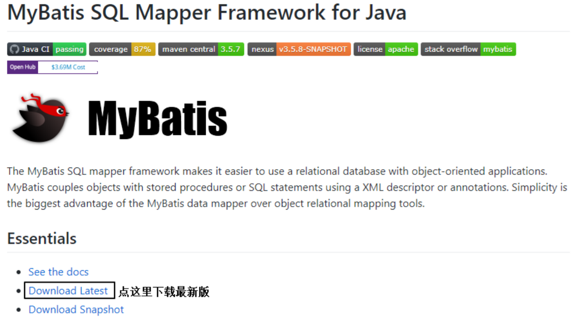
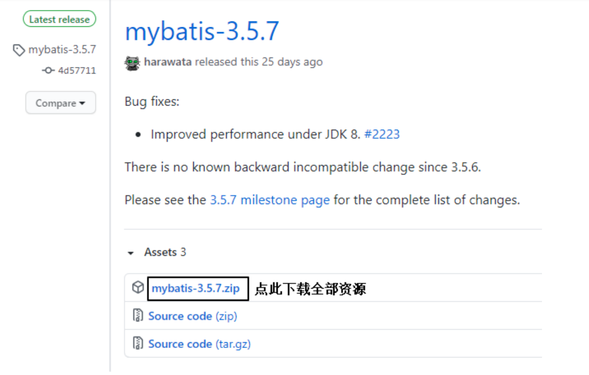

# MyBatis

## 一、MyBatis简介

### 1. MyBatis历史

MyBatis最初是Apache的一个开源项目**iBatis**, 2010年6月这个项目由Apache Software Foundation迁移到了Google Code。随着开发团队转投Google Code旗下， iBatis3.x正式更名为MyBatis。代码于2013年11月迁移到Github。

iBatis一词来源于“internet”和“abatis”的组合，是一个基于Java的持久层框架。 iBatis提供的持久层框架包括SQL Maps和Data Access Objects（DAO）。

### 2. MyBatis特性

1. MyBatis 是支持定制化 SQL、存储过程以及高级映射的优秀的持久层框架 
2. MyBatis 避免了几乎所有的 JDBC 代码和手动设置参数以及获取结果集 
3. MyBatis可以使用简单的XML或注解用于配置和原始映射，将接口和Java的POJO（Plain Old Java Objects，普通的Java对象）映射成数据库中的记录 
4. MyBatis 是一个 半自动的ORM（Object Relation Mapping）框架

### 3. MyBatis下载

MyBatis下载地址：https://github.com/mybatis/mybatis-3





### 4. 和其它持久化层技术对比

* JDBC
  - SQL 夹杂在Java代码中耦合度高，导致硬编码内伤
  - 维护不易且实际开发需求中 SQL 有变化，频繁修改的情况多见
  - 代码冗长，开发效率低
* Hibernate 和 JPA
  - 操作简便，开发效率高
  - 程序中的长难复杂 SQL 需要绕过框架
  - 内部自动生产的 SQL，不容易做特殊优化
  - 基于全映射的全自动框架，大量字段的 POJO 进行部分映射时比较困难。
  - 反射操作太多，导致数据库性能下降
* MyBatis
  - 轻量级，性能出色
  - SQL 和 Java 编码分开，功能边界清晰。Java代码专注业务、SQL语句专注数据
  - 开发效率稍逊于HIbernate，但是完全能够接受

## 二、搭建MyBatis

### 1. 开发环境

IDE：idea 2021.3

构建工具：maven 3.8.1

MySQL版本：MySQL 5.7

MyBatis版本：MyBatis 3.5.7

### 2. 创建maven工程

1. 打包方式：jar

2. 引入依赖

```xml
<dependencies>
  <!-- Mybatis核心 -->
  <dependency>
    <groupId>org.mybatis</groupId>
    <artifactId>mybatis</artifactId>
    <version>3.5.7</version>
  </dependency>
  
  <!-- junit测试 -->
  <dependency>
    <groupId>junit</groupId>
    <artifactId>junit</artifactId>
    <version>4.12</version>
    <scope>test</scope>
    
  </dependency>
  <!-- MySQL驱动 -->
  <dependency>
    <groupId>mysql</groupId>
    <artifactId>mysql-connector-java</artifactId>
    <version>5.1.3</version>
  </dependency>
</dependencies>
```

### 3. 创建MyBatis的核心配置文件

> 习惯上命名为mybatis-config.xml，这个文件名仅仅只是建议，并非强制要求。将来整合Spring之后，这个配置文件可以省略，所以操作时可以直接复制、粘贴。
> 
> 核心配置文件主要用于配置连接数据库的环境以及MyBatis的全局配置信息
> 
> 核心配置文件存放的位置是src/main/resources目录下

```xml
<?xml version="1.0" encoding="UTF-8" ?>
<!DOCTYPE configuration
        PUBLIC "-//mybatis.org//DTD Config 3.0//EN"
        "http://mybatis.org/dtd/mybatis-3-config.dtd">
<configuration>
  <!--设置连接数据库的环境-->
  <environments default="development">
    <environment id="development">
      <transactionManager type="JDBC"/>
      <dataSource type="POOLED">
        <property name="driver" value="com.mysql.jdbc.Driver"/>
        <property name="url"
                  value="jdbc:mysql://localhost:3306/MyBatis"/>
        <property name="username" value="root"/>
        <property name="password" value="123456"/>
      </dataSource>
    </environment>
  </environments>
  <!--引入映射文件-->
  <mappers>
    <mapper resource="mappers/UserMapper.xml"/>
  </mappers>
</configuration>
```

[相关文件mybatis-config.xml](MyBatis_demo1/src/main/resources/mybatis-config.xml)

### 4. 创建mapper接口

> MyBatis中的mapper接口相当于以前的dao。但是区别在于，mapper仅仅是接口，我们不需要提供实现类。

```java
public interface UserMapper {
  /**
   * 添加用户信息
   */
  int insertUser();
}
```

[相关文件UserMapper.java](MyBatis_demo1/src/main/java/com/toxicant123/mybatis/mapper/UserMapper.java)

### 5. 创建MyBatis的映射文件

相关概念：ORM（Object Relationship Mapping）对象关系映射。

* 对象：Java的实体类对象
* 关系：关系型数据库
* 映射：二者之间的对应关系

| Java概念 | 数据库概念 |
|:------:|:-----:|
|   类    |   表   |
|   属性   | 字段/列  |
|   对象   | 记录/行  |

> 1、映射文件的命名规则：
> 
> 表所对应的实体类的类名+Mapper.xml
> 
> 例如：表t_user，映射的实体类为User，所对应的映射文件为UserMapper.xml
> 
> 因此一个映射文件对应一个实体类，对应一张表的操作
> 
> MyBatis映射文件用于编写SQL，访问以及操作表中的数据
> 
> MyBatis映射文件存放的位置是src/main/resources/mappers目录下
> 
> 2、MyBatis中可以面向接口操作数据，要保证两个一致：
> 
> a.mapper接口的全类名和映射文件的命名空间（namespace）保持一致
> 
> b.mapper接口中方法的方法名和映射文件中编写SQL的标签的id属性保持一致


```xml
<?xml version="1.0" encoding="UTF-8" ?>
<!DOCTYPE mapper
        PUBLIC "-//mybatis.org//DTD Mapper 3.0//EN"
        "http://mybatis.org/dtd/mybatis-3-mapper.dtd">
<mapper namespace="com.atguigu.mybatis.mapper.UserMapper">
  <!--int insertUser();-->
  <insert id="insertUser">
    insert into t_user values(null,'张三','123',23,'女')
  </insert>
</mapper>
```

[相关文件UserMapper.xml](MyBatis_demo1/src/main/resources/mappers/UserMapper.xml)

### 6. 通过junit测试功能

```
//读取MyBatis的核心配置文件
InputStream is = Resources.getResourceAsStream("mybatis-config.xml");
//创建SqlSessionFactoryBuilder对象
SqlSessionFactoryBuilder sqlSessionFactoryBuilder = new
SqlSessionFactoryBuilder();
//通过核心配置文件所对应的字节输入流创建工厂类SqlSessionFactory，生产SqlSession对象
SqlSessionFactory sqlSessionFactory = sqlSessionFactoryBuilder.build(is);
//创建SqlSession对象，此时通过SqlSession对象所操作的sql都必须手动提交或回滚事务
//SqlSession sqlSession = sqlSessionFactory.openSession();
//创建SqlSession对象，此时通过SqlSession对象所操作的sql都会自动提交
SqlSession sqlSession = sqlSessionFactory.openSession(true);
//通过代理模式创建UserMapper接口的代理实现类对象
UserMapper userMapper = sqlSession.getMapper(UserMapper.class);
//调用UserMapper接口中的方法，就可以根据UserMapper的全类名匹配元素文件，通过调用的方法名匹配
映射文件中的SQL标签，并执行标签中的SQL语句
int result = userMapper.insertUser();
//sqlSession.commit();
System.out.println("结果："+result); 
```

[相关文件MyBatisTest.java](MyBatis_demo1/src/test/java/com/toxicant123/mybatis/test/MyBatisTest.java)

> * SqlSession：代表Java程序和数据库之间的会话。（HttpSession是Java程序和浏览器之间的会话）
> * SqlSessionFactory：是“生产”SqlSession的“工厂”。
> * 工厂模式：如果创建某一个对象，使用的过程基本固定，那么我们就可以把创建这个对象的相关代码封装到一个“工厂类”中，以后都使用这个工厂类来“生产”我们需要的对象。

### 7. 加入log4j日志功能

1. 加入依赖

```xml
<!-- log4j日志 -->
<dependency>
  <groupId>log4j</groupId>
  <artifactId>log4j</artifactId>
  <version>1.2.17</version>
</dependency>
```

2. 加入log4j的配置文件

> log4j的配置文件名为log4j.xml，存放的位置是src/main/resources目录下

```xml
<?xml version="1.0" encoding="UTF-8" ?>
<!DOCTYPE log4j:configuration SYSTEM "log4j.dtd">
<log4j:configuration xmlns:log4j="http://jakarta.apache.org/log4j/">
  <appender name="STDOUT" class="org.apache.log4j.ConsoleAppender">
    <param name="Encoding" value="UTF-8"/>
    <layout class="org.apache.log4j.PatternLayout">
      <param name="ConversionPattern" value="%-5p %d{MM-dd HH:mm:ss,SSS}
%m (%F:%L) \n"/>
    </layout>
  </appender>
  <logger name="java.sql">
    <level value="debug"/>
  </logger>
  <logger name="org.apache.ibatis">
    <level value="info"/>
  </logger>
  <root>
    <level value="debug"/>
    <appender-ref ref="STDOUT"/>
  </root>
</log4j:configuration>
```

[相关文件log4j.xml](MyBatis_demo1/src/main/resources/log4j.xml)

> 日志的级别
> 
> FATAL(致命)>ERROR(错误)>WARN(警告)>INFO(信息)>DEBUG(调试)
> 
> 从左到右打印的内容越来越详细

## 三、核心配置文件详解

核心配置文件中的标签必须按照固定的顺序：  

* properties
* settings
* typeAliases
* typeHandlers
* objectFactory
* objectWrapperFactory
* reflectorFactory
* plugins
* environments
* databaseIdProvider
* mappers

```xml
<?xml version="1.0" encoding="UTF-8" ?>
<!DOCTYPE configuration
        PUBLIC "-//MyBatis.org//DTD Config 3.0//EN"
        "http://MyBatis.org/dtd/MyBatis-3-config.dtd">
<configuration>
  <!--引入properties文件，此时就可以${属性名}的方式访问属性值-->
  <properties resource="jdbc.properties"></properties>
  <settings>
    <!--将表中字段的下划线自动转换为驼峰-->
    <setting name="mapUnderscoreToCamelCase" value="true"/>
    <!--开启延迟加载-->
    <setting name="lazyLoadingEnabled" value="true"/>
  </settings>
  <typeAliases>
    <!--
    typeAlias：设置某个具体的类型的别名
    属性：
    type：需要设置别名的类型的全类名
    alias：设置此类型的别名，若不设置此属性，该类型拥有默认的别名，即类名且不区分大小
    写
    若设置此属性，此时该类型的别名只能使用alias所设置的值
    -->
    <!--<typeAlias type="com.atguigu.mybatis.bean.User"></typeAlias>-->
    <!--<typeAlias type="com.atguigu.mybatis.bean.User" alias="abc">
    </typeAlias>-->
    <!--以包为单位，设置改包下所有的类型都拥有默认的别名，即类名且不区分大小写-->
    <package name="com.atguigu.mybatis.bean"/>
  </typeAliases>
  <!--
  environments：设置多个连接数据库的环境
  属性：
  default：设置默认使用的环境的id
  -->
  <environments default="mysql_test">
    <!--
    environment：设置具体的连接数据库的环境信息
    属性：
    id：设置环境的唯一标识，可通过environments标签中的default设置某一个环境的id，
    表示默认使用的环境
    -->
    <environment id="mysql_test">
      <!--
      transactionManager：设置事务管理方式
      属性：
      type：设置事务管理方式，type="JDBC|MANAGED"
      type="JDBC"：设置当前环境的事务管理都必须手动处理
      type="MANAGED"：设置事务被管理，例如spring中的AOP
      -->
      <transactionManager type="JDBC"/>
      <!--
      dataSource：设置数据源
      属性：
      type：设置数据源的类型，type="POOLED|UNPOOLED|JNDI"
      type="POOLED"：使用数据库连接池，即会将创建的连接进行缓存，下次使用可以从
      缓存中直接获取，不需要重新创建
      type="UNPOOLED"：不使用数据库连接池，即每次使用连接都需要重新创建
      type="JNDI"：调用上下文中的数据源
      -->
      <dataSource type="POOLED">
        <!--设置驱动类的全类名-->
        <property name="driver" value="${jdbc.driver}"/>
        <!--设置连接数据库的连接地址-->
        <property name="url" value="${jdbc.url}"/>
        <!--设置连接数据库的用户名-->
        <property name="username" value="${jdbc.username}"/>
        <!--设置连接数据库的密码-->
        <property name="password" value="${jdbc.password}"/>
      </dataSource>
    </environment>
  </environments>
  <!--引入映射文件-->
  <mappers>
    <mapper resource="UserMapper.xml"/>
    <!--
    以包为单位，将包下所有的映射文件引入核心配置文件
    注意：此方式必须保证mapper接口和mapper映射文件必须在相同的包下
    -->
    <package name="com.atguigu.mybatis.mapper"/>
  </mappers>
</configuration>
```

[相关文件mybatis-config-core.xml](MyBatis_demo1/src/main/resources/mybatis-config-core.xml)

## 四、MyBatis的增删改查

1. 添加

```xml
<!--int insertUser();-->
<insert id="insertUser">
  insert into t_user values(null,'admin','123456',23,'男')
</insert>
```

2. 删除

```xml
<!--int deleteUser();-->
<delete id="deleteUser">
  delete from t_user where id = 7
</delete>
```

3. 修改

```xml
<!--int updateUser();-->
<update id="updateUser">
  update t_user set username='ybc',password='123' where id = 6
</update>
```

4. 查询一个实体类对象

```xml
<!--User getUserById();-->
<select id="getUserById" resultType="com.atguigu.mybatis.bean.User">
  select * from t_user where id = 2
</select>
```

5. 查询集合

```xml
<!--List<User> getUserList();-->
<select id="getUserList" resultType="com.atguigu.mybatis.bean.User">
  select * from t_user
</select>
```

[相关文件UserMapper.xml](MyBatis_demo1/src/main/resources/com/toxicant123/mybatis/mapper/UserMapper.xml)

> 注意：
> 1. 查询的标签select必须设置属性resultType或resultMap，用于设置实体类和数据库表的映射关系  
>  resultType：自动映射，用于属性名和表中字段名一致的情况  
>  resultMap：自定义映射，用于一对多或多对一或字段名和属性名不一致的情况
> 2. 当查询的数据为多条时，不能使用实体类作为返回值，只能使用集合，否则会抛出异常TooManyResultsException；但是若查询的数据只有一条，可以使用实体类或集合作为返回值

## 五、MyBatis获取参数值的两种方式（重点）

MyBatis获取参数值的两种方式：**${}和#{}**

${}的本质就是字符串拼接，#{}的本质就是占位符赋值

${}使用字符串拼接的方式拼接sql，若为字符串类型或日期类型的字段进行赋值时，需要手动加单引号；但是#{}使用占位符赋值的方式拼接sql，此时为字符串类型或日期类型的字段进行赋值时，可以自动添加单引号

### 1. 单个字面量类型的参数

若mapper接口中的方法参数为单个的字面量类型

此时可以使用${}和#{}以任意的名称获取参数的值，注意${}需要手动加单引号

### 2. 多个字面量类型的参数

若mapper接口中的方法参数为多个时

此时MyBatis会自动将这些参数放在一个map集合中，以arg0,arg1...为键，以参数为值；以param1,param2...为键，以参数为值；因此只需要通过${}和#{}访问map集合的键就可以获取相对应的值，注意${}需要手动加单引号

### 3. map集合类型的参数

若mapper接口中的方法需要的参数为多个时，此时可以手动创建map集合，将这些数据放在map中

只需要通过${}和#{}访问map集合的键就可以获取相对应的值，注意${}需要手动加单引号

### 4. 实体类类型的参数

若mapper接口中的方法参数为实体类对象时

此时可以使用${}和#{}，通过访问实体类对象中的属性名获取属性值，注意${}需要手动加单引号

### 5. 使用@Param标识参数

可以通过@Param注解标识mapper接口中的方法参数

此时，会将这些参数放在map集合中，以@Param注解的value属性值为键，以参数为值；以param1,param2...为键，以参数为值；只需要通过${}和#{}访问map集合的键就可以获取相对应的值，注意${}需要手动加单引号

[相关文件ParameterMapper.java](MyBatis_demo2/src/main/java/com/toxicant123/mybatis/mapper/ParameterMapper.java)

[相关文件ParameterMapper.xml](MyBatis_demo2/src/main/resources/com/toxicant123/mybatis/mapper/ParameterMapper.xml)

[相关文件ParameterMapperTest](MyBatis_demo2/src/test/java/com/toxicant123/mybatis/test/ParameterMapperTest.java)

## 六、MyBatis的各种查询功能

### 1. 查询一个实体类对象

```java
/**
* 根据用户id查询用户信息
* @param id
* @return
*/
User getUserById(@Param("id") int id);
```

```xml
<!--User getUserById(@Param("id") int id);-->
<select id="getUserById" resultType="User">
  select * from t_user where id = #{id}
</select>
```

### 2. 查询一个list集合

```java
/**
* 查询所有用户信息
* @return
*/
List<User> getUserList();
```

```xml
<!--List<User> getUserList();-->
<select id="getUserList" resultType="User">
  select * from t_user
</select>
```

### 3. 查询单个数据

```java
/**
* 查询用户的总记录数
* @return
* 在MyBatis中，对于Java中常用的类型都设置了类型别名
* 例如：java.lang.Integer-->int|integer
* 例如：int-->_int|_integer
* 例如：Map-->map,List-->list
*/
int getCount();
```

```xml
<!--int getCount();-->
<select id="getCount" resultType="_integer">
  select count(id) from t_user
</select>
```

### 4. 查询一条数据为map集合

```java
/**
* 根据用户id查询用户信息为map集合
* @param id
* @return
*/
Map<String, Object> getUserToMap(@Param("id") int id);
```

```xml
<!--Map<String, Object> getUserToMap(@Param("id") int id);-->
<select id="getUserToMap" resultType="map">
  select * from t_user where id = #{id}
</select>
        <!--结果：{password=123456, sex=男, id=1, age=23, username=admin}-->
```

### 5. 查询多条数据为map集合

方式一：

```java
/**
* 查询所有用户信息为map集合
* @return
* 将表中的数据以map集合的方式查询，一条数据对应一个map；若有多条数据，就会产生多个map集合，此
时可以将这些map放在一个list集合中获取
*/
List<Map<String, Object>> getAllUserToMap();
```

```xml
<!--Map<String, Object> getAllUserToMap();-->
<select id="getAllUserToMap" resultType="map">
  select * from t_user
</select>
```

方式二：

```java
/**
* 查询所有用户信息为map集合
* @return
* 将表中的数据以map集合的方式查询，一条数据对应一个map；若有多条数据，就会产生多个map集合，并
且最终要以一个map的方式返回数据，此时需要通过@MapKey注解设置map集合的键，值是每条数据所对应的
map集合
*/
@MapKey("id")
Map<String, Object> getAllUserToMap();
```

```xml
<!--Map<String, Object> getAllUserToMap();-->
<select id="getAllUserToMap" resultType="map">
  select * from t_user
</select>
        结果：
        <!--
        {
        1={password=123456, sex=男, id=1, age=23, username=admin},
        2={password=123456, sex=男, id=2, age=23, username=张三},
        3={password=123456, sex=男, id=3, age=23, username=张三}
        }
        -->
```

[相关文件SelectMapper.java](MyBatis_demo2/src/main/java/com/toxicant123/mybatis/mapper/SelectMapper.java)

[相关文件SelectMapper.xml](MyBatis_demo2/src/main/resources/com/toxicant123/mybatis/mapper/SelectMapper.xml)

[相关文件SelectMapperTest.java](MyBatis_demo2/src/test/java/com/toxicant123/mybatis/test/SelectMapperTest.java)

### 总结

MyBatis的各种查询功能：
* 1. 若查询出的数据只有一条
  * a> 可以通过实体类对象接收
  * b> 可以通过list集合接收
  * c> 可以通过map集合接收
* 2. 若查询出的数据有多条
  * a> 可以通过list集合接收
  * b> 可以通过map类型的list集合接收
  * c> 可以在mapper接口的方法上添加@MapKey注解，此时就可以将每条数据转换的map集合作为值，以某个字段的值作为键，放在同一个map集合中
* 注意：一定不能通过实体类对象接收，此时会抛出异常TooManyResultsException

MyBatis设置了默认的类型别名：
* java.lang.Integer -> int,integer
* int -> _int, _integer
* String -> string

## 七、特殊SQL的执行

### 1. 模糊查询

```java
/**
* 测试模糊查询
* @param mohu
* @return
*/
List<User> testMohu(@Param("mohu") String mohu);
```

```xml
<!--List<User> testMohu(@Param("mohu") String mohu);-->
<select id="testMohu" resultType="User">
  <!--select * from t_user where username like '%${mohu}%'-->
  <!--select * from t_user where username like concat('%',#{mohu},'%')-->
  select * from t_user where username like "%"#{mohu}"%"
</select>
```

### 2. 批量删除

```java
/**
* 批量删除
* @param ids
* @return
*/
int deleteMore(@Param("ids") String ids);
```

```xml
<!--int deleteMore(@Param("ids") String ids);-->
<delete id="deleteMore">
  delete from t_user where id in (${ids})
</delete>
```

### 3. 动态设置表名

```java
/**
* 动态设置表名，查询所有的用户信息
* @param tableName
* @return
*/
List<User> getAllUser(@Param("tableName") String tableName);
```

```xml
<!--List<User> getAllUser(@Param("tableName") String tableName);-->
<select id="getAllUser" resultType="User">
  select * from ${tableName}
</select>
```

### 4. 添加功能获取自增的主键

t_clazz(clazz_id,clazz_name)

t_student(student_id,student_name,clazz_id)

1、添加班级信息

2、获取新添加的班级的id

3、为班级分配学生，即将某学的班级id修改为新添加的班级的id

```java
/**
* 添加用户信息
* @param user
* @return
* useGeneratedKeys：设置使用自增的主键
* keyProperty：因为增删改有统一的返回值是受影响的行数，因此只能将获取的自增的主键放在传输的参
数user对象的某个属性中
*/
int insertUser(User user);
```

```xml
<!--int insertUser(User user);-->
<insert id="insertUser" useGeneratedKeys="true" keyProperty="id">
  insert into t_user values(null,#{username},#{password},#{age},#{sex})
</insert>
```

[相关文件SQLMapper.java](MyBatis_demo2/src/main/java/com/toxicant123/mybatis/mapper/SQLMapper.java)

[相关文件SQLMapper.xml](MyBatis_demo2/src/main/resources/com/toxicant123/mybatis/mapper/SQLMapper.xml)

[相关文件SQLMapperTest.java](MyBatis_demo2/src/test/java/com/toxicant123/mybatis/test/SQLMapperTest.java)

## 八、自定义映射resultMap

### 1. resultMap处理字段和属性的映射关系

若字段名和实体类中的属性名不一致，则可以通过resultMap设置自定义映射

```xml
<!--
resultMap：设置自定义映射
属性：
id：表示自定义映射的唯一标识
type：查询的数据要映射的实体类的类型
子标签：
id：设置主键的映射关系
result：设置普通字段的映射关系
association：设置多对一的映射关系
collection：设置一对多的映射关系
属性：
property：设置映射关系中实体类中的属性名
column：设置映射关系中表中的字段名
-->
<resultMap id="userMap" type="User">
  <id property="id" column="id"></id>
  <result property="userName" column="user_name"></result>
  <result property="password" column="password"></result>
  <result property="age" column="age"></result>
  <result property="sex" column="sex"></result>
</resultMap>
        <!--List<User> testMohu(@Param("mohu") String mohu);-->
<select id="testMohu" resultMap="userMap">
<!--select * from t_user where username like '%${mohu}%'-->
select id,user_name,password,age,sex from t_user where user_name like
concat('%',#{mohu},'%')
</select>
```

> 若字段名和实体类中的属性名不一致，但是字段名符合数据库的规则（使用_），实体类中的属性名符合Java的规则（使用驼峰）
> 
> 此时也可通过以下两种方式处理字段名和实体类中的属性的映射关系
> 
> a>可以通过为字段起别名的方式，保证和实体类中的属性名保持一致
> 
> b>可以在MyBatis的核心配置文件中设置一个全局配置信息mapUnderscoreToCamelCase，可以在查询表中数据时，自动将_类型的字段名转换为驼峰
> 
> 例如：字段名user_name，设置了mapUnderscoreToCamelCase，此时字段名就会转换为userName

### 2. 多对一映射处理

> 查询员工信息以及员工所对应的部门信息

#### a> 级联方式处理映射关系

```xml
<resultMap id="empDeptMap" type="Emp">
  <id column="eid" property="eid"></id>
  <result column="ename" property="ename"></result>
  <result column="age" property="age"></result>
  <result column="sex" property="sex"></result>
  <result column="did" property="dept.did"></result>
  <result column="dname" property="dept.dname"></result>
</resultMap>
        <!--Emp getEmpAndDeptByEid(@Param("eid") int eid);-->
<select id="getEmpAndDeptByEid" resultMap="empDeptMap">
select emp.*,dept.* from t_emp emp left join t_dept dept on emp.did =
dept.did where emp.eid = #{eid}
</select>
```

#### b> 使用association处理映射关系

```xml

<resultMap id="empDeptMap" type="Emp">
  <id column="eid" property="eid"></id>
  <result column="ename" property="ename"></result>
  <result column="age" property="age"></result>
  <result column="sex" property="sex"></result>
  <association property="dept" javaType="Dept">
    <id column="did" property="did"></id>
    <result column="dname" property="dname"></result>
  </association>
</resultMap>
        <!--Emp getEmpAndDeptByEid(@Param("eid") int eid);-->
<select id="getEmpAndDeptByEid" resultMap="empDeptMap">
select emp.*,dept.* from t_emp emp left join t_dept dept on emp.did =
dept.did where emp.eid = #{eid}
</select>
```

#### c> 分步查询

1) 查询员工信息

```java
/**
* 通过分步查询查询员工信息
* @param eid
* @return
*/
Emp getEmpByStep(@Param("eid") int eid);
```

```java
<resultMap id="empDeptStepMap"type="Emp">
<id column="eid"property="eid"></id>
<result column="ename"property="ename"></result>
<result column="age"property="age"></result>
<result column="sex"property="sex"></result>
<!--
        select：设置分步查询，查询某个属性的值的sql的标识（namespace.sqlId）
        column：将sql以及查询结果中的某个字段设置为分步查询的条件
        -->
<association property="dept"
        select="com.atguigu.MyBatis.mapper.DeptMapper.getEmpDeptByStep"column="did">
</association>
</resultMap>
<!--Emp getEmpByStep(@Param("eid") int eid);-->
<select id="getEmpByStep"resultMap="empDeptStepMap">
        select*from t_emp where eid= #{eid}
</select>
```

2) 根据员工所对应的部门id查询部门信息

```java
/**
* 分步查询的第二步：根据员工所对应的did查询部门信息
* @param did
* @return
*/
Dept getEmpDeptByStep(@Param("did") int did);
```

```xml
<!--Dept getEmpDeptByStep(@Param("did") int did);-->
<select id="getEmpDeptByStep" resultType="Dept">
  select * from t_dept where did = #{did}
</select>
```


