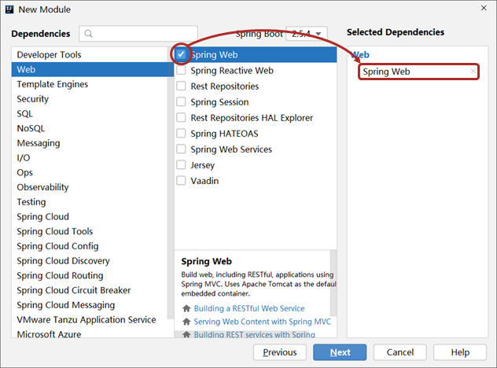
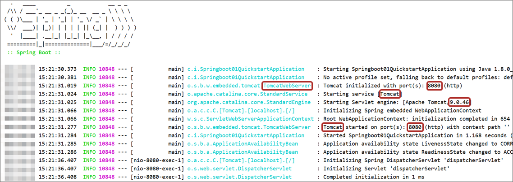
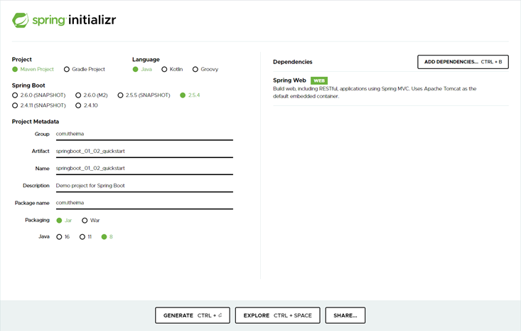
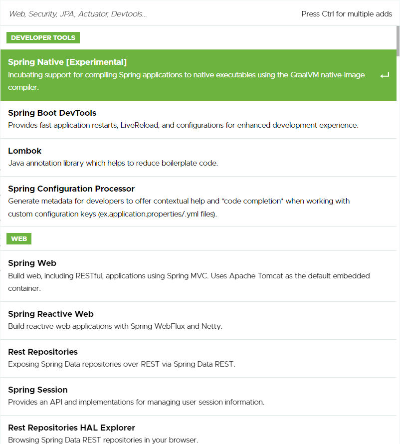

# 第一章 快速上手SpringBoot

SpringBoot技术由Pivotal团队研发制作，功能是加速Spring程序的开发，主要可分为下面两部分：

* Spring程序初始搭建过程
* Spring程序的开发过程

## 1.1 SpringBoot入门程序开发

### 1.1.1 方式一

步骤1：创建新模块，选择Spring Initializr，并配置模块相关基础信息


第3步点击Next时，Idea需要联网状态，如果不能正常联网，就无法正确到达右边的设置页

第5步选择java版本和你计算机上安装的JDK版本匹配即可，但是最低要求为JDK8或以上版本，推荐使用8或11

步骤②：选择当前模块需要使用的技术



左侧选择web，然后在中间选择Spring Web即可，选完右侧就出现了新的内容项，这就表示勾选成功了

步骤3：开发控制器类

```java
//Rest模式
@RestController
@RequestMapping("/books")
public class BookController {
    @GetMapping
    public String getById(){
        System.out.println("springboot is running...");
        return "springboot is running...";
    }
}
```

入门案例制作的SpringMVC的控制器基于Rest风格开发，当然此处使用原始格式制作SpringMVC的程序也是没有问题的，上例中的@RestController与@GetMapping注解是基于Restful开发的典型注解

步骤4：运行自动生成的Application类



使用带main方法的java程序的运行形式来运行程序，运行完毕后，控制台输出上述信息


步骤五：访问以下路径以验证是否成功

访问路径：

```text
http://localhost:8080/books
```

#### 总结

从开发者角度来看，目前只有两个文件展现到了开发者面前

第一个是pom.xml

```xml
<?xml version="1.0" encoding="UTF-8"?>
<project xmlns="http://maven.apache.org/POM/4.0.0" xmlns:xsi="http://www.w3.org/2001/XMLSchema-instance"
         xsi:schemaLocation="http://maven.apache.org/POM/4.0.0 https://maven.apache.org/xsd/maven-4.0.0.xsd">
    <modelVersion>4.0.0</modelVersion>

    <parent>
        <groupId>org.springframework.boot</groupId>
        <artifactId>spring-boot-starter-parent</artifactId>
        <version>2.5.4</version>
    </parent>

    <groupId>com.itheima</groupId>
    <artifactId>springboot_01_01_quickstart</artifactId>
    <version>0.0.1-SNAPSHOT</version>

    <dependencies>
        <dependency>
            <groupId>org.springframework.boot</groupId>
            <artifactId>spring-boot-starter-web</artifactId>
        </dependency>

        <dependency>
            <groupId>org.springframework.boot</groupId>
            <artifactId>spring-boot-starter-test</artifactId>
            <scope>test</scope>
        </dependency>
    </dependencies>
</project>
```

第二个是Application类

```java
@SpringBootApplication
public class Application {
    public static void main(String[] args) {
        SpringApplication.run(Application.class, args);
    }
}
```

Spring与SpringBoot的对比

| 类配置文件               | Spring | SpringBoot |
|---------------------|--------|------------|
| pom文件中的坐标           | 手工添加   | 勾选添加       |
| web3.0配置类           | 手工制作   | 无          |
| Spring/SpringMVC配置类 | 手工制作   | 无          |
| 控制器                 | 手工制作   | 手工制作       |

### 1.1.2 方式二

步骤1：点击网址 https://start.spring.io/ 后进入到创建SpringBoot程序的界面，输入信息



步骤2：右侧的ADD DEPENDENCIES用于选择技术，点击后打开网页版的技术选择界面



步骤3：所有信息设置完毕后，点击下面左侧按钮，生成一个文件包

步骤4：保存后得到一个压缩文件，这个文件打开后就是创建的SpringBoot工程文件夹，解压缩此文件后，得到工程目录，在Idea中导入即可使用。

### 1.1.2 方式三

如果Spring的官网访问出现了问题，我们可以使用阿里云提供的地址：http://start.aliyun.com 或 https://start.aliyun.com

创建工程时，切换选择starter服务路径


