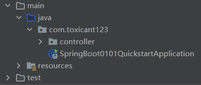
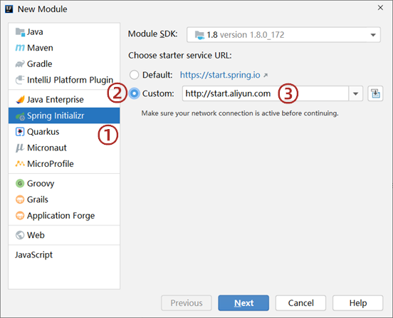
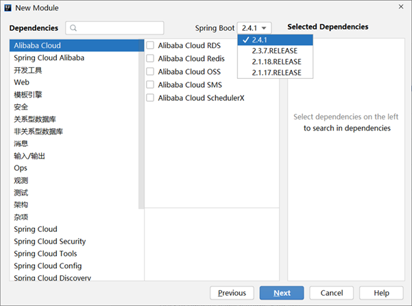
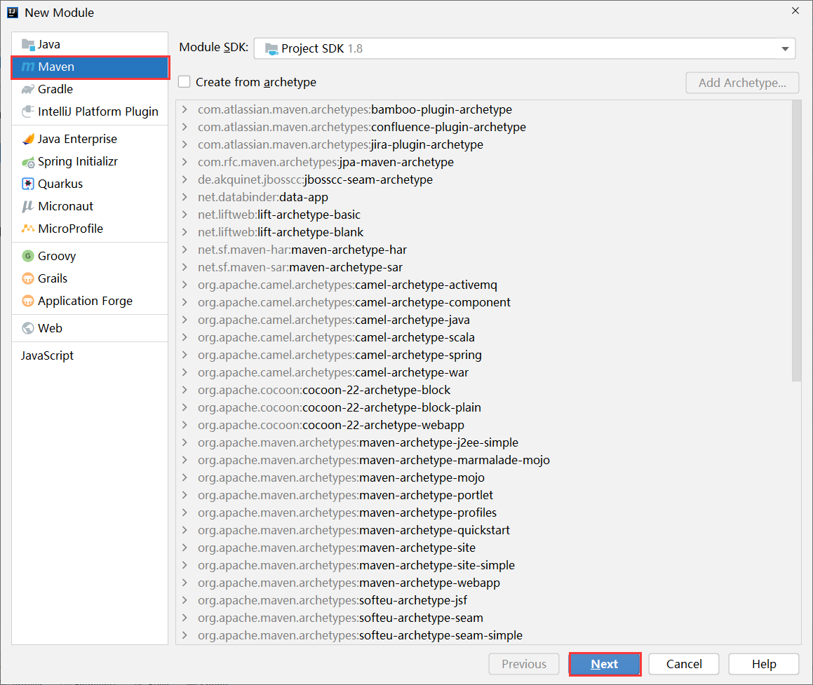

# 第一章 快速上手SpringBoot

SpringBoot技术由Pivotal团队研发制作，功能是加速Spring程序的开发，主要可分为下面两部分：

* Spring程序初始搭建过程
* Spring程序的开发过程

## 1.1 SpringBoot入门程序开发

### 1.1.1 方式一

步骤1：创建新模块，选择Spring Initializr，并配置模块相关基础信息


第3步点击Next时，Idea需要联网状态，如果不能正常联网，就无法正确到达右边的设置页

第5步选择java版本和你计算机上安装的JDK版本匹配即可，但是最低要求为JDK8或以上版本，推荐使用8或11

步骤②：选择当前模块需要使用的技术


左侧选择web，然后在中间选择Spring Web即可，选完右侧就出现了新的内容项，这就表示勾选成功了

步骤3：开发控制器类

在自动生成的类的同包下，可以创建一个controller包以存放控制器类



```java
//Rest模式
@RestController
@RequestMapping("/books")
public class BookController {
    @GetMapping
    public String getById(){
        System.out.println("springboot is running...");
        return "springboot is running...";
    }
}
```

入门案例制作的SpringMVC的控制器基于Rest风格开发，当然此处使用原始格式制作SpringMVC的程序也是没有问题的，上例中的@RestController与@GetMapping注解是基于Restful开发的典型注解

步骤4：运行自动生成的Application类


使用带main方法的java程序的运行形式来运行程序，运行完毕后，控制台输出上述信息

步骤五：访问以下路径以验证是否成功

访问路径：

```text
http://localhost:8080/books
```

#### 总结

从开发者角度来看，目前只有两个文件展现到了开发者面前

第一个是pom.xml

```xml
<?xml version="1.0" encoding="UTF-8"?>
<project xmlns="http://maven.apache.org/POM/4.0.0" xmlns:xsi="http://www.w3.org/2001/XMLSchema-instance"
         xsi:schemaLocation="http://maven.apache.org/POM/4.0.0 https://maven.apache.org/xsd/maven-4.0.0.xsd">
    <modelVersion>4.0.0</modelVersion>

    <parent>
        <groupId>org.springframework.boot</groupId>
        <artifactId>spring-boot-starter-parent</artifactId>
        <version>2.5.4</version>
    </parent>

    <groupId>com.itheima</groupId>
    <artifactId>springboot_01_01_quickstart</artifactId>
    <version>0.0.1-SNAPSHOT</version>

    <dependencies>
        <dependency>
            <groupId>org.springframework.boot</groupId>
            <artifactId>spring-boot-starter-web</artifactId>
        </dependency>

        <dependency>
            <groupId>org.springframework.boot</groupId>
            <artifactId>spring-boot-starter-test</artifactId>
            <scope>test</scope>
        </dependency>
    </dependencies>
</project>
```

第二个是Application类

```java
@SpringBootApplication
public class Application {
    public static void main(String[] args) {
        SpringApplication.run(Application.class, args);
    }
}
```

Spring与SpringBoot的对比

| 类配置文件               | Spring | SpringBoot |
|---------------------|--------|------------|
| pom文件中的坐标           | 手工添加   | 勾选添加       |
| web3.0配置类           | 手工制作   | 无          |
| Spring/SpringMVC配置类 | 手工制作   | 无          |
| 控制器                 | 手工制作   | 手工制作       |

### 1.1.2 方式二

步骤1：点击网址 https://start.spring.io/ 后进入到创建SpringBoot程序的界面，输入信息


步骤2：右侧的ADD DEPENDENCIES用于选择技术，点击后打开网页版的技术选择界面


步骤3：所有信息设置完毕后，点击下面左侧按钮，生成一个文件包

步骤4：保存后得到一个压缩文件，这个文件打开后就是创建的SpringBoot工程文件夹，解压缩此文件后，得到工程目录，在Idea中导入即可使用。

### 1.1.3 方式三

如果Spring的官网访问出现了问题，我们可以使用阿里云提供的地址：http://start.aliyun.com 或 https://start.aliyun.com

创建工程时，切换选择starter服务路径



阿里云地址默认创建的SpringBoot工程版本是2.4.1，如果想更换其他的版本，创建项目后手工修改即可



#### 总结

1. 选择start来源为自定义URL
2. 输入阿里云start地址
3. 创建项目

### 1.1.4 方式四

步骤1：创建工程时，选择手工创建Maven工程



步骤2：参照标准SpringBoot工程的pom文件，编写该项目的pom文件即可

```xml
<?xml version="1.0" encoding="UTF-8"?>
<project xmlns="http://maven.apache.org/POM/4.0.0"
         xmlns:xsi="http://www.w3.org/2001/XMLSchema-instance"
         xsi:schemaLocation="http://maven.apache.org/POM/4.0.0 http://maven.apache.org/xsd/maven-4.0.0.xsd">
    <modelVersion>4.0.0</modelVersion>

    <parent>
        <groupId>org.springframework.boot</groupId>
        <artifactId>spring-boot-starter-parent</artifactId>
        <version>2.5.4</version>
    </parent>

    <groupId>com.itheima</groupId>
    <artifactId>springboot_01_04_quickstart</artifactId>
    <version>1.0-SNAPSHOT</version>

    <properties>
        <maven.compiler.source>8</maven.compiler.source>
        <maven.compiler.target>8</maven.compiler.target>
    </properties>

    <dependencies>
        <dependency>
            <groupId>org.springframework.boot</groupId>
            <artifactId>spring-boot-starter-web</artifactId>
        </dependency>
    </dependencies>

</project>
```

步骤4：根据pom.xml中的groupId创建包，再创建启动类，类名可以自定义

```java
@SpringBootApplication
public class Application {
    public static void main(String[] args) {
        SpringApplication.run(Application.class);
    }
}
```    

类上的注解@SpringBootApplication必须有

#### 总结

1. 创建普通Maven工程
2. 继承spring-boot-starter-parent
3. 添加依赖spring-boot-starter-web
4. 制作引导类Application

## 1.2 SpringBoot简介

SpringBoot是由Pivotal团队提供的全新框架，其设计目的是用来简化Spring应用的初始搭建以及开发过程。

### 1.2.1 Spring程序的缺点

- 依赖设置繁琐
- 配置繁琐

### 1.2.2 SpringBoot程序的优点

- 简化依赖配置
- 自动配置，约定大于配置
- 辅助功能：内置服务器等

### 1.2.3 SpringBoot对于Spring的简化之处

一共分为四个方面：
- parent
- starter
- 引导类
- 内嵌tomcat

### 1.2.3.1 parent

SpringBoot关注到开发者在进行开发时，往往对依赖版本的选择具有固定的搭配格式，并且这些依赖版本的选择还不能乱搭配。比如A技术的2.0版与B技术的3.5版可以合作在一起，但是和B技术的3.7版合并使用时就有冲突。其实很多开发者都一直想做一件事情，就是将各种各样的技术配合使用的常见依赖版本进行收集整理，制作出了最合理的依赖版本配置方案，这样使用起来就方便多了。

SpringBoot将所有的技术版本的常见使用方案都给开发者整理了出来，以后开发者使用时直接用它提供的版本方案，就不用担心冲突问题了，相当于SpringBoot做了无数个技术版本搭配的列表，这个技术搭配列表的名字叫做parent。

parent自身具有很多个版本，每个parent版本中包含有几百个其他技术的版本号，不同的parent间使用的各种技术的版本号有可能会发生变化。当开发者使用某些技术时，直接使用SpringBoot提供的parent就行了，由parent帮助开发者统一的进行各种技术的版本管理，而无需关注这些技术间的版本冲突问题，只需要关注你用什么技术就行了，冲突问题由parent负责处理。

pringBoot又是如何做到这一点的呢？可以查阅SpringBoot的配置源码，看到这些定义

- 项目中的pom.xml中继承了一个坐标

```xml
<parent>
    <groupId>org.springframework.boot</groupId>
    <artifactId>spring-boot-starter-parent</artifactId>
    <version>2.5.4</version>
</parent>
```

- 打开后可以查阅到其中又继承了一个坐标

```xml
<parent>
    <groupId>org.springframework.boot</groupId>
    <artifactId>spring-boot-dependencies</artifactId>
    <version>2.5.4</version>
</parent>
```

- 这个坐标中定义了两组信息，第一组是各式各样的依赖版本号属性，下面列出依赖版本属性的局部，可以看的出来，定义了若干个技术的依赖版本号

```xml
<properties>
    <activemq.version>5.16.3</activemq.version>
    <aspectj.version>1.9.7</aspectj.version>
    <assertj.version>3.19.0</assertj.version>
    <commons-codec.version>1.15</commons-codec.version>
    <commons-dbcp2.version>2.8.0</commons-dbcp2.version>
    <commons-lang3.version>3.12.0</commons-lang3.version>
    <commons-pool.version>1.6</commons-pool.version>
    <commons-pool2.version>2.9.0</commons-pool2.version>
    <h2.version>1.4.200</h2.version>
    <hibernate.version>5.4.32.Final</hibernate.version>
    <hibernate-validator.version>6.2.0.Final</hibernate-validator.version>
    <httpclient.version>4.5.13</httpclient.version>
    <jackson-bom.version>2.12.4</jackson-bom.version>
    <javax-jms.version>2.0.1</javax-jms.version>
    <javax-json.version>1.1.4</javax-json.version>
    <javax-websocket.version>1.1</javax-websocket.version>
    <jetty-el.version>9.0.48</jetty-el.version>
    <junit.version>4.13.2</junit.version>
</properties>
```

第二组是各式各样的的依赖坐标信息，可以看出依赖坐标定义中没有具体的依赖版本号，而是引用了第一组信息中定义的依赖版本属性值

```xml
<dependencyManagement>
    <dependencies>
        <dependency>
            <groupId>org.hibernate</groupId>
            <artifactId>hibernate-core</artifactId>
            <version>${hibernate.version}</version>
        </dependency>
        <dependency>
            <groupId>junit</groupId>
            <artifactId>junit</artifactId>
            <version>${junit.version}</version>
        </dependency>
    </dependencies>
</dependencyManagement>
```

上面的依赖坐标定义是出现在标签`dependencyManagement`中的，其实是对引用坐标的依赖管理，并不是实际使用的坐标。因此当你的项目中继承了这组parent信息后，在不使用对应坐标的情况下，前面的这组定义是不会具体导入某个依赖的

因为在maven中继承机会只有一次，上述继承的格式还可以切换成导入的形式进行，例如在阿里云的starter创建工程时就使用了此种形式

```xml
<dependencyManagement>
    <dependencies>
        <dependency>
            <groupId>org.springframework.boot</groupId>
            <artifactId>spring-boot-dependencies</artifactId>
            <version>${spring-boot.version}</version>
            <type>pom</type>
            <scope>import</scope>
        </dependency>
    </dependencies>
</dependencyManagement>
```