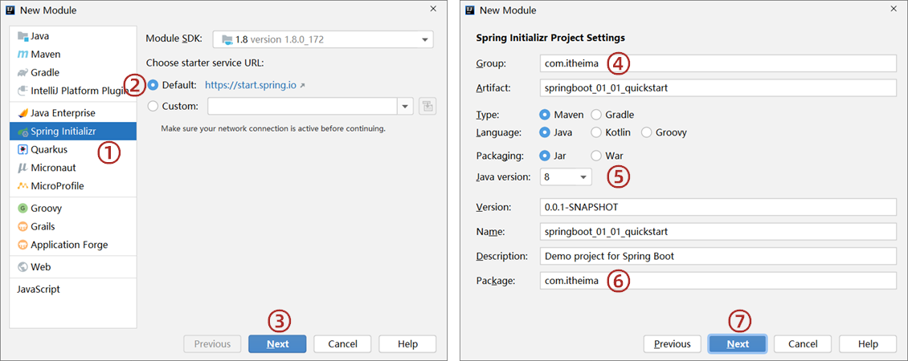

# 第一章 快速上手SpringBoot

SpringBoot技术由Pivotal团队研发制作，功能是加速Spring程序的开发，主要可分为下面两部分：

* Spring程序初始搭建过程
* Spring程序的开发过程

## 1.1 SpringBoot入门程序开发

### 1.1.1 方式一

步骤1：创建新模块，选择Spring Initializr，并配置模块相关基础信息

第3步点击Next时，Idea需要联网状态，如果不能正常联网，就无法正确到达右边的设置页